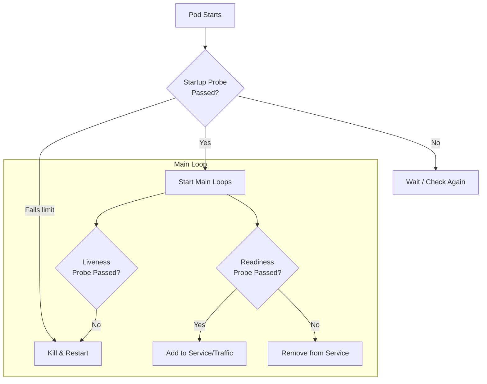

# Health Probes

Distributed systems are messy. Apps hang, freeze, or take 3 minutes to warm up. Kubernetes needs to know the difference between "I'm busy starting up" and "I am dead, please restart me."

That is where **Probes** come in. They are the health checks that let Kubernetes automate the repair and routing of your applications.

-----

## The "Traffic Light" Analogy

Think of your Pod like a car trying to enter a highway.

1.  **Startup Probe (The Ignition):** "Has the engine started?"
      * *If No:* Keep turning the key. Don't check anything else yet.
      * *If Yes:* Okay, move on to the other checks.
2.  **Readiness Probe (The Green Light):** "Is it safe to merge into traffic?"
      * *If No:* Stop sending cars (requests) to this vehicle. Let it idle on the shoulder until it's ready. **Do not kill it.**
      * *If Yes:* Add its IP to the Service load balancer.
3.  **Liveness Probe (The Heartbeat):** "Is the driver still conscious?"
      * *If No:* The driver has had a heart attack. Call the ambulance (Restart the Pod).
      * *If Yes:* Keep driving.

-----

## 1\. Startup Probe (The "Slow Starter")

**Purpose:** Protect slow-starting apps from being killed by the Liveness Probe.

Legacy Java or Windows apps might take 2-3 minutes to boot. If you set a Liveness Probe to check every 10 seconds, it will kill the app before it ever finishes booting.

The Startup Probe pauses all other probes until it passes once.

```yaml
startupProbe:
  httpGet:
    path: /healthz
    port: 8080
  # Allow up to 5 minutes (30 * 10s) for startup
  failureThreshold: 30
  periodSeconds: 10
```

-----

## 2\. Readiness Probe (The "Traffic Controller")

**Purpose:** Control whether the Pod receives traffic from the Service.

Use this to handle temporary load spikes or "warm-up" periods. If a dependency (like a database) is momentarily unreachable, you might want your app to fail readiness so traffic stops flowing to it, but you **don't** want to restart the whole Pod.

  * **Failure Action:** Remove Pod IP from the Service endpoints. (No restart).

<!-- end list -->

```yaml
readinessProbe:
  httpGet:
    path: /ready
    port: 8080
  initialDelaySeconds: 5
  periodSeconds: 10
```

-----

## 3\. Liveness Probe (The "Defibrillator")

**Purpose:** Catch deadlocks or frozen processes.

If your app has a bug where it enters an infinite loop and stops responding, a Liveness Probe detects this and restarts the container to reset the state.

  * **Failure Action:** **RESTART** the container.

<!-- end list -->

```yaml
livenessProbe:
  httpGet:
    path: /healthz
    port: 8080
  initialDelaySeconds: 15
  periodSeconds: 20
```

!!! warning "The Liveness Loop of Death"
    Be very careful with Liveness Probes. If your `initialDelaySeconds` is too short, Kubernetes will kill your app before it finishes booting. It will then restart, fail again, and restart again forever. **Always use a Startup Probe for slow apps.**

-----

## Probe Mechanisms: How to Check?

You can check health in three ways. Choose the one that matches your app's architecture.

| Type | How it works | Best For |
| :--- | :--- | :--- |
| **HTTP Get** | K8s sends a GET request. Codes 200-399 are "Success". | Web Servers, APIs |
| **TCP Socket** | K8s tries to open a TCP connection to the port. | Databases, Redis, Non-HTTP apps |
| **Exec Command** | K8s runs a command inside the container. Exit code 0 is "Success". | Apps that write status files, CLI tools |
| **gRPC** | K8s sends a standard gRPC Health Check request. | gRPC Microservices |

### Example: Exec Probe (Checking a File)

```yaml
livenessProbe:
  exec:
    command:
    - cat
    - /tmp/healthy
  initialDelaySeconds: 5
  periodSeconds: 5
```

-----

## Tuning Your Probes

Don't stick with the defaults. Tune these fields to match your application's reality.

  * **`initialDelaySeconds`**: How long to wait before the *first* check.
  * **`periodSeconds`**: How often to check. (Default: 10s).
  * **`timeoutSeconds`**: How long to wait for a response before calling it a "failure". (Default: 1s).
  * **`failureThreshold`**: How many times it must fail before taking action. (Default: 3). "Flapping" protection.

-----

## Visualizing the Decision Logic



-----

## Summary

  * **Startup Probes** are for slow-booting legacy apps.
  * **Readiness Probes** determine if the Pod should get traffic.
  * **Liveness Probes** determine if the Pod should be restarted.
  * Use **HTTP** checks for web apps and **TCP** checks for databases.
  * **Never** make your Readiness probe depend on an external service (like "Is https://www.google.com/ up?"). If the internet blips, you will take down your entire cluster.