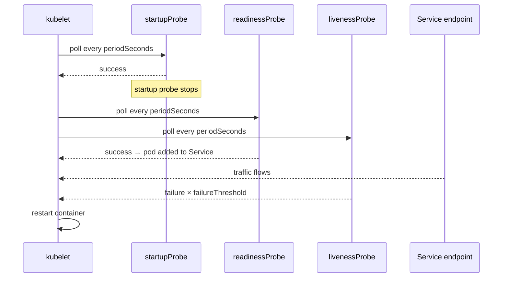

# Health Probes

Probes tell Kubernetes when a container is ready for traffic and when it should be restarted.

Well-designed probes reduce outages during deploys, restarts, and dependency failures.

## Probe types

- Startup probe: gate for slow-starting applications
- Readiness probe: controls service endpoint inclusion
- Liveness probe: restarts containers that are stuck or unhealthy

## How probes interact


```mermaid
sequenceDiagram
    participant K as kubelet
    participant SP as startupProbe
    participant RP as readinessProbe
    participant LP as livenessProbe
    participant SVC as Service endpoint

    K->>SP: poll every periodSeconds
    SP-->>K: success
    Note over SP: startup probe stops
    K->>RP: poll every periodSeconds
    K->>LP: poll every periodSeconds
    RP-->>K: success → pod added to Service
    SVC-->>K: traffic flows
    LP-->>K: failure × failureThreshold
    K->>K: restart container
```

While the startup probe is active, readiness and liveness probes are paused. This prevents premature restarts during slow initialization.

## Recommended usage model

1. Use startup probes for apps with non-trivial boot time. Give `failureThreshold × periodSeconds` enough runway -- for a 2-minute boot, use `failureThreshold: 24, periodSeconds: 5` (2-minute window).
2. Use readiness probes for dependency-aware traffic gating. Only report ready when all dependencies (DB connections, cache warmup) are confirmed.
3. Use liveness probes for deadlock or permanent failure detection. Keep them simple -- a failed HTTP 200 from `/healthz` is enough.

## Example configuration

```yaml
apiVersion: apps/v1
kind: Deployment
metadata:
  name: web
spec:
  replicas: 2
  selector:
    matchLabels:
      app: web
  template:
    metadata:
      labels:
        app: web
    spec:
      containers:
        - name: web
          image: ghcr.io/example/web:v3.0.0
          ports:
            - containerPort: 8080
          startupProbe:
            httpGet:
              path: /startup
              port: 8080
            periodSeconds: 5
            failureThreshold: 24
          readinessProbe:
            httpGet:
              path: /ready
              port: 8080
            periodSeconds: 5
            timeoutSeconds: 2
            failureThreshold: 3
          livenessProbe:
            httpGet:
              path: /healthz
              port: 8080
            periodSeconds: 10
            timeoutSeconds: 2
            failureThreshold: 3
```

## Probe mechanism options

- HTTP GET: best default for web APIs
- TCP socket: useful for non-HTTP services
- Exec: last resort for process-level checks
- gRPC health check: preferred for gRPC services that implement the protocol

## Common probe mistakes

- liveness checks that depend on external services
- aggressive timeouts that fail under normal load spikes
- missing startup probes for applications with long initialization
- readiness endpoints that report healthy before dependencies are actually ready

## Troubleshooting

```bash
kubectl describe pod <pod-name>
kubectl get events -A --sort-by=.metadata.creationTimestamp
kubectl logs <pod-name> --previous
```

Probe failures appear clearly in pod events. Start there before changing YAML.

## Summary

Startup, readiness, and liveness probes serve different goals. When tuned correctly, they protect reliability during rollouts and failures.

## Related Concepts

- [Pods and Deployments](../workloads/pods-deployments.md)
- [Troubleshooting](../operations/troubleshooting.md)
- [Resource Requests and Limits](limits-requests.md)
