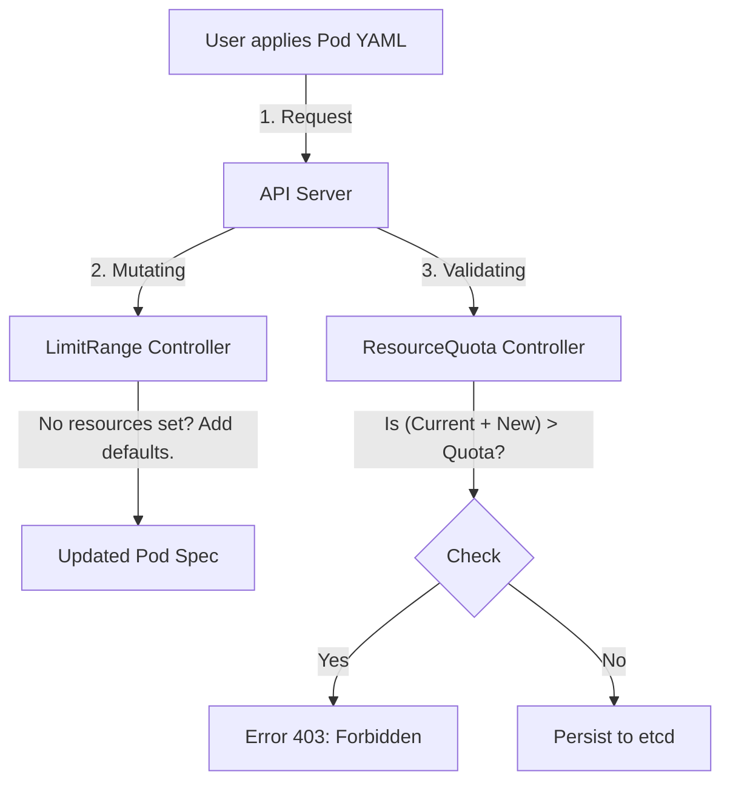

# Quotas

In a shared cluster, trust is good, but **enforcement** is better.

Without controls, a single developer with a typo (`replicas: 100` instead of `10`) can accidentally consume every CPU core in the cluster, causing production outages for everyone else.

To prevent this "Tragedy of the Commons," Kubernetes provides two layers of defense: **ResourceQuotas** (The Budget) and **LimitRanges** (The Rules).

-----

## The Analogy: Corporate Credit Cards

Think of a Namespace like a Department in a company (e.g., "Engineering").

1.  **ResourceQuota (The Department Budget):**
    "The Engineering department has a total budget of $10,000/month."
      * They can spend it on 1 big server or 100 small ones.
      * Once they hit $10,000, their card is declined.
2.  **LimitRange (The Expense Policy):**
    "No *single* lunch expense can be over $50."
    "If you forget to write down the cost, we assume it was $20."
      * This controls individual transactions (Pods).

-----

## 1\. ResourceQuota (The Ceiling)

A `ResourceQuota` limits the **aggregate** total of resources used by all objects in a specific namespace.

If a new Pod tries to start, Kubernetes checks:
$$\text{Current Usage} + \text{New Pod Request} \le \text{Quota Limit}$$

If the answer is **No**, the API Server rejects the request with a `403 Forbidden`.

### Example: The "Hard" Stop

```yaml
apiVersion: v1
kind: ResourceQuota
metadata:
  name: team-a-budget
  namespace: team-a
spec:
  hard:
    # Compute Resources
    requests.cpu: "4"        # Max 4 vCPUs reserved
    requests.memory: 10Gi    # Max 10Gi RAM reserved
    limits.cpu: "8"          # Max 8 vCPUs limit
    limits.memory: 20Gi      # Max 20Gi RAM limit
    
    # Object Counts (Prevent "Pod Spam")
    pods: "10"               # Max 10 Pods total
    services.loadbalancers: "2" # Max 2 expensive Cloud LBs
```

### Checking Usage

To see how much budget you have left:

```bash
kubectl describe quota -n team-a
```

*Output:*

```text
Resource        Used    Hard
--------        ----    ----
requests.cpu    500m    4
pods            3       10
```

-----

## 2\. LimitRange (The Defaults & Guardrails)

A `LimitRange` operates at the **Pod/Container level**. It does two critical things:

1.  **Enforcement:** "Your container cannot be smaller than 100m CPU or larger than 2 CPUs."
2.  **Defaulting (Mutation):** "You forgot to set resources? I will set them to 500m/512Mi automatically."

**This is the most useful feature for Admins.** It ensures that even lazy developers create safe Pods.

### Example: Enforcing Standards

```yaml
apiVersion: v1
kind: LimitRange
metadata:
  name: container-limits
  namespace: team-a
spec:
  limits:
  - default:            # <--- If user sets nothing, give them this LIMIT
      memory: 512Mi
      cpu: 500m
    defaultRequest:     # <--- If user sets nothing, give them this REQUEST
      memory: 256Mi
      cpu: 250m
    max:                # <--- No container can exceed this
      memory: 1Gi
      cpu: 1
    min:                # <--- No container can be smaller than this
      memory: 64Mi
      cpu: 100m
    type: Container
```

-----

## The Admission Workflow

It is important to understand the order of operations. **LimitRanges run first** (because they might add default values), and **ResourceQuotas run last** (to check the final total).



-----

## Troubleshooting Common Errors

When these policies block you, the error messages are specific.

### Error 1: Quota Exceeded

> *Error from server (Forbidden): pods "my-pod" is forbidden: exceeded quota: compute-resources, requested: requests.cpu=1, used: requests.cpu=3, limited: requests.cpu=4*

**Translation:** You asked for 1 CPU, but the namespace only has 1 CPU left in the budget.
**Fix:** Delete old pods or ask admin to increase Quota.

### Error 2: LimitRange Violation

> *Error from server (Forbidden): pods "my-pod" is forbidden: minimum cpu usage per container is 100m, but request is 50m.*

**Translation:** Your Pod spec is too small. The admin requires at least 100m.
**Fix:** Increase your `resources.requests.cpu` to match the minimum.

-----

## Interaction: The "Hidden" Requirement

!!! danger "The Catch-22"
    If you create a **ResourceQuota** for CPU/Memory, **EVERY** Pod in that namespace **MUST** have `requests/limits` defined.

    If you try to create a "naked" Pod (no resources) in a Quota-enabled namespace, the API will reject it immediately because it cannot calculate the cost.

    **Solution:** Always pair a `ResourceQuota` with a `LimitRange` that provides **defaults**. This ensures "naked" Pods get default values automatically and pass the Quota check.

-----

## Summary

| Feature | Scope | Primary Purpose |
| :--- | :--- | :--- |
| **ResourceQuota** | **Namespace** (Aggregate) | Budgeting. "Stop the team from using too much." |
| **LimitRange** | **Pod/Container** (Individual) | Policy. "Ensure every pod has reasonable defaults and sizes." |

**Best Practice:**

1.  Create a **ResourceQuota** on every namespace to prevent accidents.
2.  Create a **LimitRange** on every namespace to inject default requests/limits for developers who forget them.