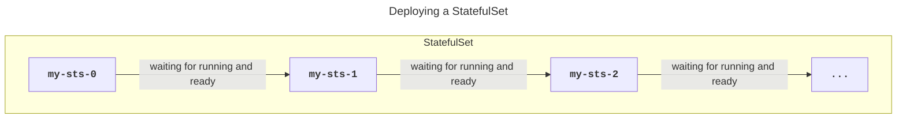

## Overview
StatefulSets are a Kubernetes feature designed to manage applications that need to remember their state, such as databases or systems that keep data consistent across pod restarts. They offer each pod a stable identity and storage that sticks around even when pods are rescheduled to different machines in the cluster.  

It's easy to compare StatefulSets with Deployments given they are v1 API objects and follow the controller architecture - but there are notable differences. StatefulSets are Kubernetes tools for running and managing applications that need to remember who they are and what they know—think of them like memory keepers for your apps, such as databases that need to recall data after a reboot. Unlike Deployments that are more about stateless apps (think of them as forgetful but easily replaceable), StatefulSets make sure each of their Pods has a consistent name, network identity, and storage, even if they move around in the cluster. This makes StatefulSets perfect for when your app's individual identity and history are crucial for running smoothly.  

StatefulSets can guarantee Pod names, volume bindings, and DNS hostnames across reboots - whereas Deployments cannot. Below are two diagrams that illustrate this point:  
#### Node/Pod Failure with Deployments

<br><br><br>

#### Node/Pod Failure with StatefulSets


Notice how with a Deployment, when a Pod is replaced it comes up with a new name, IP address, and its volume is no longer bound to it. With StatefulSets, the new Pod comes up looking exactly the same as the previous failed one.  

Below is a typical YAML file for defining a StatefulSet:  

``` yaml
apiVersion: apps/v1
kind: StatefulSet
metadata:
  name: my-sts
spec:
  selector:
    matchLabels:
      app: nginx
    serviceName: "my-sts"
    replicas: 5
    template: 
      metadata:
        labels:
          app: nginx
      spec:
        containers:
        - name: nginx-container
          image: nginx:latest

...
```

In this example, the name of the StatefulSet is `my-sts` and it defines 5 Pod replicas that will run the latest version of the NGINX image. Once you post this to the API server (via `kubectl`), the definition will be persisted to the cluster store (`etcd`), replicas will be assigned to nodes, and the StatefulSet controller will begin monitoring the state of the cluster to ensure observed = desired.  

## Naming
One nice feature of StatefulSets is that all Pods managed by them get a predictable name. The format of the names given to Pods managed by StatefulSets is `<StatefulSet name>-<integer>`. The integer begins with 0 and increases each time a new Pod from this StatefulSet is deployed. So in the example of `my-sts` above, the Pods would have the names of `my-sts-0`, `my-sts-1`, `my-sts-2`, `my-sts-3`, etc.

!!! info "StatefulSet names need to be valid DNS names"

## Order of Creation/Deletion
StatefulSets in Kubernetes are all about order and precision. They initiate and terminate Pods one at a time, following a strict sequence. This approach guarantees that each Pod is fully operational and ready to handle requests before the next Pod in the sequence is brought to life. Unlike the more free-form Deployments, which may initiate a bunch of Pods at once through a ReplicaSet—potentially tripping over themselves with race conditions—StatefulSets are the thoughtful orchestrators ensuring each Pod gets the attention it needs to start or stop without a rush.  



StatefulSets in Kubernetes not only ensure a methodical boot-up but also adhere to a careful scaling strategy, both up and down. For instance, when scaling from five to seven replicas, the StatefulSet will sequentially initiate each new Pod and ensure it's fully operational before moving on to the next. Conversely, during scale-down, the StatefulSet will remove Pods starting from the highest index, allowing each to decommission completely before proceeding. This step-by-step approach is critical for applications like databases, where simultaneous termination could lead to data loss.  

StatefulSets also offer mechanisms like the `terminationGracePeriodSeconds` to fine-tune this process, ensuring no data is compromised. Moreover, unlike Deployments which rely on a ReplicaSet for managing replicas, StatefulSet controllers handle scaling and self-healing autonomously, ensuring stateful applications maintain their integrity and data throughout their lifecycle.  

!!! warning "Deleting a StatefulSet does not terminate Pods in order"
    If you want to terminate StatefulSet Pods in order, consider scaling to 0 replicas before deleting the StatefulSet.

## StatefulSets and Volumes
StatefulSets in Kubernetes are intrinsically tied to their volumes, which form an integral part of the Pods' state. Each Pod in a StatefulSet is bound to its distinct volumes, which are created simultaneously with the Pod and bear unique identifiers linking them directly to their respective Pods. Thanks to the Persistent Volume Claim (PVC) system, these volumes enjoy a separate lifecycle from the Pods, ensuring their preservation across Pod failures and deletions. When a StatefulSet Pod is terminated or fails, its volumes remain intact, ready to be reattached to any new Pod that takes its place, even if that Pod spins up on a different node within the cluster.  

Scaling down a StatefulSet doesn't affect the existence of these volumes. If a Pod is removed during a scale-down, its dedicated volume waits patiently to be reconnected to a new Pod that may be created during a scale-up, ensuring data persistence and consistency. This feature is particularly crucial for safeguarding data in stateful applications; even if you mistakenly delete a Pod, the data is not lost, as the underlying volume can be reattached to a new Pod, effectively rescuing the situation.  

## Handling Failures
The StatefulSet controller in Kubernetes meticulously monitors the cluster's status, making sure the current state aligns with the intended setup. Consider a StatefulSet with five replicas; if one, say `my-sts-4`, goes down, the controller promptly replaces it, ensuring it retains the same name and rebinds it to the original volumes. 

But, complications arise if the failed Pod makes a comeback post-replacement and suddenly you've got twin Pods vying for the same volume. To avoid this, the StatefulSet controller handles failures with extra caution.

When it comes to node failures, the controller faces a tricky challenge. If a node goes silent, it's hard to tell if it's down for good or just temporarily unreachable due to network issues, a kubelet crash, or a reboot. Since the controller can't guarantee that a termination command will reach a Pod on an unresponsive node, it hesitates to substitute Pods until it's certain of the node's fate. This precaution means that when a node appears to be down, manual intervention is usually necessary before Kubernetes will venture to replace any Pods that were running on it. This cautious approach ensures data integrity at the cost of requiring human oversight in ambiguous failure scenarios.

## DNS
StatefulSets cater to applications that demand reliability and persistence in their Pods. This predictability extends to other applications and services that might need to establish direct connections with specific Pods. To enable these direct connections, StatefulSets employ a headless Service, which provides a stable DNS entry for each Pod based on its unique, predictable hostname. As a result, other components within the ecosystem can retrieve the entire roster of Pod hostnames via DNS queries, allowing for precise and direct Pod communications.  

Below is a snippet of YAML that shows a headless Service being defined:  

``` yaml
apiVersion: v1
kind: Service
metadata:
  name: mysql
spec:
  clusterIP: None  # this is the headless Service
---
apiVersion: apps/v1
kind: StatefulSet
metadata:
  name: sts-mysql
spec:
  serviceName: mysql  # this is the governing Service
```  

Headless Services in Kubernetes are essentially standard Service objects that lack a dedicated IP address, achieved by setting `spec.clusterIP` to `None`. This Service transforms into what is known as a governing Service for a StatefulSet when it is referenced in the StatefulSet's configuration under `spec.serviceName`.

Linking a headless Service to a StatefulSet in this way prompts the Service to create DNS SRV records for each Pod that fits the headless Service's label selector criteria. This setup allows other Pods and applications within the cluster to discover and connect to the StatefulSet's Pods by querying the DNS for the headless Service's name. To leverage this feature, applications will need to be specifically coded to perform such DNS lookups and handle connections to the StatefulSet members dynamically.

## Summary
This section contained a lot of "in the weeds" information and probably warrants a quick summary. StatefulSets within Kubernetes serve as a robust solution for deploying and managing state-persistent applications. StatefulSets are equipped with the ability to self-repair, scale both upwards and downwards, and conduct orderly rollouts - although *rollbacks* typically require a manual process.

StatefulSets provide each of their Pod replicas with consistent and enduring identities. This includes predictable names, DNS hostnames, and a unique set of volumes that remain associated through the Pod's lifecycle, encompassing failures, restarts, and rescheduling events. These persistent identities are not just superficial labels; they are fundamental to the StatefulSet's scaling mechanics and their interaction with persistent storage.

To conclude, it's important to recognize that StatefulSets offer a structural blueprint rather than a complete solution. They set the stage for resilience and consistency, but it's up to the applications themselves to be architecturally compatible with the StatefulSet paradigm to fully harness its benefits.