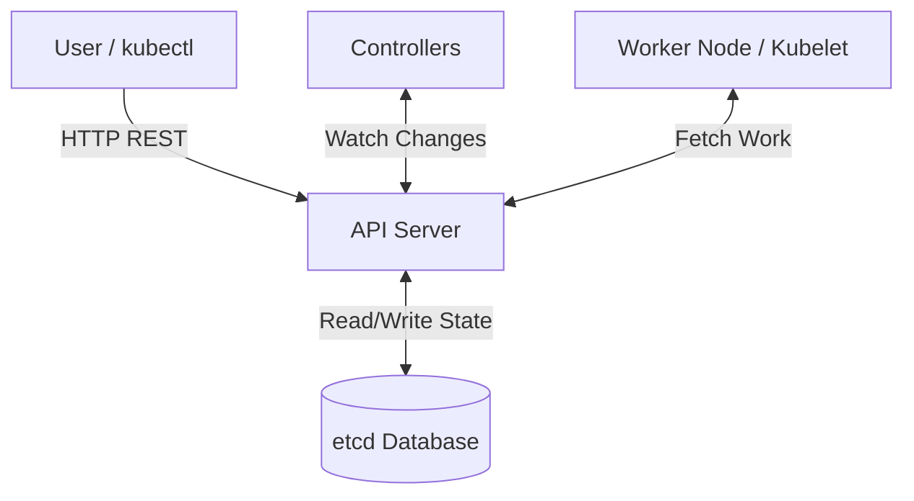
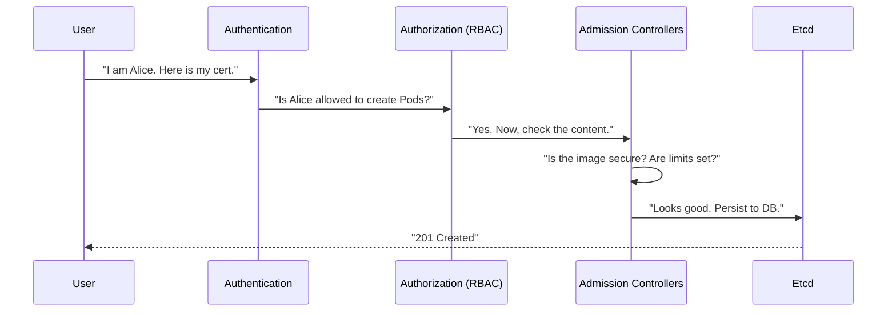

# Kubernetes API

The Kubernetes API is the **brain** of your cluster.

It is the single point of truth. Whether you are a human using `kubectl`, a robot (Controller), or a Node (Kubelet), you **never** talk to each other directly. You only talk to the API Server.

-----

## The "Hub and Spoke" Architecture

The most important architectural rule in Kubernetes is: **Only the API Server talks to etcd.**

`etcd` is the database where all cluster state is stored. It is highly sensitive. To protect it, Kubernetes forces every single component to go through the API Server to read or write data.



-----

## Anatomy of an Object: Spec vs. Status

Every API object represents a "record of intent." To understand Kubernetes, you must understand the war between `spec` and `status`.

```yaml
apiVersion: apps/v1
kind: Deployment
metadata:
  name: nginx
spec:        # THE DESIRED STATE (You write this)
  replicas: 3
status:      # THE OBSERVED STATE (K8s writes this)
  replicas: 1
```

1.  **`spec` (Specification):** This is your wish list. You tell the API: *"I desire 3 replicas."*
2.  **`status`:** This is reality. The system tells you: *"I currently see 1 replica."*
3.  **Reconciliation:** The Controller Manager sees the difference (3 vs 1) and wakes up to fix it (create 2 more pods).

**You typically only write to `spec`. The system writes to `status`.**

-----

## The Request Lifecycle

What actually happens when you type `kubectl apply -f pod.yaml`? It's not just "saving to the database." It goes through a rigorous security pipeline.



1.  **Authentication (AuthN):** "Who are you?" (Certificates, Tokens, OIDC).
2.  **Authorization (AuthZ):** "Are you allowed to do this?" (RBAC checks).
3.  **Admission Control:** "Is this request smart?"
      * *Mutating:* "You forgot to set a default CPU limit, so I'll add one for you."
      * *Validating:* "You are trying to run as `root` user? **Denied.**"
4.  **Persistence:** The object is written to `etcd`.

-----

## API Groups & Versioning

Kubernetes APIs change. To keep things stable, they are grouped and versioned.

  * **Alpha (`v1alpha1`):** Experimental. Might be deleted in the next release. **Do not use in production.**
  * **Beta (`v1beta1`):** Useful and well-tested, but details might change. Enabled by default.
  * **Stable (`v1`):** Rock solid. Will be supported for years.

### Common API Paths

| Path URL | Group Name | Resources |
| :--- | :--- | :--- |
| `/api/v1` | **Core** | Pods, Services, Nodes, ConfigMaps, Secrets |
| `/apis/apps/v1` | **Apps** | Deployments, DaemonSets, StatefulSets |
| `/apis/batch/v1` | **Batch** | Jobs, CronJobs |
| `/apis/networking.k8s.io/v1` | **Networking** | Ingress, NetworkPolicies |

!!! tip "Pro Tip"
    Run `kubectl api-resources` to see a full list of every object your cluster supports, including its shortname (e.g., `po` for Pods) and API Group.

-----

## Declarative vs. Imperative

The API supports two ways of working.

**1. Imperative (The "Do It" Command)**
You tell the API exactly what action to take.

  * `kubectl run nginx --image=nginx`
  * `kubectl scale deployment web --replicas=5`
  * *Downside:* If you run it twice, it might fail. It's hard to reproduce.

**2. Declarative (The "Make It So" Command)**
You give the API a file representing your *final desired state*.

  * `kubectl apply -f my-app.yaml`
  * *Upside:* You can run this 100 times. If the state is already correct, nothing happens. If it's different, K8s fixes it. **Always use this for production.**

-----

## Debugging the API

Want to see the API in action? You don't need a proxy. You can ask `kubectl` to show you the raw HTTP requests it is making.

**Try this command:**

```bash
kubectl get pods -v=6
```

**Output:**

```text
I1215... loader.go:372] Config loaded from file: /root/.kube/config
I1215... round_trippers.go:420] GET https://10.96.0.1:443/api/v1/namespaces/default/pods?limit=500
I1215... round_trippers.go:427] Response Status: 200 OK in 12 milliseconds
```

You can see the exact **GET** request `kubectl` sent to the API server\! This is incredibly useful for debugging authentication or permission issues.

-----

## Summary

  * The **API Server** is the only component that talks to `etcd`.
  * **Objects** consist of `spec` (what you want) and `status` (what you have).
  * **Controllers** watch the API to make `status` match `spec`.
  * Every request goes through **AuthN**, **AuthZ**, and **Admission Control**.
  * Use `kubectl -v=6` to peek under the hood.