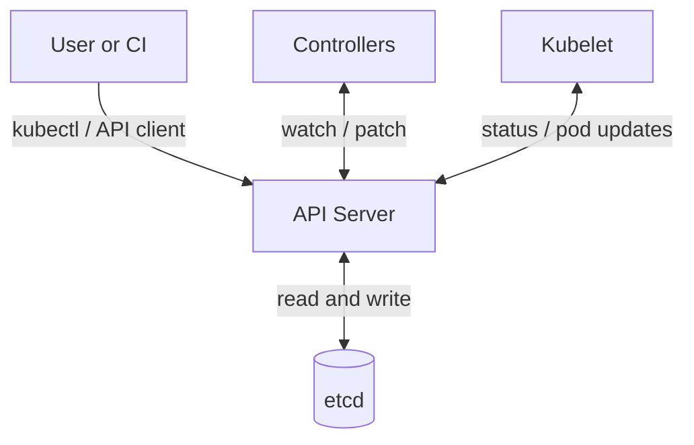

# Kubernetes API

The Kubernetes API is the control surface of the cluster.

Whether changes come from `kubectl`, CI/CD, operators, or controllers, they flow through the API server.

## API Server and etcd

A core design rule is that etcd is accessed through the API server, not directly by normal components.

- etcd stores cluster state.
- API server validates and persists state transitions.
- Controllers and kubelets watch API resources and react.


```mermaid
graph TD
    User[User or CI] -->|kubectl / API client| API[API Server]
    Controllers[Controllers] <-->|watch / patch| API
    Kubelet[Kubelet] <-->|status / pod updates| API
    API <-->|read and write| Etcd[(etcd)]
```

## Watch and the control loop

Controllers don't poll the API server. They use the **Watch** mechanism: a long-lived HTTP connection that streams change events (ADDED, MODIFIED, DELETED) as objects are updated.

This is how every controller works -- the Deployment controller watches for Deployments, the ReplicaSet controller watches ReplicaSets, the kubelet watches Pod objects assigned to its node. When you `kubectl apply`, the event reaches all relevant watchers almost instantly via this stream.

The watch mechanism keeps Kubernetes responsive and efficient. The API server buffers events from etcd and fans them out to watchers without each component independently polling.

## Object Anatomy: `spec` and `status`

Most Kubernetes resources separate intent from observation.

```yaml
apiVersion: apps/v1
kind: Deployment
metadata:
  name: web
spec:
  replicas: 3
status:
  replicas: 2
```

- `spec`: desired state declared by users or automation.
- `status`: current state reported by controllers.
- reconciliation: controllers close the gap.

## Request Pipeline

A create or update request passes through these stages:

1. **Authentication**: who is calling (certificate, bearer token, service account JWT, OIDC).
2. **Authorization**: what they are allowed to do (RBAC, ABAC, Node, Webhook modes).
3. **Admission**: mutation and validation webhooks run. Mutating webhooks (e.g. inject sidecars, set defaults) run before validating webhooks (e.g. enforce policy). Built-in admission controllers like `LimitRanger`, `ResourceQuota`, and `PodSecurity` also run here.
4. **Persistence**: accepted object is written to etcd and watch events are broadcast to listeners.

## API Groups and Versions

Kubernetes APIs are grouped and versioned for compatibility.

- Alpha (`v1alpha1`): experimental and can change or be removed.
- Beta (`v1beta1`): maturing, but still not guaranteed long-term stable.
- Stable (`v1`): production-ready API contract.

Version behavior is governed by the Kubernetes deprecation policy. Do not assume beta APIs are always enabled in every environment.

Common paths:

| Path | Group | Example resources |
| :--- | :--- | :--- |
| `/api/v1` | core | Pods, Services, ConfigMaps, Secrets |
| `/apis/apps/v1` | apps | Deployments, StatefulSets, DaemonSets |
| `/apis/batch/v1` | batch | Jobs, CronJobs |
| `/apis/networking.k8s.io/v1` | networking | Ingress, NetworkPolicy |

Useful discovery commands:

```bash
kubectl api-resources
kubectl api-versions
kubectl explain deployment.spec
```

## Declarative vs Imperative

Imperative commands are useful for quick actions:

```bash
kubectl scale deployment web --replicas=5
```

Declarative workflows are preferred for production:

```bash
kubectl apply -f deployment.yaml
```

Declarative config is repeatable, reviewable, and CI-friendly.

## Troubleshooting API Interactions

To inspect client-level API calls:

```bash
kubectl get pods -v=6
```

For server-side behavior, use audit logs and events:

```bash
kubectl get events -A --sort-by=.metadata.creationTimestamp
```

## Summary

- The API server is the authoritative control interface.
- Kubernetes objects model desired and observed state.
- Controllers continuously reconcile state.
- API version choice and deprecation awareness are operationally important.
- Declarative API usage should be the default for production systems.
