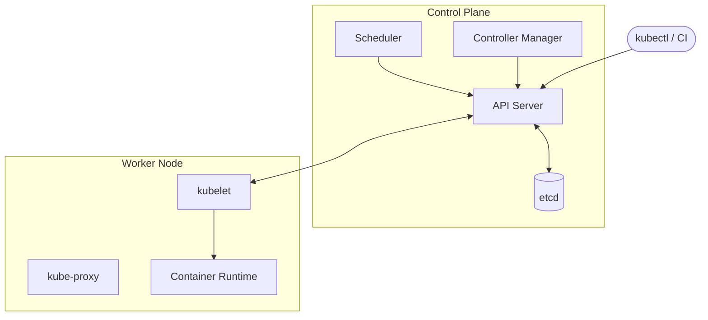

# Kubernetes Overview

Kubernetes is a platform for running containerized applications reliably at scale.

It handles deployment, scheduling, health recovery, service discovery, and rollouts so teams can operate applications consistently across environments.

## Why Kubernetes Exists

Containers made application packaging easier, but running containers in production introduced hard operational problems:

- How do you place workloads on available machines?
- How do you recover from container or node failures?
- How do you scale up and down safely?
- How do you roll out new versions without downtime?

Kubernetes solves these problems with declarative APIs and controllers.

## Core Mental Model

Kubernetes works by continuously reconciling actual state to desired state.

1. You declare desired state (usually in YAML).
2. The API server stores that state in etcd.
3. Controllers compare desired vs actual state.
4. Controllers take actions until they match.

This loop is why Kubernetes can self-heal and keep systems stable over time.

## Cluster Architecture

A Kubernetes cluster has two major parts:

- **API server**: the single entry point for all cluster changes; every component talks through it.
- **etcd**: distributed key-value store that holds all cluster state. Only the API server writes to it directly.
- **Scheduler**: watches for unscheduled pods and assigns them to nodes based on resources and constraints.
- **Controller manager**: runs control loops (Deployment, ReplicaSet, Node, etc.) that reconcile desired state.
- **kubelet**: agent on each node that ensures pods are running per the API server's instructions.
- **kube-proxy**: maintains network rules on each node to implement Service virtual IPs.
- **Container runtime**: executes containers (containerd, CRI-O).

## Key Building Blocks

- Pod: The smallest deployable unit. Usually one app container per pod.
- Deployment: Manages stateless pods and rolling updates.
- StatefulSet: Manages stateful workloads with stable identity and storage.
- Service: Stable virtual endpoint in front of pod backends.
- Ingress or Gateway API: North-south HTTP/TLS routing into cluster services.
- ConfigMap and Secret: Runtime configuration and sensitive values.

## What Kubernetes Is Not

Kubernetes is not a replacement for:

- Good application architecture
- Observability and incident response practices
- Security design and policy
- Platform standards and release discipline

It provides powerful primitives. You still need sound operational patterns.

## How to Learn Efficiently

Use this sequence:

1. Understand pods, deployments, and services.
2. Learn configuration and probes.
3. Learn networking and traffic entry.
4. Learn security fundamentals.
5. Learn maintenance and troubleshooting workflows.

## Next Steps

- [Kubernetes API](kubernetes-api.md)
- [Namespaces](namespaces.md)
- [Pods and Deployments](../workloads/pods-deployments.md)
- [Services and Networking](../networking/services-networking.md)
