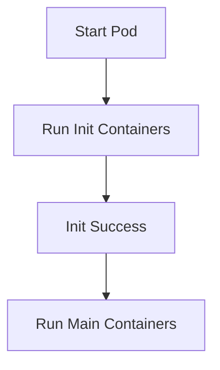

# Init Containers

**Init containers** run before regular containers in a Pod start. They’re designed to perform setup tasks that need to complete before your main application launches - like setting config values, creating folders, or waiting for external services.

---

<h2>Why Use Init Containers?</h2>

- Wait for a database or service to become available
- Download configuration or secrets from an external source
- Run database migrations or setup scripts
- Perform one-time initialization logic before the main app starts

Init containers **always run to completion** before normal containers are started. If an init container fails, the Pod restarts and tries again.

---

## Lifecycle Flow




- If any init container fails, Kubernetes restarts the entire Pod.
- Init containers run **sequentially**, not in parallel.
- Once completed, they’re never run again.

---

## Example: Init Container Waiting for Service

```yaml
initContainers:
  - name: wait-for-db
    image: busybox
    command: ['sh', '-c', 'until nc -z db 5432; do sleep 2; done']
```

This init container waits for a database service to be reachable on port 5432 before allowing the main container to start.

---

<h2>Key Differences vs Regular Containers</h2>

| Feature              | Init Container       | App Container         |
|----------------------|----------------------|------------------------|
| Runs before main app | ✅                   | ❌                    |
| Runs once per Pod    | ✅                   | ❌                    |
| Can block Pod startup| ✅                   | ❌                    |
| Restarts separately  | ❌ (triggers Pod restart) | ✅                |

---

<h2>Summary</h2>

Init containers are a built-in way to prepare your environment before your app runs. They help keep your main containers focused and clean by offloading setup logic. Use them to wait on dependencies, perform one-time actions, or enforce startup ordering.

- <strong>Init containers</strong> run before your main app, handling setup and dependencies.
- Use them for waiting on services, running migrations, or any pre-launch logic.
- They run sequentially and must succeed before your main containers start.


---

