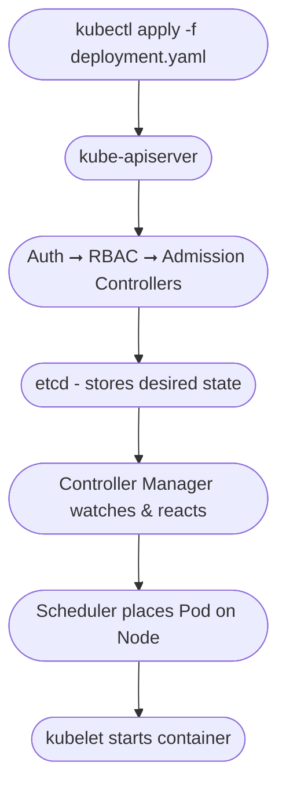

# Kubernetes API

The Kubernetes API is the **primary interface** to interact with your cluster. Whether you’re deploying an app, scaling a workload, inspecting a Pod, or running automation — you’re using the Kubernetes API.

It’s **declarative**, **versioned**, **extensible**, and serves as the **backbone of the control plane**.

---

## What Is the Kubernetes API?

At its core, the API is a RESTful interface that lets you manage **API objects** such as:

- Pods
- Deployments
- Services
- ConfigMaps
- Namespaces
- Custom Resources (via CRDs)

Everything in Kubernetes — from `kubectl` to the scheduler — interacts with the API server.

---

## Anatomy of a Kubernetes Object

Every resource in Kubernetes follows a common structure:

```yaml
apiVersion: apps/v1          # API group + version
kind: Deployment             # Type of object
metadata:
  name: my-app
  namespace: default
spec:                        # Desired state (defined by user)
  replicas: 2
status:                      # Actual state (set by the system)
  replicas: 2
```

| Field      | Description                                       |
|------------|---------------------------------------------------|
| `apiVersion` | Group/version the object belongs to             |
| `kind`       | The object type (e.g., `Pod`, `Service`)        |
| `metadata`   | Info like name, namespace, labels, annotations |
| `spec`       | The desired configuration (user-defined)        |
| `status`     | The actual observed state (set by controllers)  |

---

## API Server Role

The `kube-apiserver` is the **front door** to your cluster. It handles:

- **All incoming requests** from users, `kubectl`, controllers, and web UIs
- **Validation** of requests and schemas
- **Authentication & Authorization**
- **Admission control**
- **Persisting cluster state** in `etcd`

It's stateless and horizontally scalable — multiple API server instances can run behind a load balancer.

---

### API Request Lifecycle



---

## API Groups & Versions

Kubernetes organizes APIs into **groups** and **versions**.

| Path Prefix             | Group Name              | Used For                    |
|-------------------------|--------------------------|-----------------------------|
| `/api/v1`               | Core (no group name)     | Pods, ConfigMaps, Services  |
| `/apis/apps/v1`         | `apps` group             | Deployments, StatefulSets   |
| `/apis/batch/v1`        | `batch` group            | Jobs, CronJobs              |
| `/apis/networking.k8s.io/v1` | Networking group    | Ingress, NetworkPolicies    |
| `/apis/custom.group/v1` | Custom Resource group    | CRDs, Operators             |

You can discover all groups and versions with:

```shell
kubectl api-versions
kubectl api-resources
```

---

## CRUD via kubectl

`kubectl` is a CLI wrapper over raw HTTP requests to the API. Examples:

| Action                       | HTTP Equivalent                                 |
|-----------------------------|-------------------------------------------------|
| `kubectl get pods`          | `GET /api/v1/namespaces/default/pods`           |
| `kubectl apply -f file.yaml`| `PATCH` or `POST` to relevant endpoint          |
| `kubectl delete pod nginx`  | `DELETE /api/v1/namespaces/default/pods/nginx`  |

---

## Declarative vs Imperative

- **Imperative**: You tell Kubernetes *how* to do something (`kubectl run`, `kubectl expose`)
- **Declarative**: You define the *desired state*, and the system reconciles (`kubectl apply -f`)

Kubernetes is fundamentally declarative — the controller manager continually works to **match the actual state to the desired state**.

---

## Working with the API Directly

Enable the API proxy:

```bash
kubectl proxy
```

Browse live cluster data in your browser:  
[http://localhost:8001/api](http://localhost:8001/api)

Also try:

```bash
curl http://localhost:8001/api/v1/namespaces/default/pods
```

---

## Custom Resource Definitions (CRDs)

CRDs allow you to **extend the Kubernetes API** with your own types.

Example:

```yaml
apiVersion: myteam.example.com/v1
kind: Widget
metadata:
  name: widget-123
spec:
  color: blue
  size: large
```

This adds a new resource (`Widget`) to the cluster. Common in Operators.

---

## API Security Flow

Every API request goes through:

1. **Authentication** – Who is making the request?
2. **Authorization (RBAC)** – Are they allowed to perform this action?
3. **Admission Controllers** – Mutate or validate the request
4. **Validation** – Is the object schema correct?
5. **Persistence** – If approved, store in etcd

RBAC example:

```yaml
kind: Role
rules:
  - apiGroups: [""]
    resources: ["pods"]
    verbs: ["get", "list"]
```

---

## Common Trouble Spots

- **Wrong API version**: Resources can move or deprecate (e.g., `apps/v1beta1` is deprecated)
- **Incorrect Group**: Always verify the group (e.g., `networking.k8s.io` vs `extensions`)
- **Unregistered CRDs**: You can’t use a CRD before applying its definition

---

## Summary

- The **API server** is the core of the Kubernetes control plane.
- Everything — even `kubectl` commands — maps to API calls.
- Understand the object structure (`apiVersion`, `kind`, `metadata`, `spec`)
- Know how **groups, versions, and resources** are organized and discovered
- CRDs allow teams to define custom workflows
- All requests flow through authentication, authorization, and admission control before being persisted and acted upon