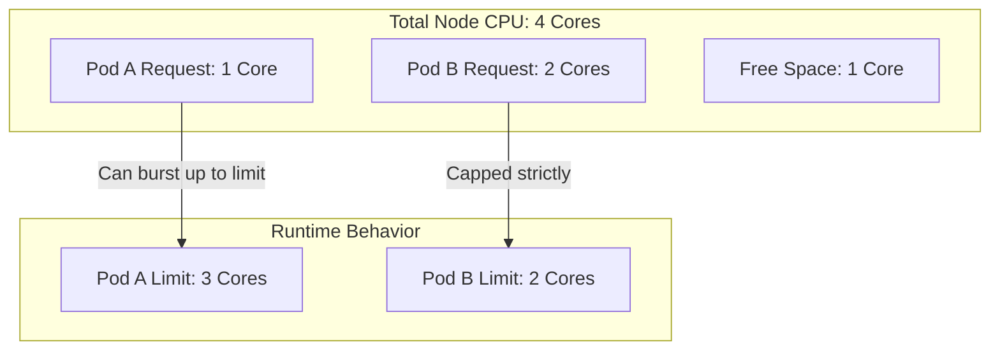

Kubernetes creates a "shared universe" where many applications run on the same physical server (Node).

Without rules, one greedy application (like a memory-leaking Java app or a crypto-miner) could consume 100% of the CPU and RAM, causing every other application on that node to crash.

To prevent this "Noisy Neighbor" problem, Kubernetes uses **Resource Requests** and **Limits**.

-----

## 1\. The Units (What do the numbers mean?)

Before setting rules, you need to speak the language.

### CPU: Millicores

CPU is measured in "cores." But since a container rarely needs a full core, we use **millicores (m)**.

  * **`1` or `1000m`** = 100% of one CPU core (vCPU).
  * **`500m`** = 50% of one core.
  * **`100m`** = 10% of one core.

!!! tip "Pro Tip"
    You can just say `0.5` instead of `500m`. They mean the exact same thing.

### Memory: Bytes

Memory is measured in bytes. You can use standard suffixes (E, P, T, G, M, K) or their power-of-two equivalents (Ei, Pi, Ti, Gi, Mi, Ki).

  * **`128Mi`** = 128 Mebibytes (approx 134 MB).
  * **`1Gi`** = 1 Gibibyte.

!!! warning
    **Mi vs M:** Be careful\! `1000M` (Megabytes) is actually *smaller* than `1000Mi` (Mebibytes). In Kubernetes, we almost always use **Mi** and **Gi**.

-----

## 2\. Requests vs. Limits

This is the most important concept to master.

| Setting | The Analogy | Technical Behavior |
| :--- | :--- | :--- |
| **Request** | **The Reservation** | Kubernetes guarantees this amount. It uses this number to decide *which node* to place the Pod on. |
| **Limit** | **The Speed Governor** | The absolute hard maximum the container can ever use. If it tries to go over, Kubernetes stops it. |

### Visualizing the difference

Imagine a Node with 10GB of RAM.

  * You have a Pod asking for `requests: 2GB` / `limits: 8GB`.
  * **Scheduling:** Kubernetes sees "2GB Request" and puts it on the node.
  * **Runtime:** The Pod sits idle using 1GB.
  * **Traffic Spike:** The Pod jumps to 4GB usage. This is allowed (it's under the Limit).
  * **Memory Leak:** The Pod hits 8GB. **BAM\!** Kubernetes kills it.

<!-- end list -->

-----

## 3\. What happens when you hit the Limit?

The consequence depends heavily on *which* resource you run out of.

### Memory: The "OOMKill"

Memory is a **non-compressible** resource. You can't just "slow down" memory usage; you either have the bytes or you don't.

  * **If a container exceeds Memory Limit:** The Linux Kernel invokes the **OOM Killer** (Out Of Memory Killer). It immediately sends a `SIGKILL` (Exit Code 137) to your container.
  * **Result:** The Pod crashes and restarts.

### CPU: Throttling

CPU is a **compressible** resource.

  * **If a container exceeds CPU Limit:** Kubernetes starts **Throttling**. It artificially denies CPU time to the container for short periods (microseconds).
  * **Result:** Your app gets **slow** and laggy, but it does **not** crash.

-----

## 4\. QoS Classes (Who dies first?)

Kubernetes assigns every Pod a "Quality of Service" (QoS) class based on how you configured your resources. When a Node runs out of resources, this class determines who gets evicted first.

| QoS Class | Configuration | Priority |
| :--- | :--- | :--- |
| **Guaranteed** | Requests == Limits (for both CPU & Mem) | **Highest** (Last to be killed) |
| **Burstable** | Requests \< Limits | **Medium** |
| **BestEffort** | No Requests or Limits set | **Lowest** (First to be killed) |

!!! danger "Avoid BestEffort in Production"
    If you don't set requests/limits, your Pod is "BestEffort." If the node gets busy, Kubernetes will delete your Pod first to save the others.

-----

## 5\. Best Practices

1.  **Always set Requests:** Without them, the Scheduler is flying blind and will overbook nodes, causing stability issues.
2.  **Requests = Limits for Databases:** For critical components (Postgres, Redis), set `requests` equal to `limits` (Guaranteed QoS). You don't want your database getting throttled or killed when the node is busy.
3.  **Use LimitRanges:** As an admin, you can create a `LimitRange` object in a namespace to force every new Pod to have default limits. This stops developers from deploying "naked" pods that consume infinite resources.
4.  **Don't starve the Sidecars:** If you use service meshes (like Istio or Linkerd), remember their sidecar proxies need CPU/Memory too\!

-----

## Summary

  * **Requests** = The minimum guarantee (used for Scheduling).
  * **Limits** = The hard maximum (used for Throttling/Killing).
  * **CPU Limit Hit** = Slowness (Throttling).
  * **Memory Limit Hit** = Death (OOMKill).
  * **Millicores (m)** = 1/1000th of a core. `1000m` = 1 vCPU.
  * **QoS Classes** determine eviction order. Aim for **Burstable** or **Guaranteed** in production.