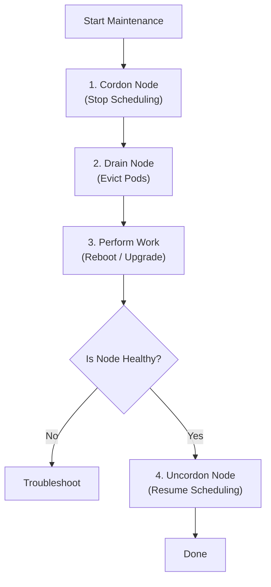

Maintenance is the most nerve-wracking part of being a Kubernetes Admin.
Unlike a standard Linux server where you just run `apt-get upgrade`, upgrading Kubernetes requires a specific dance to ensure you don't drop traffic or corrupt your database.

-----

## 1\. The "Save Game" Button (Etcd Backup)

Before you touch *anything*, back up **etcd**.
Etcd contains the state of your entire cluster. If an upgrade fails and corrupts etcd, your cluster is gone.

**The Snapshot Command:**
You typically run this on a Control Plane node.

```bash
ETCDCTL_API=3 etcdctl snapshot save snapshot.db \
  --endpoints=https://127.0.0.1:2379 \
  --cacert=/etc/kubernetes/pki/etcd/ca.crt \
  --cert=/etc/kubernetes/pki/etcd/server.crt \
  --key=/etc/kubernetes/pki/etcd/server.key
```

  * **Verify it worked:**
    `ETCDCTL_API=3 etcdctl snapshot status snapshot.db`

-----

## 2\. Upgrade Order of Operations

You cannot just upgrade everything at once. You must follow the **Version Skew Policy**.
Generally, components can lag behind, but they can never be *newer* than the API Server.

**The Strict Order:**

1.  **Primary Control Plane Node:** Upgrade the API Server & Controller Manager first.
2.  **Other Control Plane Nodes:** Upgrade the rest of the masters.
3.  **Worker Nodes:** Upgrade them one by one (or in batches).

!!! warning "The Golden Rule"
    **Never** upgrade a Kubelet (Worker Node) to a version *newer* than the API Server (Control Plane). The API Server must always be the highest version in the cluster.

-----

## 3\. Node Maintenance Workflow (Drain & Cordon)

When you need to patch the OS (e.g., kernel update) or upgrade the Kubernetes version on a specific node, you must evacuate the workloads first.

**Concept:**

1.  **Cordon:** Put up a "Do Not Enter" sign. No new pods will be scheduled here.
2.  **Drain:** Gently kick everyone out. It sends a shutdown signal to existing pods so they can finish their requests and move to another node.
3.  **Uncordon:** Open the node back up for business.

### The Visual Workflow



### The Commands

**Step 1: Evacuate**

```bash
# Safely evict all pods (respecting PodDisruptionBudgets)
kubectl drain node-01 --ignore-daemonsets --delete-emptydir-data
```

  * `--ignore-daemonsets`: Necessary because you can't "move" a DaemonSet (it lives on every node).
  * `--delete-emptydir-data`: Necessary if a pod uses local temporary storage (data will be lost).

**Step 2: Upgrade (Example: kubeadm)**

```bash
# (On the node node-01)
sudo apt-get update && sudo apt-get install -y kubeadm=1.29.0-00
sudo kubeadm upgrade node
sudo apt-get install -y kubelet=1.29.0-00 kubectl=1.29.0-00
sudo systemctl restart kubelet
```

**Step 3: Resume**

```bash
kubectl uncordon node-01
```

-----

## 4\. Certificate Rotation

If you built your cluster with `kubeadm`, the internal TLS certificates (used for components to talk to each other) expire after **1 year**.
If you forget this, your cluster will suddenly stop working one day with "x509: certificate has expired" errors.

**Check Expiration:**

```bash
kubeadm certs check-expiration
```

**Renew Certificates:**

```bash
kubeadm certs renew all
# Then restart the control plane static pods (move manifest files out and back in)
```

-----

## 5\. OS Patching

Kubernetes runs on Linux. You still need to patch the underlying OS (Ubuntu, RHEL, Rocky).

  * **Do not configure "Unattended Upgrades" to auto-reboot.**
  * If all your nodes reboot at the same time (e.g., a Tuesday night patch window), your entire cluster goes down.
  * **Best Practice:** Use a tool like **Kured (Kubernetes Reboot Daemon)**. It watches for the `/var/run/reboot-required` flag and reboots nodes *one by one*, ensuring the cluster stays healthy.

-----

## Summary

  * **Backup First:** Always snapshot etcd before an upgrade.
  * **Order Matters:** Control Plane $\rightarrow$ Workers.
  * **Drain Safely:** Use `kubectl drain` to move workloads without downtime.
  * **Watch Certs:** Remember the 1-year expiration on `kubeadm` clusters.
  * **Automate Reboots:** Use Kured to handle OS patching reboots safely.