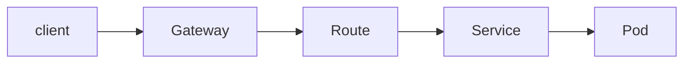
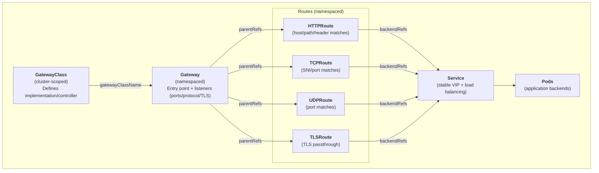
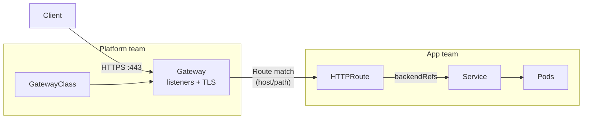
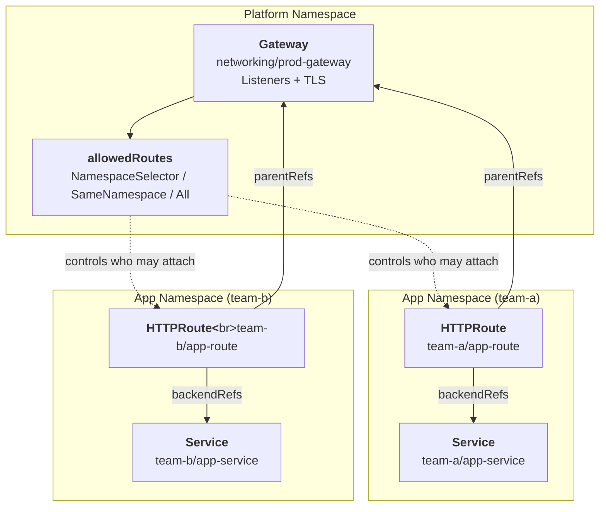

# Kubernetes Gateway API Explained
_A Modern, Extensible, and Role-Oriented Traffic Management Model_

The **Kubernetes Gateway API** is the next-generation API for managing north-south traffic into and within Kubernetes clusters. It is designed to address the structural and operational limitations of the traditional Ingress model while enabling more advanced traffic management patterns.

Gateway API is not just “Ingress v2”. It introduces a fundamentally different model built around:

- explicit infrastructure ownership
- clear separation of responsibilities
- extensibility beyond HTTP
- portability across implementations

## Why Gateway API Exists
Gateway API was designed to address many of the architectural limitations of Kubernetes Ingress, particularly around ownership, extensibility, and multi-team usage (see [Ingress](ingress/)).

Ingress succeeded because it standardized basic HTTP routing. Ingress struggled because it tried to do everything with a single resource.

### Ingress limitations
- All configuration lives in one object
- No clean separation between platform and application teams
- Annotations became de facto APIs (controller-specific, fragile)
- Poor support for advanced routing, TLS delegation, or non-HTTP protocols
- Difficult to reason about permissions and ownership
- Gateway API was created to solve these problems without breaking Kubernetes’ declarative model.

## Core Design Principles
Gateway API is built on four key ideas:

### 1. Explicit roles and ownership
- Different Kubernetes personas manage different resources:
- Platform / Infra teams manage gateways and infrastructure
- App teams manage routes
- Security teams manage policies
- This is enforced through separate resource types, not conventions.

### 2. Strong typing instead of annotations
Ingress relied heavily on controller-specific annotations.
Gateway API:

- uses typed resources
- supports portable policies
- reduces “magic strings” and implicit behavior

### 3. Protocol extensibility
Ingress is HTTP-only.
Gateway API supports:

- HTTP
- HTTPS
- TCP
- UDP
- future protocols (gRPC, custom L7)

### 4. Portable but extensible
Gateway API defines a common core, while allowing implementations to extend behavior without forking the API.

## Gateway API Resource Model
Gateway API breaks traffic management into clear, composable resources.

**High-level view**

Each layer has a distinct repsonsibility.

## GatewayClass
### What it is
GatewayClass defines which implementation backs a Gateway. Think of it as: "This Gateway is implemented by this controller."

**Example**
``` yaml
apiVersion: gateway.networking.k8s.io/v1
kind: GatewayClass
metadata:
  name: example-gateway-class
spec:
  controllerName: example.com/gateway-controller
```

### Ownership
- Created and managed by cluster operators
- Defines capabilities, defaults, and controller behavior

Applications never reference controllers directly - they reference GatewayClasses.

## Gateway
### What it is
A Gateway represents a network entry point:

- load balancer
- listener configuration
- TLS termination
- protocol bindings

It replaces the “invisible infrastructure” problem of Ingress.

**Example**
``` yaml
apiVersion: gateway.networking.k8s.io/v1
kind: Gateway
metadata:
  name: prod-gateway
  namespace: networking
spec:
  gatewayClassName: example-gateway-class
  listeners:
    - name: https
      protocol: HTTPS
      port: 443
      hostname: "*.k8s.guide"
      tls:
        mode: Terminate
        certificateRefs:
          - name: wildcard-cert
```

### Key Concepts
- Listeners define ports, protocols, and hostnames
- TLS is first-class (no annotations)
- Gateways are namespaced, but often owned by platform teams

## Routes (HTTPRoute, TCPRoute, etc.)
Routes define how traffic is routed after it enters the Gateway.

### HTTPRoute
The most common route type today.
``` yaml
apiVersion: gateway.networking.k8s.io/v1
kind: HTTPRoute
metadata:
  name: app-route
  namespace: app
spec:
  parentRefs:
    - name: prod-gateway
      namespace: networking
  hostnames:
    - "app.k8s.guide"
  rules:
    - matches:
        - path:
            type: PathPrefix
            value: /
      backendRefs:
        - name: app-service
          port: 80
```

### Important ideas
- Routes live with the application
- They reference Gateways via parentRefs
- They do not configure infrastructure

This is the clean separation Ingress never had.

### Route Types Overview
| Route Type | Purpose |
| --- | --- |
| HTTPRoute | HTTP/HTTPs traffic |
| TCPRoute | Raw TCP streams |
| UDPRoute | UDP traffic |
| TLSRoute | TLS passthrough |
| GRPCRoute | emerging support |

Each route type:

- has protocol-appropriate matching
- avoids overloading HTTP concepts where they don’t apply

### Delegation and Cross-Namespace Routing
Gateway API allows explicit delegation, instead of implicit trust.

**Example: allow app namespaces to attach routes**
``` yaml
listeners:
  - name: https
    protocol: HTTPS
    port: 443
    allowedRoutes:
      namespaces:
        from: Selector
        selector:
          matchLabels:
            expose: "true"
```

This allows:

- platform teams to control who can attach routes
- app teams to self-serve routing safely

### TLS Models
Gateway API supports multiple TLS patterns:
**TLS termination at the Gateway**

- Gateway owns certificates
- Simplest and most common

**TLS passthrough**

- Gateway forwards encrypted traffic
- Useful for:

    * mutual TLS
    * protocol-aware backends

TLS configuration is explicit and typed - not inferred.

### Policy Attachment
Gateway API introduces policy attachment, allowing reusable, targetable policies:

- timeouts
- retries
- rate limiting
- authentication
- header manipulation

Policies can attach to:

- GatewayClass
- Gateway
- Route
- Service (implementation-dependent)

This avoids duplicating logic across routes.

## How Gateway API Differs from Ingress
| Area | Ingress | Gateway API |
| --- | --- | --- |
| Ownership | Implicit | Explicit |
| Roles | Blurred | Clearly separated |
| TLS | Annotation-based | First-class |
| Extensibility | Controller hacks | API-driven |
| Protocols | HTTP only | Multi-protocol |
| Multi-team support | Weak | Strong |

Ingress still works but Gateway API is designed for scale and longevity.

## When You Should Use Gateway API
Use Gateway API if:

- multiple teams share ingress infrastructure
- you need clear ownership boundaries
- you want portable, future-proof routing
- you care about security and policy consistency

Ingress may still be fine for:

- small clusters
- single-team environments
- simple HTTP routing

### Mental Model to Keep

- **GatewayClass**: Which implementation
- **Gateway**: Where traffic enters
- **Route**: How traffic flows
- **Service**: Where traffic goes

Once that clicks, Gateway API becomes straightforward.

## Summary
Gateway API is not about adding complexity - it’s about making complexity explicit and manageable.
It reflects how Kubernetes is actually operated in real organizations:

- shared infrastructure
- multiple teams
- strong separation of concerns
- long-lived platforms

If Ingress was Kubernetes’ first draft for traffic management, Gateway API is the version written after a decade of production experience.

## Diagrams

### Gateway API Object Model


<br><br>

### Request path + role separation


<br><br>

### Delegation + allowedRoutes boundary



## Related Concepts

- [Kubernetes Services](services-networking/)
- [Network Policies](netpol/)
- [Kubernetes Security](../security/security/)
- [Ingress and HTTP Routing](ingress/)

## Further Reading
- [Official Kubernetes Gateway API documentation](https://gateway-api.sigs.k8s.io/)
