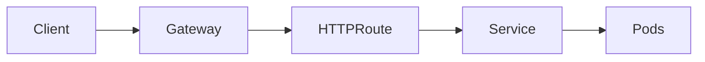
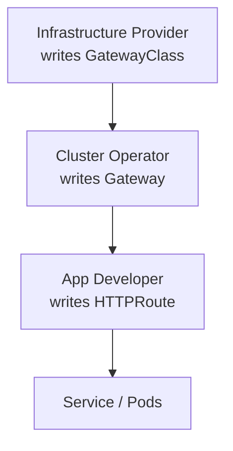

# Gateway API

Gateway API is the modern Kubernetes traffic API model for north-south and some east-west use cases.

It improves on Ingress by separating infrastructure ownership from application routing ownership.

## Core resource model

- `GatewayClass`: implementation and capability definition
- `Gateway`: network entry point and listeners
- `HTTPRoute` or other Route objects: traffic matching and backend routing


```mermaid
flowchart LR
  Client --> Gateway
  Gateway --> HTTPRoute
  HTTPRoute --> Service
  Service --> Pods
```

## Role separation model

Gateway API is designed around three distinct roles with clear ownership boundaries:


```mermaid
graph TD
    INFRA[Infrastructure Provider\nwrites GatewayClass] --> GW[Cluster Operator\nwrites Gateway]
    GW --> APP[App Developer\nwrites HTTPRoute]
    APP --> SVC[Service / Pods]
```

- **GatewayClass**: owned by the infrastructure provider (e.g. the load balancer vendor or platform team). Defines implementation capabilities.
- **Gateway**: owned by the cluster operator. Defines listeners, ports, TLS config, and which namespaces may attach routes.
- **HTTPRoute / other routes**: owned by app developers. Defines routing rules within the boundaries the Gateway permits.

This three-tier ownership model eliminates the problem Ingress has: annotations that encode implementation-specific behavior on objects the app team writes but the platform team must maintain.

## Why teams adopt Gateway API

- clear role boundaries between platform and app ownership
- typed fields instead of annotation-heavy behavior
- protocol-specific route resources (HTTP, gRPC, TCP, TLS)
- stronger cross-namespace attachment controls via `allowedRoutes`

## Minimal example

```yaml
apiVersion: gateway.networking.k8s.io/v1
kind: Gateway
metadata:
  name: public-gateway
  namespace: networking
spec:
  gatewayClassName: nginx
  listeners:
    - name: https
      protocol: HTTPS
      port: 443
      hostname: app.example.com
      tls:
        mode: Terminate
        certificateRefs:
          - kind: Secret
            name: app-example-tls
      allowedRoutes:
        namespaces:
          from: Selector
          selector:
            matchLabels:
              expose-via-gateway: "true"
---
apiVersion: gateway.networking.k8s.io/v1
kind: HTTPRoute
metadata:
  name: app-route
  namespace: app
spec:
  parentRefs:
    - name: public-gateway
      namespace: networking
  hostnames:
    - app.example.com
  rules:
    - matches:
        - path:
            type: PathPrefix
            value: /
      backendRefs:
        - name: app-service
          port: 80
```

## Cross-namespace safety

`allowedRoutes` is a key control. It defines which namespaces may attach routes to a gateway listener.

That single control prevents accidental or unauthorized route attachment in shared clusters.

### ReferenceGrant

When an HTTPRoute in one namespace needs to reference a Service in another namespace, the destination namespace must grant permission with a `ReferenceGrant`:

```yaml
apiVersion: gateway.networking.k8s.io/v1beta1
kind: ReferenceGrant
metadata:
  name: allow-app-route
  namespace: backend
spec:
  from:
    - group: gateway.networking.k8s.io
      kind: HTTPRoute
      namespace: app
  to:
    - group: ""
      kind: Service
```

Without this grant, cross-namespace backend references are rejected. This is a deliberate security boundary.

## Route types

Gateway API supports protocol-specific route resources:

| Route | Protocol | Stability |
| :--- | :--- | :--- |
| `HTTPRoute` | HTTP and HTTPS | GA (v1) |
| `GRPCRoute` | gRPC | GA (v1) |
| `TLSRoute` | TLS passthrough | Experimental |
| `TCPRoute` | Raw TCP | Experimental |

## Migration notes from Ingress

Gateway API and Ingress can coexist.

Recommended migration approach:

1. deploy controller support for Gateway API
2. migrate one hostname or route domain at a time
3. validate policy parity, TLS behavior, and observability
4. retire equivalent Ingress rules after cutover

## Operational checks

```bash
kubectl get gatewayclass
kubectl get gateways -A
kubectl get httproutes -A
kubectl describe gateway public-gateway -n networking
```

Always inspect resource status conditions. Conditions are the fastest way to spot route attachment or listener errors.

## Summary

Gateway API is a better long-term model for multi-team Kubernetes traffic management. It keeps responsibilities explicit and scales more cleanly than annotation-heavy Ingress patterns.

## Related Concepts

- [Ingress](ingress.md)
- [Services](services-networking.md)
- [Network Policies](netpol.md)
- [Security Primer](../security/security.md)

## Further Reading

- [Gateway API Project Documentation](https://gateway-api.sigs.k8s.io/)
