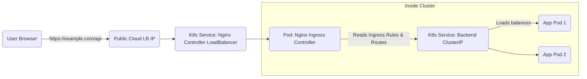

Up until now, we’ve looked at how to network Pods *inside* the cluster (ClusterIP) and crude ways to get traffic *in* (NodePort, LoadBalancer).

But what if you have a complex application? What if you want `my-app.com` to go to your frontend, and `my-app.com/api` to go to your backend? Do you need a separate expensive cloud LoadBalancer for every single service?

No. You need an **Ingress**.

Ingress is the smart receptionist for your cluster. It sits at the edge, accepts incoming HTTP/S traffic, and routes it to the correct internal backend Services based on rules you define (like hostnames or URL paths).

-----

## The "Hotel Concierge" Analogy

Think of your Kubernetes cluster as a large hotel.

1.  **Services (ClusterIP)** are the actual rooms where people stay.
2.  **NodePort/LoadBalancer** is like opening a side door directly from the street into a specific room. It works, but it’s not secure or scalable if you have 500 rooms.
3.  **Ingress** is the hotel concierge standing in the main lobby.
      * Guests arrive at the main entrance (a single public IP).
      * They approach the concierge and say, "I'm here for the Smith convention" (hostname) or "I need the restaurant" (URL path).
      * The concierge looks at their list of rules and directs the guest to the correct room number (internal Service).

Ingress operates at **Layer 7 (Application Layer)** of the OSI model, meaning it understands HTTP. It can look at headers, paths, and hostnames to make smart routing decisions.

-----

## Crucial Concept: Resource vs. Controller

This is the \#1 point of confusion for Kubernetes beginners, so let’s get it out of the way first. Ingress is a two-part system.

### 1\. The Ingress Resource (The "Rules")

This is a YAML file that you write. It is a standard Kubernetes object that defines the routing rules.

  * *"If traffic comes for `api.example.com`, send it to the `backend-service` on port 8080."*

If you only create this resource, **nothing will happen**. It's just a piece of paper with rules on it.

### 2\. The Ingress Controller (The "Implementation")

This is a piece of software (usually a Pod itself, running a reverse proxy like Nginx or Traefik) that runs in your cluster. It monitors the Kubernetes API for new Ingress Resources. When it sees one, it automatically reconfigures its own internal routing tables to make those rules reality.

**Kubernetes does not come with an Ingress Controller by default.** You must choose one and install it (usually via Helm).

**Popular Controllers:**

  * **Nginx Ingress Controller:** The community standard and most common choice.
  * **Traefik:** Popular, modern alternative.
  * **Cloud Provider specific:** (e.g., AWS ALB Ingress Controller) which turns Ingress rules into actual AWS ALBs.

-----

## How traffic flows

Here is how traffic moves from a user's browser to your application Pod. In this example, we assume you have installed the Nginx Ingress Controller.



1.  The user hits the one public IP address exposed by your cluster's Ingress Controller.
2.  The request lands on the Ingress Controller Pod (e.g., Nginx).
3.  Nginx checks the headers: "Oh, you want `example.com/api`? My rules say that goes to the `backend` service."
4.  Nginx forwards the traffic to the internal ClusterIP of the backend service.
5.  The backend service balances it to an actual application Pod.

-----

## Common Use Cases & Examples

You define Ingress rules in the `spec.rules` section of the YAML.

### 1\. Path-Based Routing (The "Fanout")

This is the most common scenario: hosting multiple microservices under one domain name, separated by URL paths.

  * `example.com/web` -\> goes to Frontend Service
  * `example.com/api` -\> goes to Backend Service

<!-- end list -->

```yaml
apiVersion: networking.k8s.io/v1
kind: Ingress
metadata:
  name: simple-fanout
spec:
  ingressClassName: nginx # Telling the Nginx controller to handle this
  rules:
  - host: example.com
    http:
      paths:
      - path: /web
        pathType: Prefix
        backend:
          service:
            name: frontend-service
            port:
              number: 80
      - path: /api
        pathType: Prefix
        backend:
          service:
            name: backend-service
            port:
              number: 8080
```

### 2\. Host-Based Routing (Virtual Hosts)

This is used when you want different domains to route to different services within the same cluster.

  * `foo.example.com` -\> Service A
  * `bar.example.com` -\> Service B

<!-- end list -->

```yaml
spec:
  rules:
  - host: foo.example.com
    http:
      paths:
      # ... points to Service A ...
  - host: bar.example.com
    http:
      paths:
      # ... points to Service B ...
```

-----

## TLS/SSL Termination

One of the biggest benefits of an Ingress is centralizing your SSL certificates.

Instead of managing certificates in every single one of your application Pods, you put the certificate in a Kubernetes Secret and tell the Ingress Controller to use it.

The Ingress Controller handles the encrypted HTTPS connection from the user, decrypts it, and sends plain HTTP to your internal backend services. This is called "TLS termination" and it offloads a lot of computational work from your app.

```yaml
spec:
  tls:
  - hosts:
      - example.com
    secretName: my-site-cert-secret # A secret containing tls.crt and tls.key
  rules:
    # ... routing rules ...
```

-----

## A Note on the Future: Gateway API

While learning Ingress is essential today, you should be aware that a new standard called the **Gateway API** is evolving to eventually replace it.

Ingress is great for simple HTTP routing, but it struggles with advanced concepts like traffic splitting (e.g., "send 10% of traffic to the canary version") or non-HTTP protocols. The Gateway API is designed to handle these complex, modern networking needs.

For now, focus on mastering Ingress, as it is still the standard for 95% of deployments.

-----

## Summary

  * **Services** (ClusterIP) provide stable networking *inside* the cluster.
  * **Ingress** is a Layer 7 router that gets traffic from *outside* to the right internal Service.
  * An **Ingress Resource** is just a list of rules (YAML).
  * You must install an **Ingress Controller** (like Nginx) to actually make those rules work.
  * Ingress is perfect for path-based routing, host-based routing, and centralizing SSL termination.

!!! tip
    If your Ingress isn't working, 90% of the time the issue isn't in your application Pod logs. Check the logs of the **Ingress Controller Pod** (e.g., in the `ingress-nginx` namespace). It will tell you if your YAML rules made sense or if it can't find the backend service.