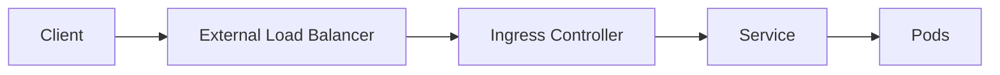

# Ingress

Ingress is an API for HTTP and HTTPS routing into cluster services.

Important distinction:

- Ingress resource: your routing rules
- Ingress controller: implementation that enforces those rules

Without a controller, Ingress objects do nothing.

## Typical traffic path


```mermaid
graph LR
  A[Client] --> B[External Load Balancer]
  B --> C[Ingress Controller]
  C --> D[Service]
  D --> E[Pods]
```

## IngressClass and controller ownership

Set `ingressClassName` so the intended controller handles your object.

Common patterns:

- one class for internet-facing traffic
- one class for internal traffic

## Ingress example

```yaml
apiVersion: networking.k8s.io/v1
kind: Ingress
metadata:
  name: app-ingress
spec:
  ingressClassName: nginx
  tls:
    - hosts:
        - app.example.com
      secretName: app-example-tls
  rules:
    - host: app.example.com
      http:
        paths:
          - path: /api
            pathType: Prefix
            backend:
              service:
                name: api-service
                port:
                  number: 8080
          - path: /
            pathType: Prefix
            backend:
              service:
                name: web-service
                port:
                  number: 80
```

## Path matching notes

- `Prefix`: best for most route trees
- `Exact`: strict path match
- `ImplementationSpecific`: controller-defined behavior, use carefully

## TLS operations

Ingress commonly terminates TLS at the controller. Certificates are referenced from Kubernetes secrets.

For managed cert lifecycle, use `cert-manager` or your platform-native certificate workflow.

## Common issues

- wrong `ingressClassName`
- backend service name or port mismatch
- no healthy endpoints behind the backend service
- DNS not pointing to controller entrypoint

## Quick debug checklist

```bash
kubectl get ingress -A
kubectl describe ingress app-ingress
kubectl get svc -A
kubectl get endpointslices -A
kubectl logs -n ingress-nginx deploy/ingress-nginx-controller
```

## Ingress vs Gateway API

Ingress remains widely used and practical for straightforward HTTP routing.

Gateway API is better when you need:

- clearer platform and app ownership boundaries
- richer policy and traffic controls
- multi-team self-service at scale

## Summary

Ingress is the standard entry point for HTTP and HTTPS in many Kubernetes platforms. Keep configuration explicit, validate controller ownership, and monitor route behavior as part of day-2 operations.

## Related Concepts

- [Services](services-networking.md)
- [Network Policies](netpol.md)
- [Gateway API](gateway-api.md)
- [Security Primer](../security/security.md)
