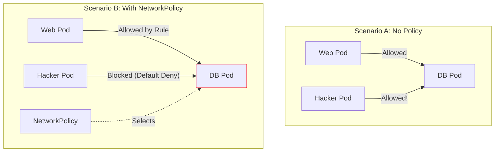

# Network Policies

By default, Kubernetes is an "Open Network."

  * Any Pod can talk to any other Pod.
  * A hacked web server in the `default` namespace can port-scan your database in the `secure` namespace.

**NetworkPolicies** are the firewall rules of Kubernetes. They let you enforce a **Zero Trust** environment where traffic is blocked unless explicitly allowed.

-----

## 1\. The "Isolation" Switch

Network Policies work differently than traditional firewalls.

1.  **No Policy:** The Pod is "Non-Isolated." It accepts traffic from anywhere.
2.  **Policy Exists:** As soon as a NetworkPolicy **selects** a Pod, that Pod becomes "Isolated."
      * It immediately blocks **ALL** traffic that isn't explicitly allowed by the policy.

### Visualizing the Switch



-----

## 2\. The "Default Deny" (Start Here)

The best practice for security is to start by **locking everything down**, and then punching holes for what you need.

This policy acts as a "Catch-All" to block all incoming and outgoing traffic for every Pod in the namespace.

```yaml
apiVersion: networking.k8s.io/v1
kind: NetworkPolicy
metadata:
  name: default-deny-all
  namespace: default
spec:
  podSelector: {} # Selects ALL pods in this namespace
  policyTypes:
    - Ingress
    - Egress
```

*Once you apply this, your application will stop working.* Now you must explicitly allow traffic.

-----

## 3\. Allow Specific Traffic (Ingress)

Let's say we want to allow our `backend` to receive traffic from the `frontend`, but nothing else.

```yaml
apiVersion: networking.k8s.io/v1
kind: NetworkPolicy
metadata:
  name: allow-frontend-to-backend
spec:
  podSelector:
    matchLabels:
      app: backend # The target (Who gets protected?)
  ingress:
    - from:
        - podSelector:
            matchLabels:
              app: frontend # The source (Who can knock?)
      ports:
        - port: 8080
          protocol: TCP
```

-----

## 4\. The "Namespace" Gotcha

A common mistake is trying to allow traffic from a different namespace using `podSelector`. **`podSelector` only works within the same namespace.**

To allow traffic from *any* Pod in the `monitoring` namespace:

```yaml
ingress:
  - from:
    - namespaceSelector:
        matchLabels:
          name: monitoring # Requires the namespace to have this label!
```

!!! warning "Label Your Namespaces!"
    `namespaceSelector` selects based on **Labels**, not the Namespace name. You must run:
    `kubectl label namespace monitoring name=monitoring`

-----

## 5\. Egress & The DNS Trap

If you block Egress (outbound traffic), **you block DNS lookups too.**
If your Pod can't reach the DNS server (CoreDNS), it can't resolve `google.com` or `my-db`, and your app will crash.

**Always allow UDP port 53 if you restrict Egress.**

```yaml
apiVersion: networking.k8s.io/v1
kind: NetworkPolicy
metadata:
  name: allow-dns-egress
spec:
  podSelector: {} # Apply to all pods
  policyTypes:
    - Egress
  egress:
    - to:
      - namespaceSelector:
          matchLabels:
            name: kube-system # Where CoreDNS lives
      ports:
        - port: 53
          protocol: UDP
        - port: 53
          protocol: TCP
```

-----

## 6\. Combining Selectors (AND vs OR)

Be careful with your YAML indentation. It changes the logic completely.

**Logic: OR (Any of these)**
Traffic allowed from `frontend` **OR** from `monitoring`.

```yaml
ingress:
  - from:
    - podSelector: { matchLabels: { app: frontend } }
    - namespaceSelector: { matchLabels: { name: monitoring } }
```

**Logic: AND (Must match BOTH)**
Traffic allowed only from a pod labeled `frontend` **running inside** the `monitoring` namespace.

```yaml
ingress:
  - from:
    - podSelector: { matchLabels: { app: frontend } }
      namespaceSelector: { matchLabels: { name: monitoring } }
```

-----

## Summary

  * **NetworkPolicies** require a CNI that supports them (Calico, Cilium, Antrea).
  * They act as a **firewall** for Pods.
  * **Default Behavior:** Allow All.
  * **Selected Behavior:** Deny Everything Else.
  * **Best Practice:** Apply a "Default Deny" policy first.
  * **Critical Gotcha:** If you block Egress, remember to **Allow DNS (Port 53)**, or nothing will work.

---

## Related Concepts

- [Kubernetes Networking](networking/)
- [Kubernetes Security](../security/security/)
- [RBAC](../security/rbac/) for access control
