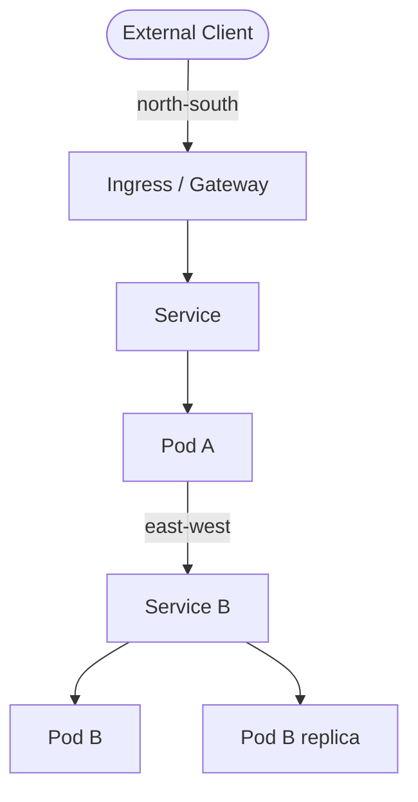

# Networking Concepts

Kubernetes networking is built on a simple model with strict expectations for connectivity and service discovery.

## Core Model

1. Every pod gets its own IP address.
2. Pods can communicate with other pods without user-managed NAT between pods.
3. Services provide stable virtual endpoints in front of changing pod backends.

Containers in the same pod share one network namespace and communicate over `localhost`.

## IP address spaces

Kubernetes uses three distinct CIDR ranges that must not overlap:

- **Node CIDR**: IP addresses assigned to nodes (from your infrastructure).
- **Pod CIDR**: IP addresses assigned to pods (e.g. `10.244.0.0/16`). The CNI plugin manages these.
- **Service CIDR**: virtual IPs assigned to Services (e.g. `10.96.0.0/12`). These exist only in iptables/eBPF rules, not routed in your network.

## Data Plane Components

Networking behavior depends on your implementation stack:

- **CNI plugin**: implements the pod network, assigns pod IPs, and handles routing between nodes. Common choices include Cilium (eBPF-based, policy-rich), Calico (BGP routing, NetworkPolicy), and Flannel (simple overlay). The CNI must support NetworkPolicy if you want policy enforcement.
- **kube-proxy**: installs iptables or IPVS rules on each node to translate Service virtual IPs to pod IPs. In eBPF-based stacks (Cilium with kube-proxy replacement), this is handled in the kernel without iptables.
- **CoreDNS**: in-cluster DNS resolver. Every Service and (when using headless services) individual pods get DNS records.

## Traffic Types



- **East-west**: traffic between workloads inside the cluster. Uses Services and DNS for discovery.
- **North-south**: traffic entering or leaving the cluster. Uses Ingress or Gateway API on top of Service backends.

## Service Discovery

Service DNS format:

```text
<service>.<namespace>.svc.cluster.local
```

Example:

```bash
nslookup api.backend.svc.cluster.local
```

## Security and Segmentation

By default, many CNIs allow broad pod-to-pod communication.

Use NetworkPolicies to explicitly control allowed ingress and egress paths between workloads.

## Practical Troubleshooting Checks

```bash
kubectl get pods -A -o wide
kubectl get svc -A
kubectl get endpointslices -A
kubectl get netpol -A
```

If DNS fails, check CoreDNS pods in `kube-system`.

## Related Networking Topics

- [Kubernetes Services](services-networking.md)
- [Ingress and HTTP Routing](ingress.md)
- [Network Policies](netpol.md)
- [Gateway API](gateway-api.md)
