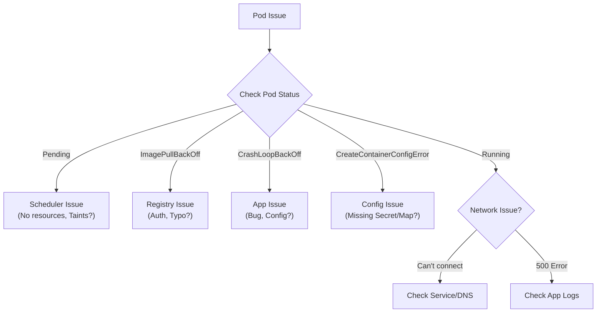

When a Pod breaks, don't guess. Follow the evidence.

Kubernetes is incredibly transparent - it almost always tells you exactly what is wrong, provided you know where to look. This guide outlines a systematic workflow for diagnosing clusters.

-----

## The Triage Flowchart

Before running random commands, mentally locate where the failure is occurring.



-----

## Phase 1: The "Big Three" Commands

In 90% of cases, you can solve the problem using just these three commands in order.

### 1\. `kubectl describe pod <name>`

**The "Crime Scene Report".**
This tells you *what Kubernetes thinks* happened. Look at the **Events** section at the bottom.

  * *Did the scheduler fail to find a node?*
  * *Did the Liveness probe fail?*
  * *Did the volume fail to mount?*

### 2\. `kubectl logs <name>`

**The "Victim's Last Words".**
This shows the application's standard output (stdout).

  * *Did the app throw a Python stack trace?*
  * *Did it say "Database Connection Refused"?*

!!! tip "Pro Tip"
    If your pod is in a restart loop, `kubectl logs` might show you the *current* (empty) container starting up. To see why the *last* one died, use:
    `kubectl logs my-pod --previous`

### 3\. `kubectl get pod <name> -o yaml`

**The "Blueprint".**
Check the configuration.

  * *Did you typo the ConfigMap name?*
  * *Are you pulling the `latest` tag by accident?*
  * *Did you verify the `command` arguments?*

-----

## Phase 2: Decoding Common States

| State | Translation | Where to look |
| :--- | :--- | :--- |
| **Pending** | "I'm waiting for a home." The Scheduler cannot find a node that fits this Pod (CPU/Mem limits, Taints, or Affinity). | `kubectl describe pod` |
| **ImagePullBackOff** | "I can't get the package." The registry path is wrong, the tag doesn't exist, or you forgot the `imagePullSecret`. | `kubectl describe pod` |
| **CrashLoopBackOff** | "I started, but I died immediately." The app is buggy or misconfigured. | `kubectl logs` |
| **CreateContainerConfigError** | "I can't find my keys." You referenced a Secret or ConfigMap that doesn't exist. | `kubectl describe pod` |
| **OOMKilled** | "I ate too much." The app used more RAM than the `limit` allowed. | `kubectl get pod` (Look for Exit Code 137) |

-----

## Phase 3: Advanced Debugging Tools

Sometimes logs aren't enough. You need to get inside.

### 1\. `kubectl exec` (The Standard Way)

If the Pod is running (e.g., a web server that is returning 500 errors), jump inside to poke around.

```bash
kubectl exec -it my-pod -- /bin/sh
# Inside:
# curl localhost:8080
# cat /etc/config/app.conf
```

### 2\. `kubectl debug` (The Modern Way)

**Use this when:** The Pod is crashing (`CrashLoopBackOff`) or is a "Distroless" image (has no shell/bash installed).

`kubectl debug` spins up a *new* container attached to the broken Pod. It shares the process namespace but brings its own tools.

```bash
# Attach a "busybox" container to your broken "my-app" pod
kubectl debug -it my-app --image=busybox --target=my-app-container
```

### 3\. Networking Debugging

If Service A can't talk to Service B:

1.  **Check DNS:** `nslookup my-service` (Does it return an IP?)
2.  **Check Service Selector:** Does the Service actually point to any pods?
      * `kubectl get endpoints my-service` (If this is empty, your labels are wrong).

-----

## Phase 4: Exit Codes (The Cheat Sheet)

Computers speak in numbers. Here is how to translate them.

| Code | Meaning | Likely Cause |
| :--- | :--- | :--- |
| **0** | Success | The process finished its job and exited. (Normal for Jobs, bad for Deployments). |
| **1** | Application Error | Generic app crash. Check logs. |
| **137** | **SIGKILL (OOM)** | Out of Memory. Increase memory `limits`. |
| **143** | SIGTERM | Kubernetes asked the Pod to stop (normal during scale-down). |
| **255** | Node Error | The Node itself failed (disk full, network partition). |

-----

## Summary

1.  **Don't Panic.** Read the status.
2.  **Events First:** Always run `kubectl describe` before anything else.
3.  **Logs Second:** Check `kubectl logs` (and `--previous`).
4.  **Validate Config:** Ensure Secrets/ConfigMaps exist before the Pod starts.
5.  **Use `debug`:** Learn `kubectl debug` for difficult crashes.

!!! tip
    **The "Rubber Duck" Method**
    
    If you are stuck, read the `kubectl describe` output out loud line-by-line. You will almost always find the error staring you in the face (e.g., `MountVolume.SetUp failed for volume "secret-key": secret "my-secret" not found`).

---

## Related Concepts

- [Pods and Deployments](../workloads/pods-deployments/)
- [Kubernetes Networking](../networking/networking/)
- [Kubernetes Security](../security/security/)
