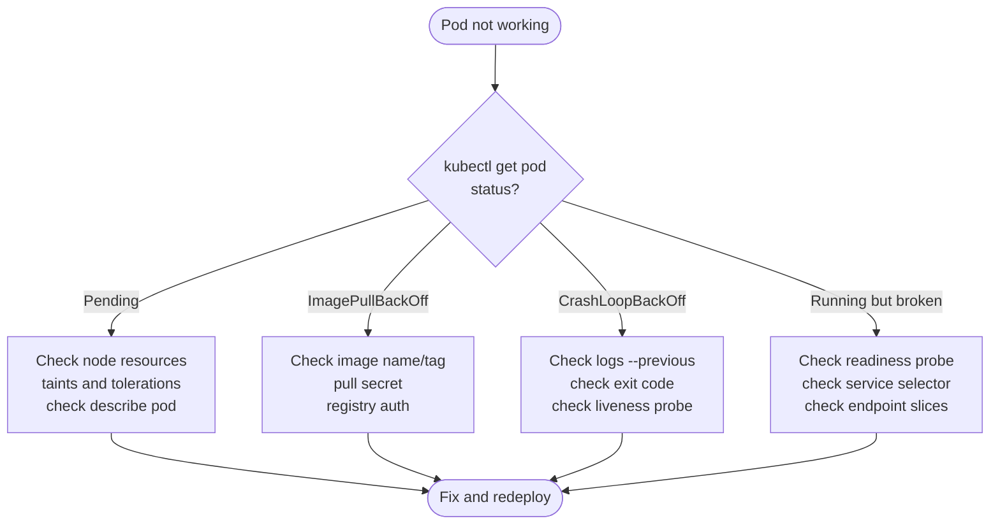

# Troubleshooting

Reliable Kubernetes troubleshooting is a workflow, not a command list.

Start with symptoms, follow evidence, and narrow the failure domain quickly.

## Triage sequence


```mermaid
flowchart TD
    START([Pod not working]) --> STATUS{kubectl get pod\nstatus?}
    STATUS -->|Pending| PEND[Check node resources\ntaints and tolerations\ncheck describe pod]
    STATUS -->|ImagePullBackOff| IMG[Check image name/tag\npull secret\nregistry auth]
    STATUS -->|CrashLoopBackOff| CRASH[Check logs --previous\ncheck exit code\ncheck liveness probe]
    STATUS -->|Running but broken| CONN[Check readiness probe\ncheck service selector\ncheck endpoint slices]
    PEND --> FIX([Fix and redeploy])
    IMG --> FIX
    CRASH --> FIX
    CONN --> FIX
```

Detailed sequence:

1. Identify failing object type and status.
2. Inspect events and controller messages (`kubectl describe`).
3. Inspect application and sidecar logs (`kubectl logs --previous` for crashed containers).
4. Validate config references and runtime environment (secrets, configmaps, volumes).
5. Test service connectivity and DNS paths.

## First-response commands

```bash
kubectl get pods -A
kubectl describe pod <pod-name> -n <namespace>
kubectl logs <pod-name> -n <namespace> --all-containers
kubectl logs <pod-name> -n <namespace> --all-containers --previous
kubectl get events -A --sort-by=.metadata.creationTimestamp
```

## Common status patterns

| State | Typical cause | First check |
| :--- | :--- | :--- |
| `Pending` | scheduler cannot place pod | `describe pod` for resource or taint constraints |
| `ImagePullBackOff` | image path, tag, or auth issue | image name, pull secret, registry permissions |
| `ErrImagePull` | transient or permanent pull failure | registry reachability, rate limits |
| `CrashLoopBackOff` | process exits repeatedly | `logs --previous`, exit code, liveness probe |
| `CreateContainerConfigError` | missing config or secret | referenced ConfigMap or Secret existence |
| `OOMKilled` | memory limit exceeded | resource settings and memory usage trend |
| `Terminating` stuck | finalizer blocking deletion | `kubectl get pod -o yaml` for finalizers |

`CrashLoopBackOff` uses exponential backoff: 10s, 20s, 40s, 80s, 160s, then 5 minutes (capped). This means a crashing pod can be slow to recover even after you fix the root cause.

## Network diagnosis flow

```bash
kubectl get svc -n <namespace>
kubectl get endpointslices -n <namespace>
kubectl exec -it <pod-name> -n <namespace> -- nslookup <service>
kubectl exec -it <pod-name> -n <namespace> -- wget -qO- http://<service>:<port>
```

If service has no endpoints, verify selector labels and readiness state of backend pods.

## Debugging running containers

Use `kubectl exec` for interactive inspection. For minimal images or crash loops, use ephemeral debug containers:

```bash
kubectl debug -it <pod-name> -n <namespace> --image=busybox:1.36 --target=<container-name>
```

## Control plane and node checks

```bash
kubectl get nodes
kubectl describe node <node-name>
kubectl top nodes
kubectl top pods -A
```

For node pressure or kubelet issues, inspect node conditions and recent events.

## Incident habits that reduce MTTR

- document exact failing timestamp and first observed symptom
- capture commands and outputs in a runbook timeline
- avoid changing multiple variables at once during diagnosis
- confirm recovery with objective service checks

## Summary

Effective Kubernetes troubleshooting depends on sequence and discipline. Start with status and events, then move to logs, configuration, and connectivity checks in a controlled order.

## Related Concepts

- [Pods and Deployments](../workloads/pods-deployments.md)
- [Networking Overview](../networking/networking.md)
- [Security Primer](../security/security.md)
