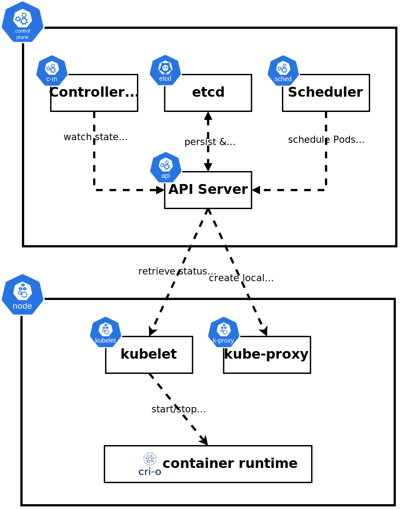

## Introduction to Kubernetes

Kubernetes, often referred to as K8s, is an open-source platform designed to automate deploying, scaling, and operating application containers. It was originally developed by Google and is now maintained by the Cloud Native Computing Foundation (CNCF). This section covers the essentials to get you up to speed with Kubernetes, its architecture, and its key features. Think of this as a one-pager or TLDR of Kubernetes.

## What is Kubernetes?

Kubernetes is a container orchestrator, which means it manages the deployment and operation of containerized applications. Containers are lightweight, portable units that bundle an application and its dependencies, allowing them to run consistently across different environments. Kubernetes automates several tasks:

- **Deployment:** Seamlessly deploys applications by creating and managing containers.
- **Scaling:** Adjusts the number of application instances based on demand, ensuring efficient use of resources.
- **Self-healing:** Detects and replaces failed instances to maintain application availability.
- **Rolling Updates and Rollbacks:** Updates applications without downtime and rolls back if needed to a previous version if something goes wrong.

<h3>Declarative Model</h3>

Kubernetes operates on a declarative model, where you specify the desired state of the system in YAML or JSON configuration files. The system continuously works to ensure the observed state matches the desired state. This involves three key principles:

1. **Observed State:** The current state of the system.
2. **Desired State:** The state you want the system to achieve.
3. **Reconciliation:** The process of adjusting the observed state to match the desired state.

The declarative nature of Kubernetes is key to understanding its power. At a high level, here's how it works:

1. You *tell* Kubernetes (typically via `kubectl`) how you want your application to look—what image to use, how many replicas, ports to expose, etc.
2. Kubernetes persists this desired state to the cluster store (etcd).
3. A series of background controllers consistently check if the current state matches the desired state.
4. If the current state does not equal the desired state (e.g., you desire 3 replicas but only 2 are currently running),
5. Kubernetes initiates a series of actions to reconcile the two states. In this example, it would involve spinning up an additional replica.

## Historical Background

Kubernetes was born from Google's internal systems like Borg and Omega, which managed containerized applications like Search and Gmail at a massive scale. In 2014, Google open-sourced Kubernetes, and it quickly became *the* standard for container orchestration.

## Kubernetes Architecture

From a 20K-foot level, Kubernetes clusters consist of two types of nodes - **control plane** nodes and **worker** nodes:

- **Control Plane Nodes:** These nodes run the Kubernetes control plane, which includes components like the API server, scheduler, and controllers. They manage the overall state of the cluster.
- **Worker Nodes:** These nodes run the applications and report back status to the control plane.

<h3>Components of the Control Plane</h3>

- **API Server:** The front end of Kubernetes that exposes the Kubernetes API. All traffic within, to, and from various Kubernetes components flows through the API Server. It is the Grand Central Station or central nervous system of Kubernetes.
- **Cluster Store:** A distributed database (etcd) that stores the entire state of the cluster. When you define your desired application specifications, they are stored here. This is the only *stateful* core component of Kubernetes.
- **Controllers:** Ensure the cluster's desired state matches its observed state by running background watch loops on objects like Deployments, Pods, etc.
- **Scheduler:** Assigns tasks to worker nodes based on resource availability, application requirements, and other criteria.

<h3>Components of Worker Nodes</h3>

- **Kubelet:** The agent that communicates with the API server and manages containers on the node. The kubelet communicates directly with the container runtime on the node, instructing it to pull images, and start/stop containers.
- **Container Runtime:** Executes container operations like starting and stopping containers. Common runtimes include containerd and CRI-O.
- **Kube-proxy:** Manages networking for containers, including load balancing.

!!! info "Note"
    The API Server is the **only** component in Kubernetes that interacts directly with etcd.

## Common Features Primer

<h3>Pods and Deployments</h3>

- **Pods:** The smallest deployable units in Kubernetes, which can contain one or more containers. Containers within Pods share resources like network and storage.
- **Deployments:** Higher-level controllers that manage Pods, providing features like scaling, rolling updates, and rollbacks.

<h3>Services</h3>

Services provide stable networking endpoints for Pods, enabling reliable communication between different parts of an application. They abstract away the ephemeral nature of Pods, which can be created and destroyed dynamically, and give you a stable, long-lived connection point to the underlying Pods.

<h3>Self-Healing and Scaling</h3>

If deployed as part of a Deployment or StatefulSet, Kubernetes will automatically replace failed Pods and scale your application up or down based on traffic, load, or other custom thresholds. This ensures high availability and efficient resource utilization.

<h3>Rolling Updates and Rollbacks</h3>

By leveraging [Deployments](https://kubernetes.io/docs/concepts/workloads/controllers/deployment/) (via [ReplicaSets](https://kubernetes.io/docs/concepts/workloads/controllers/replicaset/)), Kubernetes allows you to update your application without downtime by gradually replacing old Pods with new ones. If something goes wrong, Kubernetes can roll back to the previous version.

## Summary

Kubernetes is a powerful tool for managing containerized applications, offering automation, scalability, and reliability. By abstracting the underlying infrastructure, it simplifies application deployment and management across various environments. Whether you're running on-premises or in the cloud, Kubernetes provides a consistent and efficient platform for your applications. Before diving into some more details on these topics, let's first cover how you can quickly get your hands on a Kubernetes environment in the next section.