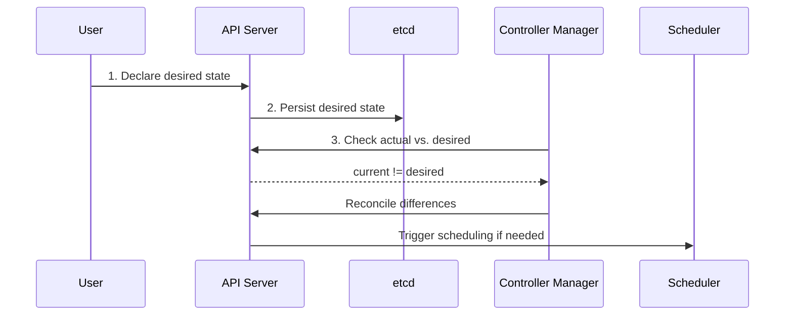

## Introduction to Kubernetes

Kubernetes, often referred to as K8s, is an open-source platform designed to automate deploying, scaling, and operating application containers. Originally developed by Google, it is now maintained by the Cloud Native Computing Foundation (CNCF). This section provides an essential overview of Kubernetes, its architecture, and key features to get you started.

## What is Kubernetes?

Kubernetes is a powerful container orchestrator that manages the deployment and operation of containerized applications. Containers are lightweight, portable units that bundle an application and its dependencies, allowing them to run consistently across different environments. Kubernetes automates several tasks:

- **Deployment:** Seamlessly deploys applications by creating and managing containers.
- **Scaling:** Adjusts the number of application instances based on demand, ensuring efficient use of resources.
- **Self-healing:** Detects and replaces failed instances to maintain application availability.
- **Rolling Updates and Rollbacks:** Updates applications without downtime and rolls back to a previous version if needed.

## Key Concepts of Kubernetes

<h3>Declarative Model</h3>

Kubernetes operates on a declarative model, where you specify the desired state of the system in YAML or JSON configuration files. The system continuously works to ensure the observed state matches the desired state. This involves three key principles:

1. **Observed State:** The current state of the system.
2. **Desired State:** The state you want the system to achieve.
3. **Reconciliation:** The process of adjusting the observed state to match the desired state.

The declarative nature of Kubernetes is key to understanding its power. At a high level, here's how it works:

1. You *tell* Kubernetes (typically via `kubectl`) how you want your application to look—what image to use, how many replicas, ports to expose, etc.
2. Kubernetes persists this desired state to the cluster store (etcd).
3. A series of background controllers consistently check if the current state matches the desired state.
4. If the current state does not equal the desired state (e.g., you desire 3 replicas but only 2 are currently running), the API Server is notified and,
5. Kubernetes initiates actions to reconcile the two states.

<h3>Declarative Approach in Kubernetes</h3>

Kubernetes uses a declarative approach to manage resources. This means you define the desired state of the system and Kubernetes works to maintain that state.

This diagram illustrates how Kubernetes manages resources declaratively, ensuring the system's state aligns with the user's specifications.

<h3>Kubernetes Architecture</h3>

Kubernetes architecture consists of several key components:

- **API Server:** The front-end for the Kubernetes control plane, handling all REST operations.
- **etcd:** A consistent and highly-available key-value store used as Kubernetes' backing store for all cluster data.
- **Scheduler:** Assigns workloads to nodes based on resource availability.
- **Controller Manager:** Runs controllers to regulate the state of the cluster.
- **Kubelet:** Ensures containers are running in a Pod on each node.

<h3>Services</h3>

Services provide stable networking endpoints for Pods, enabling reliable communication between different parts of an application. They abstract away the ephemeral nature of Pods, which can be created and destroyed dynamically, and give you a stable, long-lived connection point to the underlying Pods.

## Historical Background

Kubernetes was born from Google's internal systems like Borg and Omega, which managed containerized applications like Search and Gmail at a massive scale. In 2014, Google open-sourced Kubernetes, and it quickly became *the* standard for container orchestration.

## Common Features Primer

<h3>Pods and Deployments</h3>

- **Pods:** The smallest deployable units in Kubernetes, which can contain one or more containers. Containers within Pods share resources like network and storage.
- **Deployments:** Higher-level controllers that manage Pods, providing features like scaling, rolling updates, and rollbacks.

<h3>Self-Healing and Scaling</h3>

If deployed as part of a Deployment or StatefulSet, Kubernetes will automatically replace failed Pods and scale your application up or down based on traffic, load, or other custom thresholds. This ensures high availability and efficient resource utilization.

<h3>Rolling Updates and Rollbacks</h3>

By leveraging [Deployments](https://kubernetes.io/docs/concepts/workloads/controllers/deployment/) (via [ReplicaSets](https://kubernetes.io/docs/concepts/workloads/controllers/replicaset/)), Kubernetes allows you to update your application without downtime by gradually replacing old Pods with new ones. If something goes wrong, Kubernetes can roll back to the previous version.

## Summary

Kubernetes is a powerful tool for managing containerized applications, offering automation, scalability, and reliability. By abstracting the underlying infrastructure, it simplifies application deployment and management across various environments. Whether you're running on-premises or in the cloud, Kubernetes provides a consistent and efficient platform for your applications. Before diving into some more details on these topics, let's first cover how you can quickly get your hands on a Kubernetes environment in the next section.