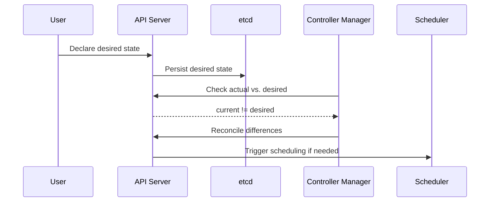

---
hide:
  - navigation
  - toc
---

<h2>Introduction to Kubernetes</h2>

Kubernetes (K8s) is like the air traffic controller for your applications—making sure everything is running, scaling, and healing automatically. Originally created by Google and now maintained by the CNCF, Kubernetes helps you run containers (small, portable application units) across clusters of computers.

<h2>What is Kubernetes?</h2>

Kubernetes is a platform that automates the deployment, scaling, and management of containerized applications. Think of it as an operating system for your data center, making sure your apps are always running the way you want.

**Key things Kubernetes does for you:**
- <strong>Deployment</strong>: Launches and manages containers for your apps.
- <strong>Scaling</strong>: Adds or removes copies of your app as needed.
- <strong>Self-healing</strong>: Restarts or replaces containers if they fail.
- <strong>Rolling Updates/Rollbacks</strong>: Updates your app with zero downtime and can revert if something goes wrong.

<h2>Key Concepts of Kubernetes</h2>

<h3>Declarative Model</h3>
Kubernetes uses a "declarative" approach: you describe how you want your system to look, and Kubernetes works to make it so—automatically.

**Three key ideas:**

1. <strong>Observed State</strong>: What’s actually running right now.
2. <strong>Desired State</strong>: What you want running (defined in YAML or JSON).
3. <strong>Reconciliation</strong>: Kubernetes constantly checks and adjusts to make observed = desired.

**How it works:**
- You tell Kubernetes (with `kubectl` or a YAML file) what you want.
- Kubernetes saves this in its database (etcd).
- Controllers keep checking: does reality match what you asked for?
- If not, Kubernetes takes action to fix it.

<h3>Declarative Approach in Kubernetes</h3>

You define what you want, Kubernetes keeps it that way. Here’s a visual summary:

> <strong>Tip:</strong> Most real-world Kubernetes work is about describing the desired state in YAML files.

This diagram illustrates how Kubernetes manages resources declaratively, ensuring the system's state aligns with the user's specifications.

<h3>Kubernetes Architecture</h3>

Kubernetes architecture consists of several key components:

- **API Server:** The front-end for the Kubernetes control plane, handling all REST operations.
- **etcd:** A consistent and highly-available key-value store used as Kubernetes' backing store for all cluster data.
- **Scheduler:** Assigns workloads to nodes based on resource availability.
- **Controller Manager:** Runs controllers to regulate the state of the cluster.
- **Kubelet:** Ensures containers are running in a Pod on each node.

<h3>Services</h3>

Services provide stable networking endpoints for Pods, enabling reliable communication between different parts of an application. They abstract away the ephemeral nature of Pods, which can be created and destroyed dynamically, and give you a stable, long-lived connection point to the underlying Pods.

## Historical Background

Kubernetes was born from Google's internal systems like Borg and Omega, which managed containerized applications like Search and Gmail at a massive scale. In 2014, Google open-sourced Kubernetes, and it quickly became *the* standard for container orchestration.

## Common Features Primer

<h3>Pods and Deployments</h3>

- **Pods:** The smallest deployable units in Kubernetes, which can contain one or more containers. Containers within Pods share resources like network and storage.
- **Deployments:** Higher-level controllers that manage Pods, providing features like scaling, rolling updates, and rollbacks.

<h3>Self-Healing and Scaling</h3>

If you use a Deployment or StatefulSet, Kubernetes will:
- Replace failed Pods automatically
- Scale your app up or down based on demand
- Keep your app highly available and efficient

<h3>Rolling Updates and Rollbacks</h3>

With <a href="https://kubernetes.io/docs/concepts/workloads/controllers/deployment/">Deployments</a>, Kubernetes can update your app with zero downtime—gradually swapping out old Pods for new ones. If a problem is detected, it can roll back to the previous version automatically.

---

<h2>Summary</h2>
Kubernetes is all about automation, reliability, and making sure your apps run the way you want. By describing your desired state, Kubernetes does the heavy lifting to keep everything running smoothly—so you can focus on building, not babysitting, your infrastructure.

Kubernetes is a powerful tool for managing containerized applications, offering automation, scalability, and reliability. By abstracting the underlying infrastructure, it simplifies application deployment and management across various environments. Whether you're running on-premises or in the cloud, Kubernetes provides a consistent and efficient platform for your applications. Before diving into some more details on these topics, let's first cover how you can quickly get your hands on a Kubernetes environment in the next section.