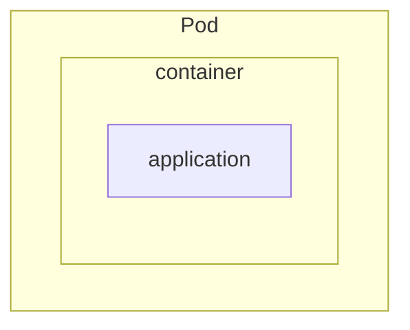

# Pods & Deployments

Pods and Deployments are two of the most essential workload primitives in Kubernetes. Understanding their roles and differences is foundational for working with containerized workloads.

---

## Pods (Core Execution Unit)

A **Pod** is the smallest deployable unit in Kubernetes. It wraps one or more containers that:

- Share the same **network namespace** (they communicate over `localhost`)
- Can share **volumes**
- Are scheduled and executed together on the same node

Most Pods run a **single container**, but Kubernetes allows multi-container Pods when containers need to be tightly coupled.

### Pod Structure



---

### Multi-Container Pods

Multi-container Pods are used in scenarios like sidecars (e.g. logging agents, proxies) or helper containers that share resources.

  


---

### Minimal Pod Example

```yaml
kind: Pod
spec:
  containers:
    - name: app
      image: nginx
```

Pods are **ephemeral** — they are not automatically replaced if they crash unless managed by a controller.

---

## Deployments (Lifecycle + Scaling)

A **Deployment** manages a ReplicaSet, which ensures that a specified number of Pods are running at all times. It enables:

- **Declarative replica management**
- **Rolling updates and rollbacks**
- **Self-healing**: dead Pods are replaced automatically

### Minimal Deployment Example

```yaml
kind: Deployment
spec:
  replicas: 2
  template:
    spec:
      containers:
        - name: app
          image: nginx
```

---

## Pod vs Deployment: Quick Comparison

| Feature         | Pod             | Deployment          |
|------------------|------------------|-----------------------|
| Use case         | Debug, sidecars  | Production workloads  |
| Scales automatically | ❌              | ✅                     |
| Replaces failed Pod | ❌              | ✅                     |
| Rolling updates   | ❌              | ✅                     |
| Manages replicas   | ❌              | ✅                     |

---

## Summary

- Use **Pods** for simple or coupled workloads (e.g. sidecars).
- Use **Deployments** for scalable, self-healing applications with rolling updates.
- Avoid managing standalone Pods in production — Deployments are the standard controller for most apps.