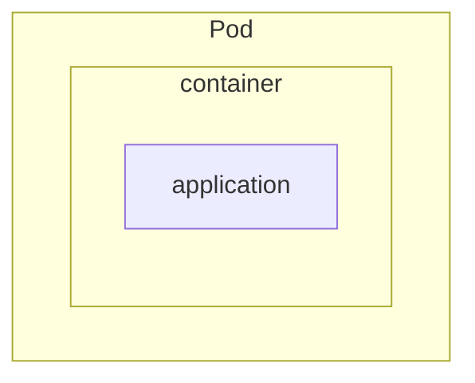

<h1>Pods & Deployments</h1>

Kubernetes runs everything inside a Pod, but in real-world production, you rarely manage Pods directly. Instead, you use Deployments to automate, heal, and update your applications.

---

<h2>What is a Pod?</h2>

A <strong>Pod</strong> is the smallest unit you can deploy in Kubernetes. It wraps one or more containers that:

- Share the same <strong>network</strong> (IP and ports)
- Can share <strong>storage</strong>
- Are managed as a single unit

Most Pods have just one container, but sometimes you need tightly-coupled containers together (like a main app and a helper/sidecar).

<strong>Key traits:</strong>

- Pods are short-lived and disposable.
- If a Pod crashes, it won’t restart by itself (unless managed by something higher-level).
- Pods stick to the Node they’re scheduled on until they die.

---

<h2>What is a Deployment?</h2>

A <strong>Deployment</strong> is a manager for your Pods. It ensures the right number are running, replaces them if they fail, and allows you to update your app with zero downtime.

<strong>With Deployments, you get:</strong>

- Automated management of Pod replicas
- Rolling updates and safe rollbacks
- Automatic replacement of failed Pods
- Easy version control for your app

You describe your desired state in a YAML file, and Kubernetes makes it happen.

---

<h2>Relationship Between Pods and Deployments</h2>

Think of a Pod as a coffee machine in a busy café. It makes drinks, does its job, and eventually wears out or breaks.

Now imagine the Deployment as the café manager:

- They make sure there are always enough coffee machines running.
- If one breaks, they replace it.
- If demand increases, they bring in more.
- If an update to the machine model is needed, they roll them out gradually and safely.

So while a **Pod** is the worker, the **Deployment** manages the workforce and ensures consistency, scalability, and resiliency over time.

**A Deployment always manages Pods** - you typically never run a Deployment without Pods.

When you apply a Deployment spec:

1. Kubernetes creates a **ReplicaSet**.
2. The ReplicaSet creates the desired number of **Pods**.
3. If any Pod dies, the ReplicaSet spawns a replacement.

---

<h2>When to Use What?</h2>

<strong>Use Pods directly:</strong>

- For quick experiments or debugging
- One-off tasks (but consider <code>Job</code> for this)
- Learning and testing

<strong>Use Deployments:</strong>

- Always use for production workloads
- When you want automatic healing, scaling, and updates
- For anything that needs to run reliably over time

!!! tip

    In almost all cases, use Deployments for your applications. Pods alone are for special situations.

---

<h2>Summary</h2>
<ul>
<li><strong>Pods</strong> are the basic building block, but not self-healing or scalable on their own.</li>
<li><strong>Deployments</strong> manage Pods, giving you automation, scaling, and reliability.</li>
<li>For production, always use Deployments.</li>
</ul>