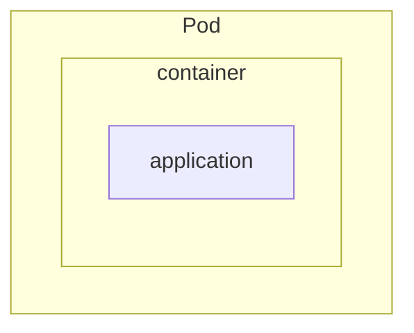

## Introduction to Kubernetes Pods

In Kubernetes, every application runs inside a Pod. Understanding how to work with Pods is crucial for deploying, scaling, and managing applications effectively.

<h3>Pod Fundamentals</h3>

Pods are the smallest deployable units in Kubernetes and serve as an abstraction layer, allowing various types of workloads to run seamlessly. They enable resource sharing, advanced scheduling, health monitoring, and more.

<h4>Abstraction and Benefits</h4>

Pods abstract the complexities of different workload types, enabling Kubernetes to manage them without needing to understand the specifics of each workload. This abstraction allows for uniform deployment and management across heterogeneous environments.

<h4>Enhancements and Capabilities</h4>

Pods offer several enhancements for containers, including:

- **Resource Sharing:** Shared filesystem, network stack, memory, process tree, and hostname.
- **Advanced Scheduling:** Features like nodeSelectors, affinity rules, topology spread constraints, resource requests, and limits.
- **Health Monitoring and Restart Policies:** Probes for application health and policies for container restarts.
- **Security and Termination Control:** Enhanced security measures and graceful shutdown processes.
- **Volumes:** Shared storage among containers within a Pod.

<br>



In the image above, you can have any sort of application running (Python, Java, MySQL, LLM, etc.), but once containerized and wrapped in a Pod, Kubernetes treats them all the same and doesn't have to worry about the details of how each application is written or works.

<br>

<h4>Detailed Pod Lifecycle</h4>

- **Pending:** The Pod has been accepted by the Kubernetes system, but one or more of the container images has not been created. This includes time before being scheduled as well as time spent downloading images over the network, which could take a while.
- **Running:** The Pod has been bound to a node, and all of the containers have been created. At least one container is still running, or is in the process of starting or restarting.
- **Succeeded:** All containers in the Pod have terminated in success, and will not be restarted.
- **Failed:** All containers in the Pod have terminated, and at least one container has terminated in failure. That is, the container either exited with non-zero status or was terminated by the system.
- **Unknown:** For some reason the state of the Pod could not be obtained, typically due to an error in communicating with the host of the Pod.

<h3>Multi-Container Pods</h3>
Multi-container Pods follow the single responsibility principle, where each container performs a distinct role. Some example use cases for this pattern include:

- **Init Containers:** Prepare the environment before application containers start.
- **Sidecar Containers:** Provide auxiliary services alongside the main application container.

One common example is to use a multi-container Pod for service meshes. In these scenarios, a sidecar container acts as an SSL termination point for all traffic coming into the main Pod.

Multiple containers within a Pod share the same IP address, network stack, and filesystem. As such, to communicate with specific containers within a multi-container Pod, you have to leverage port addresses. The containers themselves, however, will be able to communicate with each other via localhost.


## Kubernetes Deployments

Deployments in Kubernetes provide powerful capabilities for managing stateless applications. They enable features like self-healing, scaling, rolling updates, and versioned rollbacks, making it easier to maintain robust and scalable applications.

<h3>Key Concepts of Deployments</h3>

A Deployment in Kubernetes is a resource that manages a set of identical Pods, ensuring they are up and running as specified. Deployments provide a declarative way to manage updates and scaling of applications.

<h4>Why Use Deployments?</h4>

Deployments add several benefits to managing applications:

- **Self-Healing:** Automatically replaces failed Pods.
- **Scaling:** Adjusts the number of running Pods based on demand.
- **Rolling Updates:** Updates Pods without downtime.
- **Rollbacks:** Easily revert to previous versions if something goes wrong.

<h4>Deployment Strategies</h4>

- **Recreate:** Terminates all existing Pods before creating new ones.
- **Rolling Update:** Gradually replaces Pods one by one to avoid downtime.

<h4>Detailed Deployment Process</h4>

1. **Create a Deployment:** Define your Deployment in a YAML file and use `kubectl apply` to create it.
2. **Monitor the Deployment:** Use `kubectl get deployments` to check the status and ensure it's running as expected.
3. **Update the Deployment:** Modify the YAML file and apply changes using `kubectl apply`.
4. **Rollback if Necessary:** Use `kubectl rollout undo` to revert to a previous version if needed.

## Creating and Managing Deployments

You can create a Deployment using a YAML file that specifies the configuration.

**Example YAML for Deployment:**

```yaml
apiVersion: apps/v1
kind: Deployment
metadata:
  name: example-deployment
spec:
  replicas: 3
  selector:
    matchLabels:
      app: example
  template:
    metadata:
      labels:
        app: example
    spec:
      containers:
      - name: example
        image: nginx
```

This configuration creates a Deployment that manages 3 replicas of an Nginx Pod.
