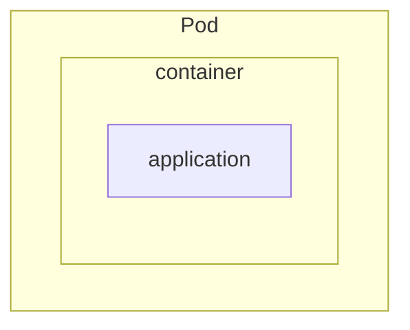

# Pods & Deployments

In Kubernetes, **Pods** are the foundational execution units—everything runs in a Pod. But on their own, Pods aren't typically used directly in production environments. Instead, **Deployments** manage Pods to provide automation, self-healing, and declarative updates.

---

## What is a Pod?

A **Pod** is the smallest deployable unit in Kubernetes. It represents one or more containers that share:

- The same **network namespace** (IP address and port space).
- A shared **storage volume** (if defined).
- The same **lifecycle** (they are scheduled and managed together).

Typically, a Pod contains a **single container**, but multi-container Pods are used when tightly coupled containers need to share resources, such as a sidecar pattern.

**Key traits of Pods**:

- Pods are ephemeral and disposable.
- Pods do not self-heal if they crash or are evicted.
- Pods are bound to a specific Node until terminated.

---

## What is a Deployment?

A **Deployment** is a higher-level Kubernetes resource that manages a ReplicaSet, which in turn manages the lifecycle of multiple identical Pods.

With Deployments, you get:

- Declarative management of Pod replicas
- Rolling updates and rollbacks
- Auto-replacement of failed Pods
- Declarative versioning of your app

You define the desired state in a `Deployment` YAML file, and the Kubernetes control plane ensures that the running state matches it.

---

## Relationship Between Pods and Deployments

Think of it this way:

- A **Pod** is like a single soldier.
- A **Deployment** is the commanding officer ensuring there are always a certain number of those soldiers available, healthy, and working.

**A Deployment always manages Pods**—you never run a Deployment without Pods.

When you apply a Deployment spec:

1. Kubernetes creates a **ReplicaSet**.
2. The ReplicaSet creates the desired number of **Pods**.
3. If any Pod dies, the ReplicaSet spawns a replacement.

---

## When to Use What?

- **Use Pods directly**:
  - In static dev/test environments.
  - For one-off jobs (though `Job` is preferred).
  - For simple single-Pod debugging.

- **Use Deployments**:
  - Always, for production services.
  - When you need replication, availability, and self-healing.
  - If you plan to roll out updates with zero downtime.