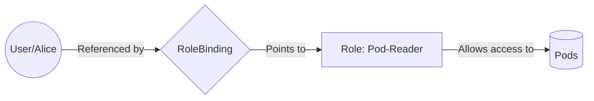
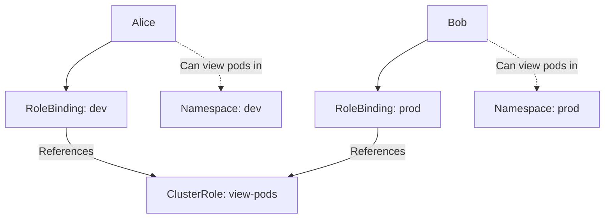

In Kubernetes, **Authentication** asks "Who are you?" (Alice, Bob, or a Robot).
**Authorization (RBAC)** asks "What are you allowed to do?"

RBAC is the glue that connects **Users** to **Actions**. Without it, your authenticated user is just a person standing in the lobby with no keys to any doors.

-----

## The Three Pillars of RBAC

To understand RBAC, you must visualize it as a triangle. You cannot grant permissions directly to a user. You must use a "Binding" to connect them.

1.  **Subject:** The "Who" (User, Group, or ServiceAccount).
2.  **Role:** The "What" (A list of permissions, like "Can read Pods").
3.  **RoleBinding:** The "Connector" (Assigns the Role to the Subject).

<!-- end list -->



-----

## 1\. The "Where": Role vs. ClusterRole

The first decision you make is **Scope**. Does this permission apply to one room (Namespace) or the whole building (Cluster)?

| Object | Scope | Use Case |
| :--- | :--- | :--- |
| **Role** | **Namespaced** | "Alice can read Pods in `dev`." |
| **ClusterRole** | **Global** | "Bob can read Nodes." OR "The CNI plugin can read all Pods in all namespaces." |

!!! tip "Pro Tip"
    `ClusterRoles` are reusable\! You can define a generic "view-only" ClusterRole and reuse it in multiple namespaces.


-----

## 2\. The "How": RoleBinding vs. ClusterRoleBinding

This is where beginners get stuck. The binding determines the final scope of the permission.

  * **RoleBinding:** Grants the permissions *within a specific namespace*.
  * **ClusterRoleBinding:** Grants the permissions *across the entire cluster*.

### The "Cookie Cutter" Pattern (Important\!)

You can bind a **ClusterRole** using a **RoleBinding**.

**Why?** Imagine you have 50 namespaces. You don't want to write a `Role` yaml for "view-pods" 50 times.

1.  Create **one** `ClusterRole` named `view-pods`.
2.  Create a `RoleBinding` in the `dev` namespace pointing to it.
3.  Create a `RoleBinding` in the `prod` namespace pointing to it.

Now Alice has the "view-pods" permission, but **only** inside the specific namespaces where you bound it.



-----

## 3\. Service Accounts (Robots)

Users (Humans) live outside the cluster (in Google/AWS IAM, or OIDC).
**ServiceAccounts** live *inside* the cluster. They are the identities for your Pods.

If your Jenkins Build Pod needs to deploy to Kubernetes, you:

1.  Create a `ServiceAccount`.
2.  Create a `Role` (Deployer).
3.  Create a `RoleBinding` (Bind Jenkins SA to Deployer Role).
4.  Mount the ServiceAccount into the Jenkins Pod.

<!-- end list -->

```yaml
apiVersion: v1
kind: ServiceAccount
metadata:
  name: jenkins-bot
  namespace: ci-cd
```

-----

## 4\. Debugging: "Can I?"

RBAC is complex. Sometimes you don't know why permission is denied. Kubernetes includes a tool to check permissions for yourself or others.

**Check my own permissions:**

```bash
kubectl auth can-i create deployments
# Output: yes

kubectl auth can-i delete nodes
# Output: no
```

**Check someone else's permissions (Impersonation):**
(Great for admins testing a new user's setup)

```bash
kubectl auth can-i list secrets --as alice --namespace dev
# Output: no
```

-----

## 5\. Aggregated ClusterRoles (Advanced)

Kubernetes has a cool feature where you can create a "Super Role" that automatically combines other roles.

The default `admin` ClusterRole is an aggregated role. If you install a CRD (like `Prometheus`), the CRD can automatically add its permissions to the default `admin` role so your admins don't need to manually update their permissions.

-----

## Summary

  * **Role/RoleBinding**: For Namespace-level access (90% of use cases).
  * **ClusterRole/ClusterRoleBinding**: For Node-level access or "All Namespaces" access.
  * **ClusterRole + RoleBinding**: The efficient way to reuse standard permissions in specific namespaces.
  * **ServiceAccounts**: The users for your Pods.
  * **`kubectl auth can-i`**: The best way to test your rules.

!!! danger "Security Warning"
    Be extremely careful with the `cluster-admin` ClusterRole. It allows users to do anything, including deleting the entire cluster or reading all secrets. Follow **Least Privilege**: Only grant the specific verbs (`get`, `list`) needed for the specific resource (`pods`, `services`).