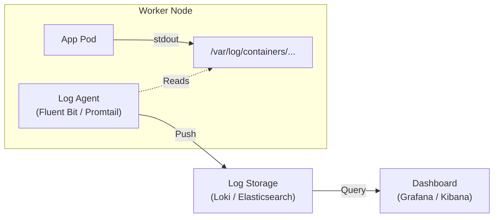

# Audit Logging

In Kubernetes, there are two stories being told at the same time:

1.  **The Detective Story (Audit Logs):** "Who changed the system configuration?"
2.  **The Operator Story (App Logs):** "Why is my application crashing?"

If you don't capture these stories immediately, they vanish. Kubernetes logs are ephemeral; when a Pod dies, its logs die with it.

-----

## 1\. Audit Logs (The "Black Box" Recorder)

Audit logs record every single request sent to the Kubernetes API Server. They answer the questions: **Who, What, Where, and When.**

  * **Who:** User `alice`
  * **What:** Tried to `delete`
  * **Where:** The `secret` named `db-pass`
  * **When:** At `12:05 PM`
  * **Result:** `403 Forbidden`

### The 4 Audit Levels

You must configure *how much* data you want. This is a trade-off between "Visibility" and "Disk Space."

| Level | Description | Use Case |
| :--- | :--- | :--- |
| **`None`** | Don't log anything. | Frequent, noisy events (like `kube-proxy` watching endpoints). |
| **`Metadata`** | Log the User, Timestamp, Resource, and Verb. **No payloads.** | Standard Production (Low Cost, High Value). |
| **`Request`** | Log metadata + the *request body* sent by the user. | Debugging "Why did this object change?" |
| **`RequestResponse`** | Log everything + the server's *response body*. | **High Security / Debugging.** (Generates massive data). |

!!! danger "Security Warning: Secrets in Logs"
    Be extremely careful using `Request` or `RequestResponse` levels on `Secret` or `ConfigMap` resources. You might accidentally write your database passwords into your plain-text audit log files\!


### Configuration (The Policy File)

You pass a policy file to the API Server to define rules.

```yaml
# audit-policy.yaml
apiVersion: audit.k8s.io/v1
kind: Policy
rules:
  # 1. Don't log noisy system calls
  - level: None
    users: ["system:kube-proxy"]
    verbs: ["watch"]

  # 2. Log full request body for critical changes (Pod modifications)
  - level: Request
    resources:
    - group: ""
      resources: ["pods"]

  # 3. Default: Log metadata only for everything else
  - level: Metadata
```

-----

## 2\. Application Logging (The "Stream")

Kubernetes does not provide a native storage solution for logs. It assumes your application writes to **Standard Output (stdout)** and **Standard Error (stderr)**.

The container runtime (containerd) captures these streams and writes them to a file on the Node (usually `/var/log/containers/*.log`).

### The Logging Pipeline

Since logs on the Node are deleted when the Pod is deleted, you need a **Cluster-Level Logging Stack** to ship them to safety.



### The "DaemonSet" Pattern

The most common architecture is running a **Logging Agent** (like Fluent Bit or Promtail) as a **DaemonSet**.

1.  One agent runs on every Node.
2.  It mounts `/var/log/containers` as a read-only volume.
3.  It tails every log file, adds metadata (Pod Name, Namespace), and pushes it to the backend.

-----

## 3\. Best Practices

### Security

1.  **Alert on `403 Forbidden`:** If your Audit Logs show a user trying to read `secrets` and getting denied 10 times in a minute, you are under attack. Alert on this pattern.
2.  **Separate Retention:** Audit logs are legal documents. Keep them in a separate bucket (e.g., S3 Glacier) for 1 year, even if you only keep App logs for 7 days.

### Operations

1.  **JSON Logging:** Force your developers to log in JSON format.
      * *Bad:* `2023-10-01 Error: DB failed` (Hard to parse).
      * *Good:* `{"level": "error", "msg": "DB failed", "service": "payment"}` (Easy to filter).
2.  **Don't Log to Files Inside Containers:** If your legacy app writes to `/app/logs/server.log`, standard Kubernetes logging **will not catch it**. You must use a "Sidecar" container to `tail -f` that file to stdout, or configure the app to write to stdout directly.

-----

## Summary

  * **Audit Logs** track API access ("Who did it?"). They are configured via a **Policy File** on the control plane.
  * **App Logs** track application health. They rely on the **stdout/stderr** stream.
  * **Persistence:** Logs are ephemeral. You **must** use a collection agent (DaemonSet) to ship them to a central store (Loki/Elastic) or they will be lost on Pod restart.
  * **Golden Rule:** Avoid `RequestResponse` logging for Secrets to prevent credential leaks.