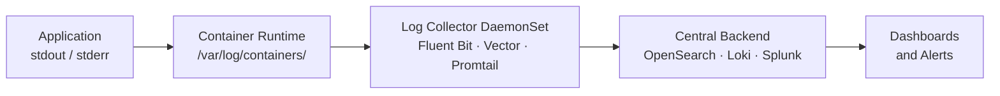

# Audit and Logging

Operational logging and API audit logging serve different goals. You need both.

- audit logs: who changed cluster state and when
- workload logs: what applications and components are doing at runtime

## Kubernetes API audit logging

Audit logs are produced by the API server according to an audit policy. Each log entry captures one stage of a request lifecycle: `RequestReceived`, `ResponseStarted`, `ResponseComplete`, or `Panic`.

Common audit levels:

- `None`: skip this request entirely
- `Metadata`: record who, what, and when -- no body
- `Request`: metadata plus request body
- `RequestResponse`: metadata plus request and response bodies

For most production systems, `Metadata` is the practical default. Add `Request`-level logging selectively for high-value resources like Secrets, ConfigMaps, and RBAC objects. Avoid `RequestResponse` on Secrets -- it logs plaintext secret values.

## Policy example

```yaml
apiVersion: audit.k8s.io/v1
kind: Policy
rules:
  - level: None
    users: ["system:kube-proxy"]
    verbs: ["watch"]
  - level: Request
    resources:
      - group: ""
        resources: ["configmaps"]
  - level: Metadata
```

Use caution with request and response body logging for sensitive resources such as secrets.

## Workload logging pipeline

Kubernetes does not persist logs for you. Container logs must be collected and shipped to durable storage.


```mermaid
flowchart LR
    APP[Application\nstdout / stderr] --> RT[Container Runtime\n/var/log/containers/]
    RT --> COL[Log Collector DaemonSet\nFluent Bit · Vector · Promtail]
    COL --> BE[Central Backend\nOpenSearch · Loki · Splunk]
    BE --> DASH[Dashboards\nand Alerts]
```

Common collectors: **Fluent Bit** (lightweight, widely deployed), **Vector** (high-performance, flexible), **Promtail** (Loki ecosystem).

Typical architecture:

- Application writes to stdout and stderr (not log files).
- Container runtime rotates log files under `/var/log/containers/`.
- Node-level collector DaemonSet tails log files and ships to backend.
- Central backend stores, indexes, and retains logs.
- Dashboards and alerts consume centralized data.

## Incident response value

Audit plus workload logs provide full investigation context:

- who changed policy or deployment
- what changed in workload behavior
- when an issue started and how it propagated

## Practical controls

- set retention by data class and compliance requirements
- sanitize logs to avoid leaking credentials or tokens
- alert on sensitive action patterns, such as repeated secret access denial
- keep clock synchronization healthy across nodes for timeline accuracy

## Summary

Without audit logging, control plane actions are hard to reconstruct. Without workload logging, runtime failures are hard to explain. Production Kubernetes needs both pipelines running continuously.

## Related Security Concepts

- [RBAC](rbac.md)
- [Pod Security](psa.md)
- [Troubleshooting](../operations/troubleshooting.md)
