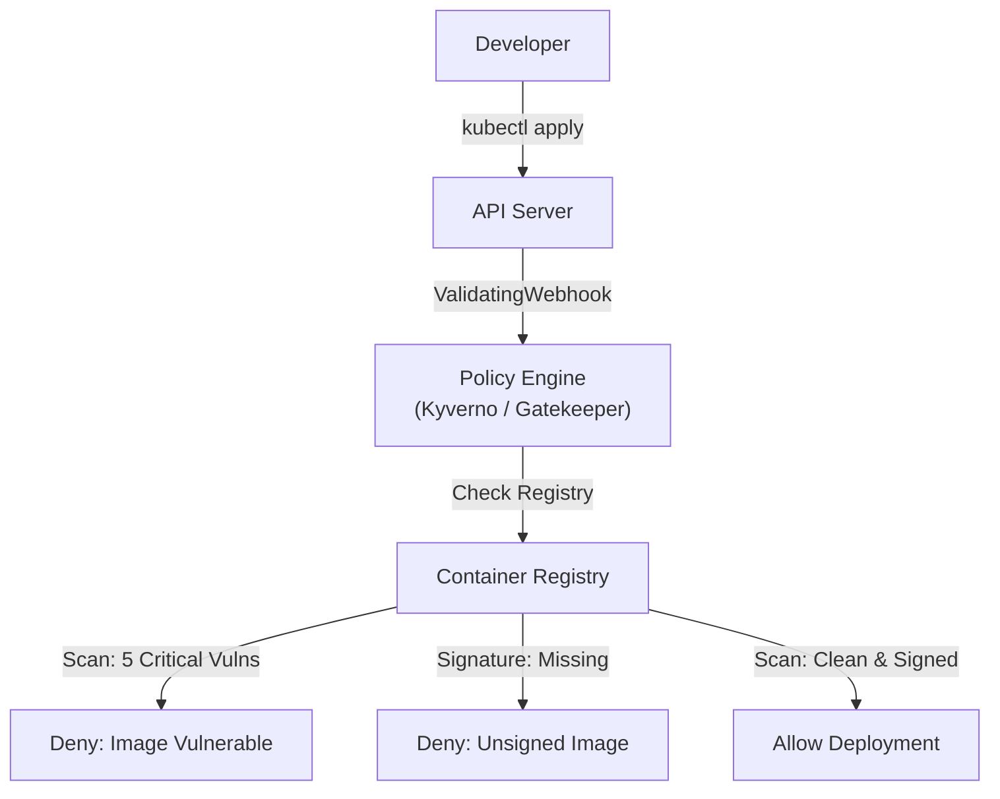

# Image Scanning

In Kubernetes, your security is only as strong as the software you run.

If you deploy an image containing a known vulnerability (like Log4j) or a malicious backdoor, all your firewalls and RBAC rules are useless. The attacker is already inside the house.

This domain is often called **Supply Chain Security**. It focuses on two questions:

1.  **Scanning:** "Is this code safe?" (Are there known vulnerabilities?)
2.  **Signing:** "Is this code authentic?" (Did *my* team build it, or did a hacker swap it?)

-----

## The "Food Safety" Analogy

Think of your container image like a sealed jar of food.

1.  **Scanning (The Lab Test):** You open the jar in a lab to check for bacteria (Vulnerabilities/CVEs). You want to know if the ingredients are rotten.
2.  **Signing (The Tamper Seal):** You put a holographic seal on the jar before it leaves the factory. If the seal is broken or missing when it arrives at the store (Cluster), you refuse to put it on the shelf (Deploy it).

-----

## 1\. Image Scanning (Checking for Rot)

Scanning tools look inside your container layers for outdated packages (e.g., an old version of `openssl` or `glibc`) that have known security flaws (CVEs).

### The "Time Bomb" Problem

A common mistake is scanning only during the Build phase.

  * **Day 1:** You build an image. Scan says "0 Vulnerabilities." You deploy it.
  * **Day 10:** A new vulnerability is discovered in that image.
  * **Result:** You are running a vulnerable image, but your CI pipeline is green.

**Solution:** You need **Continuous Scanning**. Your registry (Harbor, ECR, Quay) or a cluster-operator (Starboard/Trivy Operator) should re-scan running images daily.

### Tools of the Trade

| Tool | Focus | Best For |
| :--- | :--- | :--- |
| **Trivy** | OS + App Dependencies | The gold standard. Fast, CLI-based, scans everything. |
| **Grype** | OS + App Dependencies | Excellent integration with Syft (SBOM generation). |
| **Clair** | OS Packages | Often built into registries (like Quay). |

### Remediation: The "Distroless" Strategy

Scanning will find thousands of vulnerabilities in the Linux OS layer (Debian/Ubuntu/Alpine).
**The best fix? Remove the OS.**

Use **Distroless** images. They contain *only* your application and its runtime (e.g., Python/Java). They have no shell, no package manager, and no extensive OS libraries.

  * *Standard Node image:* \~600 vulnerabilities.
  * *Distroless Node image:* \~5 vulnerabilities.

-----

## 2\. Image Signing (The Tamper Seal)

Scanning proves the code *was* safe when built. Signing proves the code *hasn't changed* since then.

If a hacker compromises your Docker Hub account and pushes a malicious image tagged `v1.0`, your cluster will pull it without complaint. **Image Signing** prevents this.

### The Modern Standard: Cosign & Sigstore

Historically, signing (Docker Content Trust) was painful to manage (managing private keys is hard).
Today, we use **Sigstore/Cosign**.

**Keyless Signing** is the magic feature. Instead of managing a private key file, it uses your **OIDC Identity** (like your GitHub or Google login) to sign the image temporarily.

```bash
# 1. Sign the image (opens browser to login via OIDC)
cosign sign --keyless ghcr.io/my-user/my-image:v1

# 2. Verify it
cosign verify --keyless --certificate-identity=my-email@gmail.com ...
```

-----

## 3\. SBOM (Software Bill of Materials)

An **SBOM** is a list of ingredients.
It doesn't say if the ingredients are *bad*; it just lists them.
*"This image contains Log4j v2.14, OpenSSL v1.1, and React v16."*

**Why do you need it?**
When the next massive zero-day hits (like Log4j), you don't want to scan 5,000 images. You want to query your database of SBOMs: *"Show me every app running Log4j v2.14."*

**Tools:** `Syft` (generates SBOMs) and `Grype` (scans them).

-----

## 4\. Enforcement (The Bouncer)

Scanning and Signing are useless if you don't **enforce** them. You need an **Admission Controller** to block bad images at the door.



### Example: Kyverno Policy

This policy blocks any image that hasn't been signed by your specific public key.

```yaml
apiVersion: kyverno.io/v1
kind: ClusterPolicy
metadata:
  name: check-image-signature
spec:
  validationFailureAction: Enforce
  rules:
    - name: verify-signature
      match:
        resources:
          kinds:
            - Pod
      verifyImages:
      - imageReferences:
        - "ghcr.io/my-company/*"
        attestors:
        - entries:
          - keys:
              publicKeys: |-
                -----BEGIN PUBLIC KEY-----
                ... (Your Cosign Public Key) ...
```

-----

## Summary

1.  **Scan Early, Scan Often:** Scan in CI, but also scan continuously in the registry.
2.  **Use Distroless:** Reducing the attack surface is better than patching it.
3.  **Sign with Cosign:** Ensure trusted provenance.
4.  **Enforce with Admission:** Use Kyverno or Gatekeeper to block unsigned or vulnerable images from ever starting.
5.  **Generate SBOMs:** Know what is running in your cluster so you can react to zero-days instantly.