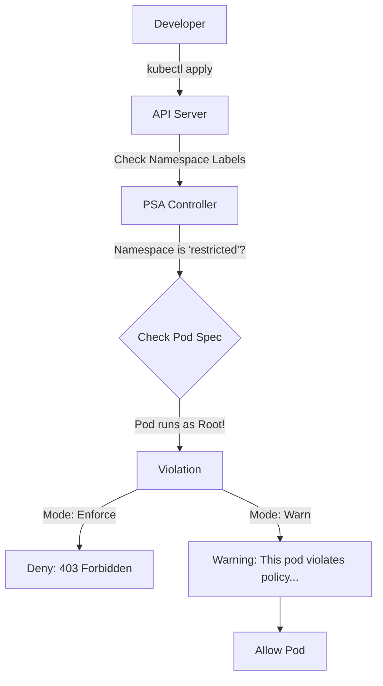

# Pod Security

For years, Kubernetes used **PodSecurityPolicy (PSP)** to lock down pods. It was complex, buggy, and confusing. In v1.25, it was completely removed.

The replacement is **Pod Security Admission (PSA)**. It is built-in, on by default, and much easier to use. It relies on the **Pod Security Standards (PSS)** - a predefined set of rules maintained by the Kubernetes community.

-----

## The "Club Bouncer" Analogy

Think of PSA as the bouncer at the door of a nightclub (Namespace). You tell the bouncer what the "Dress Code" (Policy Level) is for that room.

1.  **Privileged (The VIP Room):** Anything goes. You can come in wearing pajamas, carrying weapons (root access), or acting wild.
2.  **Baseline (The General Floor):** Standard dress code. No obvious threats allowed, but we won't inspect your socks. (Prevents known privilege escalations).
3.  **Restricted (The Black Tie Gala):** Extremely strict. You must have a tie, polished shoes, and perfect behavior. (Follows hard-core hardening best practices).

-----

## 1\. The Three Levels (The Standards)

You cannot invent your own rules anymore. You must pick one of these three standard profiles.

| Level | Goal | Use Case |
| :--- | :--- | :--- |
| **Privileged** | **Unrestricted.** Allows known privilege escalations. | System agents (CNI, Storage Drivers), Logging agents. |
| **Baseline** | **Minimally Restrictive.** Prevents known escalations. | Standard applications, web servers, microservices. (90% of use cases). |
| **Restricted** | **Hardened.** Requires pods to explicitly drop capabilities and run as non-root. | High-security financial/gov apps. |

-----

## 2\. The Three Modes (The Action)

What happens when someone breaks the dress code?

| Mode | Action | When to use? |
| :--- | :--- | :--- |
| **Enforce** | **Block** the Pod. Return 403 Forbidden. | Production (after testing). |
| **Audit** | **Log** the violation to the audit log, but allow the pod. | Monitoring & Compliance. |
| **Warn** | **Tell** the user immediately in the CLI, but allow the pod. | Developer feedback loop. |

### Visualizing the Flow



-----

## 3\. How to Configure (Namespace Labels)

PSA is controlled entirely via **Namespace Labels**. You don't need to create any CRDs or objects.

### The Syntax

```text
pod-security.kubernetes.io/<MODE>=<LEVEL>
pod-security.kubernetes.io/<MODE>-version=<VERSION>
```

### Practical Example: The Safe Rollout

You want to enforce `restricted` security, but you are afraid of breaking the app.

**Step 1: Turn on Warnings & Audit (Dry Run)**

```bash
kubectl label namespace backend \
  pod-security.kubernetes.io/enforce=baseline \
  pod-security.kubernetes.io/warn=restricted \
  pod-security.kubernetes.io/audit=restricted
```

*Result:* The app runs (Baseline enforcement), but if the developer tries to deploy something that isn't fully "Restricted" compliant, they get a warning in their terminal.

**Step 2: Fix the Warnings**
The developer updates their `securityContext` in the YAML to meet the Restricted standard.

**Step 3: Enforce Restricted**

```bash
kubectl label namespace backend \
  pod-security.kubernetes.io/enforce=restricted \
  pod-security.kubernetes.io/warn=restricted --overwrite
```

-----

## 4\. The Versioning Trap (Critical\!)

You will notice the label `enforce-version`. You can set this to `latest` or a specific version like `v1.28`.

!!! danger "Avoid `latest` in Production"
    Kubernetes security standards change. A setting that is allowed in `Restricted v1.25` might be banned in `Restricted v1.29`.
    
    If you use `enforce-version=latest`, and you upgrade your cluster, **your existing valid pods might suddenly fail to restart** because the rules changed under your feet.

    **Best Practice:** Pin the version to your current cluster version (e.g., `v1.29`) and manually update it only when you have verified your apps against the new rules.

-----

## 5\. Troubleshooting: What a Block Looks Like

If you try to deploy a standard Nginx pod into a **Restricted** namespace, it will fail because Nginx tries to run as `root` by default, and it doesn't drop capabilities.

**Command:**
`kubectl apply -f nginx.yaml`

**Error Output:**

```text
Error from server (Forbidden): error when creating "nginx.yaml": 
pods "nginx" is forbidden: violates PodSecurity "restricted:v1.29": 
- (container "nginx" must not set securityContext.allowPrivilegeEscalation=true)
- (container "nginx" must set securityContext.runAsNonRoot=true)
- (container "nginx" must set securityContext.seccompProfile.type to "RuntimeDefault" or "Localhost")
```

**The Fix:**
You must update your Pod YAML to explicitly adhere to the rules:

```yaml
spec:
  securityContext:
    runAsNonRoot: true
    seccompProfile:
      type: RuntimeDefault
  containers:
  - name: nginx
    securityContext:
      allowPrivilegeEscalation: false
      capabilities:
        drop: ["ALL"]
```

-----

## Summary

  * **PSA** is the standard, built-in way to secure pods.
  * **Levels:** `Privileged` (Unsafe), `Baseline` (Standard), `Restricted` (Hardened).
  * **Modes:** `Enforce` (Block), `Audit` (Log), `Warn` (Notify).
  * **Configuration:** Done strictly via labels on the Namespace.
  * **Production Tip:** Pin your versions (don't use `latest`) and use `Warn/Audit` modes before switching `Enforce` to a stricter level.

---

## Related Security Concepts

- [Security Contexts](sec-context/)
- [Kubernetes RBAC](rbac/)
- [Kubernetes Security Overview](security/)
