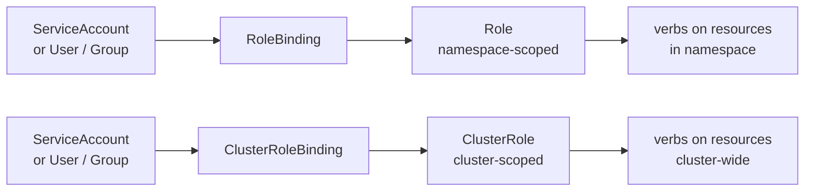

# RBAC

RBAC governs what authenticated identities can do in Kubernetes.

Authentication answers who the caller is. Authorization with RBAC answers what that caller is allowed to do.

## Core RBAC objects



- **Role**: grants permissions within a single namespace.
- **ClusterRole**: grants permissions cluster-wide, or defines a reusable permission set applied per-namespace via RoleBinding.
- **RoleBinding**: attaches a Role or ClusterRole to subjects within one namespace.
- **ClusterRoleBinding**: attaches a ClusterRole to subjects across the entire cluster.

## Scope and reuse model

A common pattern is to define reusable ClusterRoles and bind them per namespace with RoleBindings.

This gives consistency without giving global access.

## Role example

```yaml
apiVersion: rbac.authorization.k8s.io/v1
kind: Role
metadata:
  name: app-reader
  namespace: team-a
rules:
  - apiGroups: [""]
    resources: ["pods", "services", "configmaps"]
    verbs: ["get", "list", "watch"]
```

## RoleBinding example

```yaml
apiVersion: rbac.authorization.k8s.io/v1
kind: RoleBinding
metadata:
  name: app-reader-binding
  namespace: team-a
subjects:
  - kind: Group
    name: team-a-developers
    apiGroup: rbac.authorization.k8s.io
roleRef:
  kind: Role
  name: app-reader
  apiGroup: rbac.authorization.k8s.io
```

## Service account access

Workloads should use dedicated service accounts, not the namespace default account.

Pair each service account with only the minimal verbs and resources it needs.

Disable automatic token mounting for service accounts that don't need API access:

```yaml
apiVersion: v1
kind: ServiceAccount
metadata:
  name: my-app
automountServiceAccountToken: false
```

Or per-pod:

```yaml
spec:
  automountServiceAccountToken: false
```

By default, every pod gets a token for the namespace's `default` service account, even if it never uses the Kubernetes API. Disabling this reduces the blast radius if a pod is compromised.

## Validation and troubleshooting

```bash
kubectl auth can-i list pods -n team-a
kubectl auth can-i create deployments --as=system:serviceaccount:team-a:deployer -n team-a
kubectl get role,rolebinding -n team-a
kubectl get clusterrole,clusterrolebinding
```

## Hardening guidance

- avoid broad wildcard rules unless explicitly justified
- tightly control `secrets`, `pods/exec`, and `impersonate` permissions
- minimize use of `cluster-admin`
- review bindings on a fixed cadence and remove stale access

## Summary

RBAC is a primary control plane security boundary. Keep permissions explicit, minimal, and auditable.

## Related Security Concepts

- [Security Primer](security.md)
- [Pod Security](psa.md)
- [Audit and Logging](audit-logging.md)
