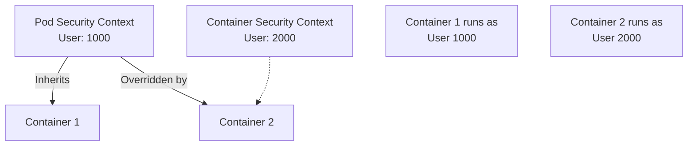

# Security Context

If RBAC secures the **API** (who can talk to Kubernetes), Security Contexts secure the **Runtime** (what the process can do on the Linux kernel).

A container in Kubernetes is not a virtual machine. It is a process running on the Host's kernel. If you don't lock it down, a hacked container can attack the kernel, read other containers' memory, or modify host files.

**Security Contexts** are the configuration settings in your YAML that tell the container runtime (containerd/CRI-O): *"Sandobx this process. Take away its keys. Don't let it run as root."*

-----

## 1\. Pod vs. Container Contexts (The Hierarchy)

You can set security contexts in two places. It is vital to know which one wins.

1.  **`spec.securityContext` (Pod Level):** Applies to **all** containers.
      * *Used for:* Shared settings like `fsGroup` (Volume permissions) or `runAsUser` (if identical for all).
2.  **`spec.containers.securityContext` (Container Level):** Applies to **one** container.
      * *Used for:* Capabilities, `readOnlyRootFilesystem`, or overriding the Pod setting.

**The Rule:** Container settings **override** Pod settings.



-----

## 2\. The User Identity (`runAsUser` vs `runAsGroup`)

By default, containers run as `root` (UID 0). This is dangerous. If a hacker escapes the container, they are `root` on the host node.

  * **`runAsUser`**: Forces the process to start with this specific UID.
  * **`runAsNonRoot: true`**: A safety check. It checks the image metadata. If the image is built to run as root, Kubernetes **refuses to start it**.

!!! tip
    **Why `fsGroup` matters**
    When you mount a Volume (like a PVC), it might be owned by `root`. If your container runs as User 1000, it can't write to that disk\!
    **Solution:** Set `fsGroup: 2000` in the **Pod Security Context**. Kubernetes will automatically `chown` (change ownership) of the volume files to Group 2000 so your container can write to them.

-----

## 3\. Linux Capabilities (The Keys to the Kingdom)

In Linux, "Root" isn't just one permission. It is a bundle of super-powers called **Capabilities**.

  * `CAP_NET_ADMIN` (Change firewalls/IPs)
  * `CAP_SYS_TIME` (Change the system clock)
  * `CAP_CHOWN` (Change file ownership)

By default, Docker/Kubernetes gives containers a "default set" of these keys. **You usually don't need them.**

**Best Practice:** Drop ALL capabilities, then add back only what you strictly need.

```yaml
securityContext:
  capabilities:
    drop: ["ALL"]  # Drop everything. Highly secure.
    add: ["NET_BIND_SERVICE"] # Add back ability to bind port 80
```

-----

## 4\. Immutable Infrastructure (`readOnlyRootFilesystem`)

Hackers love to download scripts (`wget malicious.sh`) and execute them.
If your filesystem is **Read-Only**, they can't save the file.

```yaml
securityContext:
  readOnlyRootFilesystem: true
```

*Note: If your app needs to write temp files (like logs), you must mount an `emptyDir` volume at that specific path (e.g., `/var/log`).*

-----

## 5\. Privilege Escalation (`allowPrivilegeEscalation`)

Even if you are not root, a process can "become" root using tools like `sudo` or binaries with the `setuid` bit set.

Setting `allowPrivilegeEscalation: false` disables this mechanism entirely. It effectively says: *"Once you are a standard user, you stay a standard user forever."*

-----

## A "Golden Standard" Example

Here is a snippet you can copy-paste for 90% of production web applications.

```yaml
apiVersion: v1
kind: Pod
metadata:
  name: secure-app
spec:
  securityContext:
    # Pod Level: Handle Storage
    fsGroup: 2000
    runAsUser: 1000
    runAsGroup: 3000
  containers:
  - name: my-app
    image: my-app:v1
    securityContext:
      # Container Level: Runtime Hardening
      runAsNonRoot: true
      allowPrivilegeEscalation: false
      readOnlyRootFilesystem: true
      capabilities:
        drop: ["ALL"]
    volumeMounts:
    - name: tmp
      mountPath: /tmp # Allow writing to /tmp even on read-only FS
  volumes:
  - name: tmp
    emptyDir: {}
```

-----

## Summary

  * **Security Contexts** are the firewall for the Linux Kernel.
  * **Container Context** overrides **Pod Context**.
  * **`runAsNonRoot`** protects you from root-level exploits.
  * **`capabilities: drop: ["ALL"]`** is the gold standard for least privilege.
  * **`fsGroup`** is the magic fix when your non-root container can't write to its PVC.

---

## Related Security Concepts

- [Pod Security Standards](psa/)
- [RBAC](rbac/)
- [Kubernetes Workloads](../workloads/pods-deployments/)
