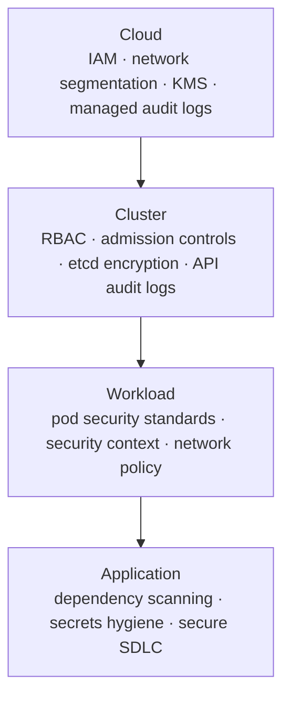

# Security Primer

Kubernetes security is a layered discipline, not a single feature.

A practical model is to protect each layer of the stack and assume controls can fail independently.

## Major risk areas

- excessive RBAC permissions
- privileged or poorly constrained containers
- weak image supply-chain controls
- unrestricted lateral network traffic
- missing audit visibility and incident response readiness

## 4-layer security model

A breach at any inner layer is harder to contain if the outer layers are weak. Treat each layer as independently enforceable -- do not rely on the application layer to compensate for weak cluster controls.

## Security operating baseline

1. enforce least privilege access
2. harden workload defaults
3. restrict unnecessary east-west traffic
4. verify artifact integrity before deploy
5. collect and retain actionable audit and runtime telemetry

## Admission controllers

Admission webhooks provide a powerful enforcement point between "request accepted by API server" and "object written to etcd." Two common policy engines:

- **Kyverno**: Kubernetes-native policy engine using YAML-based policies. Good fit for teams that want policy-as-code without a new DSL.
- **OPA/Gatekeeper**: Open Policy Agent with the Gatekeeper admission controller. Uses Rego policy language. More expressive for complex constraints.

Both support `validate` (reject non-compliant objects) and `mutate` (inject defaults or required fields) policies.

## Security in the delivery pipeline

Security should run before deploy, not only after incidents.

Recommended controls in CI and CD:

- manifest linting and policy checks (e.g. `kube-score`, `trivy config`)
- image scanning and signing
- admission policy verification (dry-run against policy engine before merge)

## Continuous improvement loop

- review new cluster and namespace permissions regularly
- test incident response playbooks
- patch and rotate credentials on a schedule
- run periodic architecture threat reviews

## Summary

Secure Kubernetes operations come from consistent controls across identity, runtime, network, and supply chain. Treat security as an operational system, not a one-time project.

## Core Kubernetes Security Topics

- [RBAC](rbac.md)
- [Pod Security](psa.md)
- [Security Context](sec-context.md)
- [Image Scanning and Signing](image-scan-sign.md)
- [Audit and Logging](audit-logging.md)
