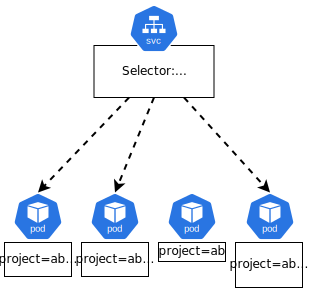
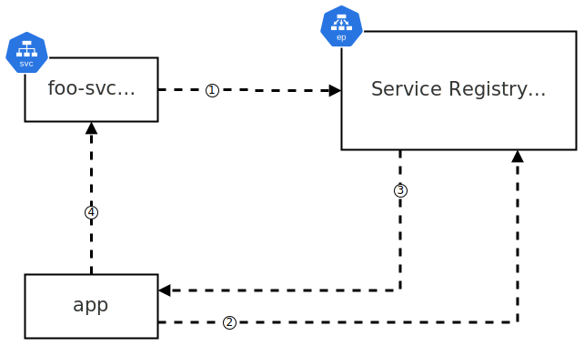
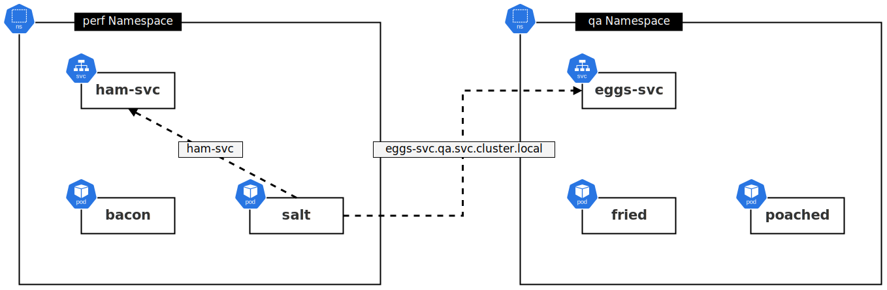

## Understanding and Utilizing Kubernetes Services

Kubernetes Services are essential for ensuring reliable communication between Pods. They abstract the complexities of networking and provide stable endpoints for applications.

## Introduction to Kubernetes Services

<h3>Why Use Services?</h3>

Pods in Kubernetes are ephemeral; they can be created, destroyed, and rescheduled at any time due to various events such as scaling operations, rolling updates, rollbacks, and failures. This makes direct communication with Pods unreliable. Kubernetes Services address this issue by providing a stable endpoint for communication.

<h3>How Services Work</h3>

Services in Kubernetes provide a front end (DNS name, IP address, and port) that remains constant regardless of the state of the Pods behind it. They use label selectors to dynamically route traffic to healthy Pods that match the specified criteria.

## Types of Kubernetes Services

<h3>ClusterIP</h3>

The default Service type, ClusterIP, exposes the Service on an internal IP within the cluster. This makes it accessible **only within the cluster**.

Below is a high-level representation of how this looks:


**Key Points:**

- Internal IP and DNS name are automatically created.
- Accessible only from within the cluster.

**Example YAML:**
```yaml
apiVersion: v1
kind: Service
metadata:
  name: my-clusterip-service
spec:
  selector:
    app: my-app
  ports:
    - protocol: TCP
      port: 80
      targetPort: 8080
```

<h3>NodePort</h3>

NodePort Services extend ClusterIP Services by making them accessible from outside the cluster through a port on each node.

Below is a high-level example of how the flow works:


1. External client hits node on NodePort.
2. Node forwards request to the ClusterIP of the Service.
3. The Service picks a Pod from the list of healthy Pods in the EndpointSlice.
4. Forward request to the selected Pod.

**Key Points:**

- Exposes the Service on a specific port on each node.
- External traffic can access the Service using `<NodeIP>:<NodePort>`.

**Example YAML:**
```yaml
apiVersion: v1
kind: Service
metadata:
  name: my-nodeport-service
spec:
  type: NodePort
  selector:
    app: my-app
  ports:
    - protocol: TCP
      port: 80
      targetPort: 8080
      nodePort: 30007
```

<h3>LoadBalancer</h3>

LoadBalancer Services are built on top of NodePort and ClusterIP Services. They integrate with cloud provider load balancers to expose Services to the internet.

Below is a high-level example of how the flow works:


1. External client hits LoadBalancer Service on friendly DNS name.
2. LoadBalancer forwards request to a NodePort.
3. Node forwards request to the ClusterIP of the Service.
4. The Service picks a Pod from the EndpointSlice.
5. Forwards request to the selected Pod.

**Key Points:**

- Provides an external IP managed by the cloud provider.
- Simplifies access from outside the cluster.

**Example YAML:**
```yaml
apiVersion: v1
kind: Service
metadata:
  name: my-loadbalancer-service
spec:
  type: LoadBalancer
  selector:
    app: my-app
  ports:
    - protocol: TCP
      port: 80
      targetPort: 8080
```

## Detailed Service Theory

<h3>Labels and Selectors</h3>

Services use labels and selectors to determine which Pods receive traffic. This loose coupling allows Services to dynamically update the list of Pods they route to, maintaining high availability and load balancing.

It should also be noted that Pods can still belong to a Service if they have *extra* labels, so long as they also contain all the labels that the Service is selecting on.



**Example:**
```yaml
apiVersion: apps/v1
kind: Deployment
metadata:
  name: my-app
spec:
  replicas: 3
  template:
    metadata:
      labels:
        app: my-app
    spec:
      containers:
      - name: my-app-container
        image: my-app-image
---
apiVersion: v1
kind: Service
metadata:
  name: my-service
spec:
  selector:
    app: my-app
  ports:
    - protocol: TCP
      port: 80
      targetPort: 8080
```

<h3>EndpointSlices</h3>

As mentioned above, as Pods are spinning up and down, the Service will keep an updated list of Pods with the given labels and selectors. How it does this is through the use of EndpointSlices, which are effectively just dynamic lists of healthy Pods that match a given label selector.

Any new Pods that are created on the cluster that match a Service's label selector will automatically be added to the given Service's EndpointSlice object. When a Pod disappears (fails, Node goes down, etc.) it will be removed from the EndpointSlice. The net result is that the Service's EndpointSlice should always be up to date with a list of healthy Pods that the Service can route to.

## Hands-On with Services

<h3>Creating and Managing Services</h3>

<h4>Imperative Creation</h4>

Create a Service for an existing Deployment using `kubectl expose`:
```sh
kubectl expose deployment my-app --type=LoadBalancer --name=my-service
```

<h4>Declarative Creation</h4>

Define a Service in a YAML file and apply it:
```yaml
apiVersion: v1
kind: Service
metadata:
  name: my-service
spec:
  type: LoadBalancer
  selector:
    app: my-app
  ports:
    - protocol: TCP
      port: 80
      targetPort: 8080
```
```sh
kubectl apply -f my-service.yaml
```

<h4>Inspecting Services</h4>

Check the status and details of Services:
```sh
kubectl get svc
kubectl describe svc my-service
```

## Service Discovery

<h3>How Service Discovery Works</h3>

Kubernetes uses an internal DNS to resolve Service names to IP addresses. Each Pod's `resolv.conf` is configured to use the cluster DNS, enabling seamless service discovery.

<h3>Service Registration</h3>

Service registration is the process of an app on Kubernetes providing its connection details to a registry in order for other apps on the cluster to be able to find it. This happens automatically when Services are created.

**High-level flow of Service registration:**

1. Post a Service manifest to the API server (via `kubectl`).
2. The Service is given a stable IP address called a **ClusterIP**.
3. EndpointSlices are created to maintain the list of healthy Pods which match the Service's label selector.
4. The Service's name and IP are registered with the cluster DNS.

<br>

**High-level flow of Service discovery:**

In terms of how an application then discovers other applications behind a Service, the flow looks like this:

1. The new Service is registered with the cluster DNS (Service Registry).
2. Your application wants to know the IP address of the Service so it provides the name to the cluster DNS for lookup.
3. The cluster DNS returns the IP address of the Service.
4. Your application now knows where to direct its request.



<h3>Practical Example of Service Discovery</h3>

Assume we have two applications on the same cluster - `ham` and `eggs`. Each application has their Pods fronted by a Service, which in turn each have their own ClusterIP.

```sh
kubectl get svc
```
Example output:
```text
NAME         TYPE        CLUSTER-IP   EXTERNAL-IP   PORT(S)   AGE
ham-svc      ClusterIP   192.168.1.200               443/TCP   5d19h
eggs-svc     ClusterIP   192.168.1.208               443/TCP   5d19h
```

For `ham` to communicate with `eggs`, it needs to know two things:
1. The *name* of the `eggs` application's Service (`eggs-svc`).
2. How to convert that name to an IP address.

**Steps for Service Discovery:**

1. The application container's default gateway routes the traffic to the **Node** it is running on.
2. The Node itself does not have a route to the Service network so it routes the traffic to the **node kernel**.
3. The Node kernel recognizes traffic intended for the service network and routes the traffic to a healthy Pod that matches the label selector of the Service.

## Using Namespaces with Services

<h3>Role of Namespaces</h3>

Namespaces partition a cluster's address space, allowing you to create isolated environments within a single cluster.

**Example:**

- **Perf**: `ham-svc.perf.svc.cluster.local`
- **QA**: `ham-svc.qa.svc.cluster.local`

Objects within the same Namespace can connect to each other using short names. However, cross-Namespace communication must use the FQDN.



## Advanced Concepts

<h3>Session Affinity</h3>

Session Affinity allows you to configure Services to direct requests from the same client to the same Pod, useful for stateful applications.

**Example YAML:**
```yaml
apiVersion: v1
kind: Service
metadata:


  name: my-affinity-service
spec:
  selector:
    app: my-app
  ports:
    - protocol: TCP
      port: 80
      targetPort: 8080
  sessionAffinity: ClientIP
```

<h3>External Traffic Policy</h3>

External Traffic Policy controls whether traffic from outside the cluster is routed only to Pods on the same node (preserving client IP) or across all nodes.

**Example YAML:**
```yaml
apiVersion: v1
kind: Service
metadata:
  name: my-external-service
spec:
  type: LoadBalancer
  selector:
    app: my-app
  ports:
    - protocol: TCP
      port: 80
      targetPort: 8080
  externalTrafficPolicy: Local
```

## Troubleshooting Services

<h3>Common Issues and Solutions</h3>

**Service Not Accessible:**

- Check the status of the Service and Pods:
  ```sh
  kubectl get svc
  kubectl get pods
  ```
- Ensure the selectors match the Pod labels.

**DNS Resolution Fails:**

- Verify the cluster DNS is running:
  ```sh
  kubectl get pods -n kube-system -l k8s-app=kube-dns
  ```
- Check the contents of `/etc/resolv.conf` in the Pods.

<h3>Practical Tips</h3>

- Use `kubectl logs` to inspect logs of coreDNS Pods for DNS-related issues.
- Restart coreDNS Pods if necessary:
  ```sh
  kubectl delete pod -n kube-system -l k8s-app=kube-dns
  ```

## Summary

Kubernetes Services are critical for managing and accessing applications within a cluster. They provide stable endpoints and load balancing, abstracting the dynamic nature of Pods. By understanding and utilizing different Service types and configurations, you can ensure robust and scalable application deployment.