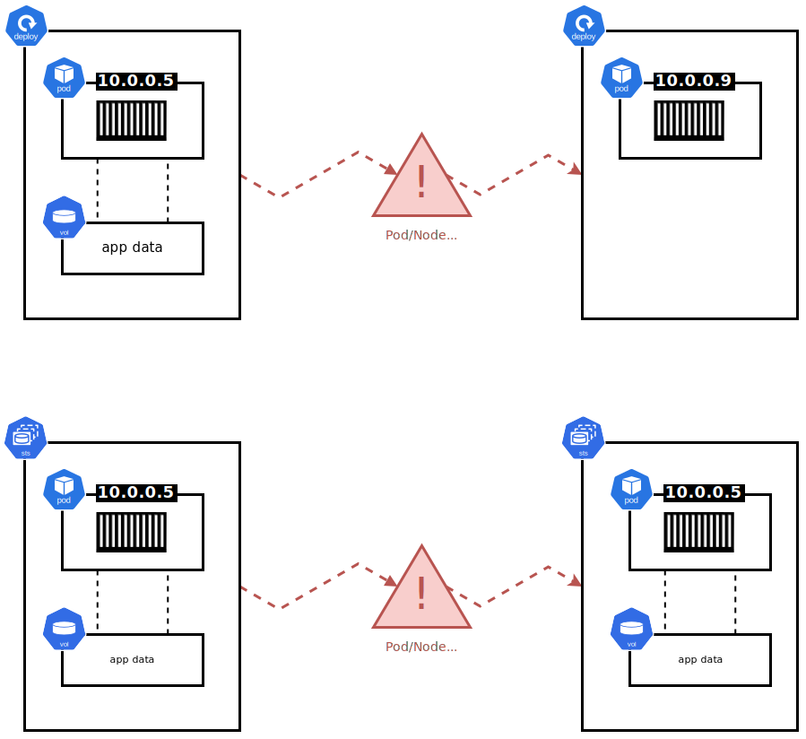

## Managing Stateful Applications with Kubernetes StatefulSets

StatefulSets are essential for deploying and managing stateful applications on Kubernetes, which require persistent storage and stable network identities. This includes databases, key-value stores, and applications that maintain client session data.

## Introduction to StatefulSets

<h3>What are StatefulSets?</h3>

StatefulSets are a Kubernetes resource designed to manage stateful applications. Unlike Deployments, StatefulSets provide:

- Predictable and persistent Pod names
- Persistent DNS hostnames
- Persistent volume bindings

These features ensure that each Pod maintains a consistent identity, even across restarts, failures, and rescheduling.

<h3>Key Differences from Deployments</h3>

While both StatefulSets and Deployments are used to manage Pods, StatefulSets offer additional guarantees:
- **Ordered Creation and Deletion:** Pods are created and deleted in a specific order.
- **Unique Network Identities:** Each Pod gets a unique, stable network identity.
- **Stable Storage:** Each Pod is associated with persistent storage that remains consistent across restarts.

StatefulSets are Kubernetes constructs designed to manage stateful applications that require persistent data and identity across Pod restarts and deployments. Each Pod in a StatefulSet is given a stable and unique network identifier and persistent storage, which remains associated with the Pod, even when it is rescheduled to a different node within the cluster.

StatefulSets are Kubernetes tools for running and managing applications that need to remember who they are and what they know—think of them like memory keepers for your apps, such as databases that need to recall data after a reboot. Unlike Deployments that are more about stateless apps (think of them as forgetful but easily replaceable), StatefulSets make sure each of their Pods has a consistent name, network identity, and storage, even if they move around in the cluster. This makes StatefulSets perfect for when your app's individual identity and history are crucial for running smoothly.

StatefulSets can guarantee Pod names, volume bindings, and DNS hostnames across reboots - whereas Deployments cannot. Below are two diagrams that illustrate this point:



Notice how with a Deployment, when a Pod is replaced it comes up with a new name, IP address, and its volume is no longer bound to it. With StatefulSets, the new Pod comes up looking exactly the same as the previous failed one.

## StatefulSet Theory

<h3>Pod Naming</h3>

Each Pod in a StatefulSet gets a predictable name, following the format `<StatefulSetName>-<integer>`. For example, a StatefulSet named `my-sts` with three replicas will have Pods named `my-sts-0`, ` my-sts-1`, and `my-sts-2`.

<h3>Ordered Creation and Deletion</h3>

StatefulSets create and delete Pods in a specific order:

- **Creation:** Pods are created one at a time, waiting for each to be running and ready before creating the next.
- **Deletion:** Pods are deleted in reverse order, ensuring that the highest ordinal Pod is terminated first.

<h3>Volume Management</h3>

StatefulSets manage volumes through PersistentVolumeClaims (PVCs). Each Pod gets its own unique volume, which is preserved across restarts and reattachments:

- **Volume Naming:** Volumes are named based on the StatefulSet and Pod names, e.g., `vol-my-sts-0`, `vol-my-sts-1`.
- **Persistence:** Volumes remain attached to the same Pod, even if the Pod is rescheduled to a different node.

## Hands-On with StatefulSets

<h3>Deploying StatefulSets</h3>

<h4>Example StatefulSet Configuration</h4>

Here’s an example of a simple StatefulSet for a mysqlDB deployment:

**StatefulSet YAML:**
```yaml
apiVersion: apps/v1
kind: StatefulSet
metadata:
  name: my-sts
spec:
  replicas: 3
  selector:
    matchLabels:
      app: mysql
  serviceName: "my-sts"
  template:
    metadata:
      labels:
        app: mysql
    spec:
      containers:
      - name: ctr-mysql
        image: mysql:latest
        ports:
        - containerPort: 3306
  volumeClaimTemplates:
  - metadata:
      name: mysql-data
    spec:
      accessModes: ["ReadWriteOnce"]
      storageClassName: "fast"
      resources:
        requests:
          storage: 15Gi
```

<h3>Creating a StatefulSet</h3>

Deploy the StatefulSet using the following command:
```sh
kubectl apply -f statefulset.yaml
```
This command posts the StatefulSet configuration to the Kubernetes API server, which will create and manage the specified Pods and their associated storage.

Example output:
```text
statefulset.apps/my-sts created
```

<h3>Inspecting StatefulSet and Pods</h3>

Check the status of the StatefulSet and its Pods:
```sh
kubectl get sts
```
This command displays the status of the StatefulSets in your cluster.

Example output:
```text
NAME     READY   AGE
my-sts   3/3     2m
```

To get detailed information about the Pods managed by the StatefulSet:
```sh
kubectl get pods
```
This command lists all Pods in your cluster, including those managed by the StatefulSet.

Example output:
```text
NAME      READY   STATUS    RESTARTS   AGE
my-sts-0  1/1     Running   0          2m
my-sts-1  1/1     Running   0          1m
my-sts-2  1/1     Running   0          30s
```

<h3>Scaling StatefulSets</h3>

StatefulSets can be scaled up or down, ensuring order and data integrity:

- **Scaling Up:** New Pods are created sequentially.
- **Scaling Down:** Pods are deleted in reverse order.

To scale the StatefulSet:
```sh
kubectl scale sts my-sts --replicas=4
```
This command scales the StatefulSet to 4 replicas. Kubernetes will create the new Pod in order, ensuring consistency and stability.

Example output:
```text
statefulset.apps/my-sts scaled
```

<h3>Handling Failures</h3>

StatefulSets handle failures by automatically recreating Pods with the same identity and volume bindings:

- **Pod Failure:** A failed Pod is replaced with a new Pod with the same name and volume.
- **Node Failure:** Modern Kubernetes versions handle node failures more effectively, replacing Pods on failed nodes automatically.

<h3>Using Headless Services</h3>

StatefulSets often use headless Services to manage network identities:

**Headless Service YAML:**
```yaml
apiVersion: v1
kind: Service
metadata:
  name: mysql-prod
spec:
  clusterIP: None
  selector:
    app: mysql
---
apiVersion: apps/v1
kind: StatefulSet
metadata:
  name: sts-mysql
spec:
  serviceName: mysql-prod
  replicas: 3
  template:
    metadata:
      labels:
        app: mysql
    spec:
      containers:
      - name: mysql
        image: mysql:latest
        ports:
        - containerPort: 3306
```
The `clusterIP: None` in the Service configuration creates a headless Service, which means it does not get a ClusterIP address. Instead, it allows Pods to be addressed directly via their DNS names.

## Scaling and Updating StatefulSets

<h3>Scaling StatefulSets</h3>

Edit the StatefulSet YAML to change the replica count and apply the changes:
```sh
kubectl apply -f statefulset.yaml
```
This command updates the StatefulSet configuration, adjusting the number of replicas as specified.

Example output:
```text
statefulset.apps/my-sts scaled
```

<h3>Rolling Updates</h3>

Update the image version in the StatefulSet YAML and apply the changes to perform a rolling update:
```sh
kubectl apply -f statefulset.yaml
```
This command triggers a rolling update, where each Pod is updated one by one, ensuring that the application remains available during the update process.

Example output:
```text
statefulset.apps/my-sts updated
```

## Summary

StatefulSets are crucial for managing stateful applications in Kubernetes. They provide stable network identities, persistent storage, and ordered Pod creation and deletion. By leveraging StatefulSets, you can ensure your stateful applications are robust, scalable, and resilient.