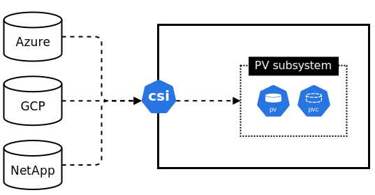

# Mastering Kubernetes Storage

Storing and retrieving data is crucial for most real-world applications. Kubernetes' persistent volume subsystem allows you to connect to enterprise-grade storage systems that provide advanced data management services such as backup and recovery, replication, and snapshots.

## Overview

Kubernetes supports a variety of storage systems, including those from major cloud providers and enterprise-class solutions like EMC and NetApp. This section will cover:

- The big picture of Kubernetes storage
- Various storage providers
- The Container Storage Interface (CSI)
- Kubernetes persistent volume subsystem
- Dynamic provisioning with Storage Classes
- Hands-on examples

## The Big Picture

Kubernetes supports different types of storage, such as block, file, and object storage, from various external systems, either in the cloud or on-premises.

<h3>High-Level Architecture</h3>

Storage providers connect to Kubernetes through a plugin layer, often using the Container Storage Interface (CSI). This standardized interface simplifies integrating external storage resources with Kubernetes. 



<h3>Key Components</h3>

- **Storage Providers:** External systems providing storage services, like EMC, NetApp, or cloud providers.
- **Plugin Layer:** Connects external storage systems with Kubernetes, typically using CSI plugins.
- **Kubernetes Persistent Volume Subsystem:** Standardized API objects that allow applications to consume storage easily.

## Storage Providers

Kubernetes supports a wide range of external storage systems, each typically providing its own CSI plugin. These plugins are usually installed via Helm charts or YAML installers and run as Pods in the `kube-system` Namespace.

<h3>Restrictions</h3>

- **Cloud-Specific:** You can't provision and mount GCP volumes if your cluster is on Microsoft Azure.
- **Locality:** Pods often need to be in the same region or zone as the storage backend.

## Container Storage Interface (CSI)

The Container Storage Interface (CSI) is a standard for exposing arbitrary block and file storage systems to containerized workloads on Container Orchestration Systems (COS) like Kubernetes. CSI allows for the consistent configuration and management of storage solutions across various container orchestration systems.

CSI enables storage providers to develop a standardized plugin once and have it work across a multitude of container orchestration systems without requiring changes. This simplifies the process of adding new storage capabilities to Kubernetes clusters and ensures compatibility and extendibility.

While CSI is a critical piece of getting storage working in Kubernetes, unless you explicitly work on writing storage plugins you'll likely never interact with it directly. Most of your interaction with CSI will simply be referencing your relevant CSI plugin in YAML files.

<h3>Benefits of CSI</h3>

- **Decoupled Updates:** CSI plugins can be updated independently of Kubernetes releases.
- **Broad Compatibility:** CSI plugins work across different orchestration platforms.

<h3>Installing CSI Plugins</h3>

Most cloud platforms pre-install CSI plugins for native storage services. Third-party storage systems require manual installation, often available as Helm charts or YAML files.

## Kubernetes Persistent Volume Subsystem

The Persistent Volume Subsystem uses several key resources to manage storage:

- **PersistentVolumes (PV):** Represent external storage volumes.
- **PersistentVolumeClaims (PVC):** Requests for storage by applications.
- **StorageClasses (SC):** Define different classes of storage for dynamic provisioning.

<h3>Workflow Example</h3>

1. **Pod Requests Storage:** Via a PersistentVolumeClaim (PVC).
2. **PVC Requests Creation:** PVC asks the StorageClass (SC) to create a new PV on the storage backend.
3. **CSI Plugin Interaction:** The SC uses the CSI plugin to provision the volume.
4. **Volume Creation:** The external volume is created and reported back to Kubernetes.
5. **PV and PVC Binding:** The PV is mapped to the created volume, and the Pod mounts the PV.

## Dynamic Provisioning with Storage Classes

StorageClasses (SCs) allow you to define different types of storage. How they are defined depends on the type of storage you're using. For example, if you're using Google Cloud Storage you have classes such as Standard, Nearline, Coldline, and Archive. You may also have simpler/more straightforward classes at your disposal such as SSD and HDD. When you create a SC you map both of those definitions so Pods in your cluster can use either or.

<h3>Example YAML for a StorageClass</h3>

```yaml
apiVersion: storage.k8s.io/v1
kind: StorageClass
metadata:
  name: ssd
provisioner: pd.csi.storage.gke.io  # Google Cloud CSI plugin
volumeBindingMode: WaitForFirstConsumer
allowVolumeExpansion: true
parameters:
  type: pd-ssd  # Google Cloud SSD drives
  provisioned-iops-on-create: '10000'
```

<h3>Key Points</h3>

- **Immutability:** StorageClass objects cannot be modified once created.
- **Meaningful Names:** Use descriptive names for easy reference.
- **Provisioner-Specific Parameters:** The parameters block varies between different plugins.

## Example

**Example YAML:**
Below is the high-level flow for creating and using StorageClasses:

1. Ensure you have a storage back-end (cloud, on-prem, etc.)
2. Have a running Kubernetes cluster
3. Install and setup the CSI storage plugin to connect to Kubernetes
4. Create at least one StorageClass on Kubernetes
5. Deploy Pods with PVCs that reference those Storage classes

```yaml
apiVersion: v1
kind: Pod
metadata:
  name: mypod
spec:
  volumes:
    - name: data
      persistentVolumeClaim:
        claimName: mypvc
  containers:
  - name: my-container
    image: myimage
    volumeMounts:
    - name: data
      mountPath: /data
---
apiVersion: v1
kind: PersistentVolumeClaim
metadata:
  name: mypvc
spec:
  accessModes:
  - ReadWriteOnce
  resources:
    requests:
      storage: 50Gi
  storageClassName: fast
---
kind: StorageClass
apiVersion: storage.k8s.io/v1
metadata:
  name: fast
provisioner: pd.csi.storage.gke.io
parameters:
  type: pd-ssd
```

## Additional Volume Settings

<h3>Access Modes</h3>

- **ReadWriteOnce (RWO):** Single PVC can bind to a volume in read-write mode.
- **ReadWriteMany (RWM):** Multiple PVCs can bind to a volume in read-write mode.
- **ReadOnlyMany (ROM):** Multiple PVCs can bind to a volume in read-only mode.

<h3>Reclaim Policy</h3>

- **Delete:** Deletes PV and external storage when PVC is released.
- **Retain:** Keeps PV and external storage when PVC is deleted, requiring manual cleanup.

## Summary

Kubernetes provides a robust storage subsystem that allows applications to dynamically provision and manage storage from various external systems. By leveraging CSI plugins and StorageClasses, you can create flexible and scalable storage solutions tailored to your application's needs.