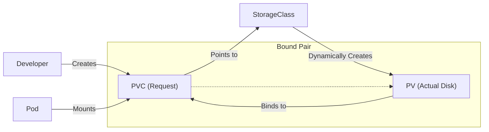

# Storage Overview

Containers are ephemeral. When a container crashes or stops, all the files created inside it are lost.

For many apps (like web servers), this is fine. For others (databases, queues, key-value stores), this is catastrophic. Kubernetes solves this with a robust **Storage** system that decouples "Disk" from "Pod."

-----

## 1\. Ephemeral Storage (The Temporary Stuff)

Before jumping to disks, know that you can store data temporarily without any complex setup.

### `emptyDir`

This creates a temporary directory on the Node's disk that is mounted into your Pod.

  * **Lifespan:** Deleted immediately when the Pod is deleted.
  * **Use Case:** Cache files, scratch space, sorting large data sets.

<!-- end list -->

```yaml
volumes:
  - name: cache-volume
    emptyDir: {} # Creates a temp directory on the host
```

### `hostPath`

This mounts a file or directory from the **host node's filesystem** directly into your Pod.

  * **Risk:** If the Pod moves to a different Node, the data is gone (or different). It is also a huge security risk (giving a Pod access to `/var/lib/docker` or `/etc`).
  * **Use Case:** Only for system agents (like Log Collectors) that *need* to read host internals. **Avoid in normal apps.**

-----

## 2\. The Big Three: PV, PVC, and StorageClass

To save data forever (or at least until you say so), Kubernetes uses three distinct API objects.

| Object | Analogy | Who Creates It? |
| :--- | :--- | :--- |
| **PersistentVolume (PV)** | **The Parking Spot.** The actual piece of storage (AWS EBS, Google Disk, NFS share). | Admin (or Auto-provisioner) |
| **PersistentVolumeClaim (PVC)** | **The Ticket.** A request for a spot ("I need 10GB of fast storage"). | Developer |
| **StorageClass (SC)** | **The Valet.** An automated system that creates PVs on demand based on PVCs. | Admin |

### The Workflow



-----

## 3\. PersistentVolumeClaim (The Request)

As a developer, this is usually the only YAML you write. You are asking Kubernetes for storage.

```yaml
apiVersion: v1
kind: PersistentVolumeClaim
metadata:
  name: db-data
spec:
  accessModes:
    - ReadWriteOnce
  resources:
    requests:
      storage: 10Gi
  storageClassName: standard # Requests a specific "Valet"
```

### Access Modes

Be careful here. "ReadWriteMany" does not mean "Magic Cloud Drive." It depends heavily on the underlying hardware.

  * **`ReadWriteOnce` (RWO):** Can be mounted by **one Node** (e.g., standard EBS/disk).
  * **`ReadWriteOncePod` (RWOP):** *New & Safer.* Can be mounted by **one Pod**. Prevents two Pods on the same node from fighting over the disk.
  * **`ReadWriteMany` (RWX):** Can be mounted by **many Nodes** at once (e.g., NFS, EFS, AzureFile). *Block storage (AWS EBS, Azure Disk) generally cannot do this.*

-----

## 4\. StorageClass (The Automation)

In the old days ("Static Provisioning"), an Admin had to manually create 100 PVs and hope they matched the PVCs. Today, we use **Dynamic Provisioning** via StorageClasses.

The StorageClass defines *what kind* of disk to create.

```yaml
apiVersion: storage.k8s.io/v1
kind: StorageClass
metadata:
  name: fast-ssd
provisioner: kubernetes.io/aws-ebs
parameters:
  type: gp3
  encrypted: "true"
reclaimPolicy: Delete # Critical Setting!
allowVolumeExpansion: true
```

### Reclaim Policies (Crucial\!)

What happens to your data when you delete the PVC?

  * **`Delete` (Default):** The PV (and the actual cloud disk) is **deleted**. Data is lost.
  * **`Retain`:** The PV is released but keeps the data. An admin must manually clean it up or reconnect it.
  * **`Recycle`:** (Deprecated) Scrubs the data and makes the PV available again.

!!! tip "Pro Tip"
    For production databases, consider setting `reclaimPolicy: Retain` so you don't accidentally wipe your database by running `kubectl delete pvc`.

-----

## 5\. How to use it in a Pod

Once you have a PVC, you treat it just like a regular Volume.

```yaml
apiVersion: v1
kind: Pod
metadata:
  name: my-app
spec:
  volumes:
    - name: my-storage
      persistentVolumeClaim:
        claimName: db-data # Matches the PVC Name
  containers:
    - name: app
      image: nginx
      volumeMounts:
        - mountPath: "/var/www/html"
          name: my-storage
```

-----

## Summary & Best Practices

1.  **Prefer Dynamic Provisioning:** Use StorageClasses. Don't create PVs manually unless you have to (e.g., connecting to a legacy NFS share).
2.  **Match the Access Mode:** Don't ask for `ReadWriteMany` on a standard AWS/GCP disk; the Pod will fail to start.
3.  **Watch the Reclaim Policy:** Know if your data disappears when the PVC is deleted.
4.  **StatefulSets:** If you are running a replicated database (e.g., 3 replicas), don't use a single Deployment + PVC (they will all share the same disk\!). Use a **StatefulSet**, which generates a unique PVC for *every* Pod.