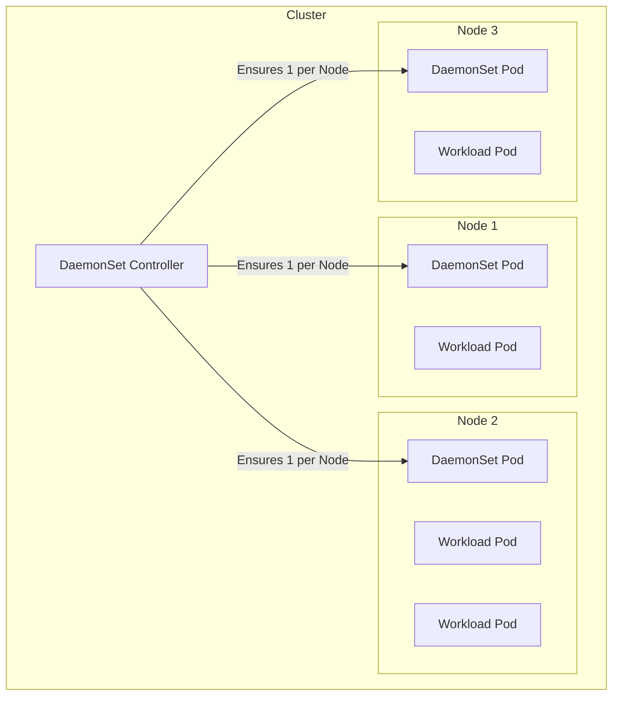

# DaemonSets

Most Kubernetes controllers (like Deployments) care about *how many* replicas you have (e.g., "I want 3 copies of my app"). They don't care *where* those copies run.

**DaemonSets** are different. They care about **Node coverage**.

A DaemonSet ensures that a copy of your Pod is running on **every single node** (or a selected subset of nodes) in your cluster. If you add a new node to the cluster, the DaemonSet automatically detects it and spins up a Pod there. If you remove a node, the garbage collector cleans up the Pod.

-----

## The "Facility Manager" Analogy

Think of your Kubernetes cluster like a large office building.

  * **Deployments** are the employees. They move around, sit at different desks, and sometimes change floors. You just need 50 employees present; you don't care exactly which desk they sit at.
  * **DaemonSets** are the **infrastructure** - like fire sprinklers or security cameras.
      * You need exactly *one* security camera per floor.
      * You don't want two cameras on one floor and zero on another.
      * If you build a new wing (add a new Node), the first thing you do is install a security camera (Pod) there.

-----

## Visualizing DaemonSets

Here is how a DaemonSet differs from a Deployment. Notice how the DaemonSet rigidly places one Pod per Node.



-----

## When to use a DaemonSet?

You should rarely use DaemonSets for your actual application logic. They are almost exclusively used for **Cluster Services** - background processes that need to run locally on every machine.

| Use Case | Example Tools | Why DaemonSet? |
| :--- | :--- | :--- |
| **Log Collection** | Fluentd, Filebeat, Promtail | The agent needs to read the log files stored on that specific node's disk. |
| **Monitoring** | Node Exporter, Datadog Agent | Needs to read the CPU/Memory stats of the host machine it is running on. |
| **Networking** | Kube-proxy, CNI Plugins (Calico/Cilium) | Needs to manipulate the iptables and network interface of that specific node. |
| **Storage** | CSI Nodes (Ceph, EBS drivers) | Needs to mount the physical disk to the node. |

-----

## Deep Dive: How Scheduling Works

Unlike Deployments, DaemonSets have a unique relationship with the Kubernetes Scheduler.

### 1\. Handling New Nodes

The moment a new Node joins the cluster (e.g., you scale up your auto-scaling group), the DaemonSet controller sees it. It immediately schedules a Pod for that node. This is critical for things like **CNI Plugins** (networking) - if the CNI plugin doesn't start instantly on the new node, no other pods can run there.

### 2\. Taints and Tolerations (Critical\!)

This is the most common "gotcha" with DaemonSets.

By default, the Kubernetes Control Plane nodes have a "Taint" (e.g., `NoSchedule`) that prevents normal apps from running on them. However, you usually *do* want your logs and monitoring to run on the Control Plane\!

To make this happen, DaemonSets often include "Tolerations" to ignore those taints.

```yaml
spec:
  template:
    spec:
      tolerations:
      # Allow this pod to run on the Control Plane / Master nodes
      - key: node-role.kubernetes.io/control-plane
        operator: Exists
        effect: NoSchedule
      # Allow this pod to run on nodes that are technically "not ready" yet
      # (Useful for networking plugins that fix the network!)
      - key: node.kubernetes.io/not-ready
        operator: Exists
        effect: NoSchedule
```

### 3\. Limiting to Specific Nodes

Sometimes you don't want a Pod on *every* node. Maybe you only want your "GPU Monitor" running on nodes that actually have GPUs.

You can use a **Node Selector** to filter where the DaemonSet runs.

```yaml
spec:
  template:
    spec:
      nodeSelector:
        hardware: gpu  # Pod will ONLY start on nodes with this label
```

-----

## Updating a DaemonSet

What happens when you change the image version of a DaemonSet? You can't just kill them all at once, or you'll lose monitoring/logs for the entire cluster simultaneously.

DaemonSets support two update strategies:

1.  **RollingUpdate (Default & Recommended):**
    Kubernetes kills one Pod, updates it, waits for it to be ready, and then moves to the next node. You can control the speed using `maxUnavailable` (e.g., "only update 1 node at a time").
2.  **OnDelete:**
    The DaemonSet will **NOT** automatically update the Pods. It will only create the new version if *you* manually delete the old Pod. This is rarely used today but useful in sensitive manual operations.

-----

## Example: Fluentd Log Collector

Here is a complete, real-world style YAML for a log collector.

```yaml
apiVersion: apps/v1
kind: DaemonSet
metadata:
  name: fluentd-logger
  namespace: kube-system # Usually runs in system namespace
spec:
  selector:
    matchLabels:
      name: fluentd-logger
  updateStrategy:
    type: RollingUpdate
    rollingUpdate:
      maxUnavailable: 1 # Only update 1 node at a time
  template:
    metadata:
      labels:
        name: fluentd-logger
    spec:
      # Tolerations allow this to run on Master/Control Plane nodes
      tolerations:
      - key: node-role.kubernetes.io/control-plane
        operator: Exists
        effect: NoSchedule
      containers:
      - name: fluentd
        image: fluent/fluentd:v1.14
        resources:
          limits:
            memory: 200Mi
            cpu: 100m
        # Mount the host's log directory so we can read it
        volumeMounts:
        - name: varlog
          mountPath: /var/log
      volumes:
      - name: varlog
        hostPath:
          path: /var/log
```

-----

## Best Practices

  * **Always Set Limits:** DaemonSets run on *every* node. If your DaemonSet has a memory leak, it will consume memory on *every* node, potentially crashing the entire cluster. Always set `resources.limits`.
  * **Use High Priority Classes:** Since DaemonSets are usually system-critical (like networking or monitoring), you should give them a high `priorityClassName`. If a node runs out of space, you want Kubernetes to kill a standard web-app Pod, not your log collector.
  * **Don't use `hostPort` unless necessary:** Beginners often use `hostPort` to expose DaemonSets. This works, but it causes port conflicts if you ever try to run something else on that port. Use a **Service** with `type: ClusterIP` if you just need internal communication.

-----

## Summary

  * **DaemonSets** ensure **one Pod per Node**.
  * They are primarily used for **system agents** (logs, monitoring, networking).
  * They handle **Node Creation** automatically (new node = new pod).
  * You must manage **Taints & Tolerations** if you want them to run on Control Plane nodes.
  * Use **NodeSelectors** if you only want them on a subset of hardware (e.g., GPU nodes).

!!! tip "Pro Tip"
    If you notice a DaemonSet Pod isn't scheduling on a specific node, check `kubectl describe node <node-name>`. The node likely has a **Taint** that your DaemonSet is missing a **Toleration** for.