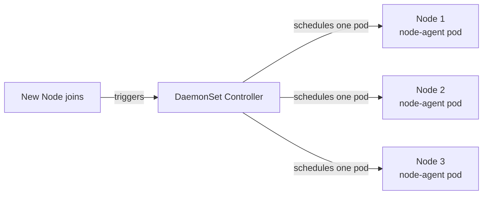

# DaemonSets

DaemonSets ensure one pod runs on every eligible node.

Use them for node-level agents, not for business application services.

## Typical DaemonSet workloads

- log collectors
- node monitoring agents
- security sensors
- storage and networking node components

## Scheduling model

A DaemonSet controller watches node inventory. When a new eligible node appears, it schedules a matching pod automatically.


```mermaid
graph LR
    DS[DaemonSet Controller] -->|schedules one pod| N1[Node 1\nnode-agent pod]
    DS -->|schedules one pod| N2[Node 2\nnode-agent pod]
    DS -->|schedules one pod| N3[Node 3\nnode-agent pod]
    NEW[New Node joins] -->|triggers| DS
```

Eligibility depends on:

- node labels and selectors
- taints and tolerations
- affinity and architecture constraints

## DaemonSet example

```yaml
apiVersion: apps/v1
kind: DaemonSet
metadata:
  name: node-agent
  namespace: kube-system
spec:
  selector:
    matchLabels:
      app: node-agent
  updateStrategy:
    type: RollingUpdate
    rollingUpdate:
      maxUnavailable: 10%
  template:
    metadata:
      labels:
        app: node-agent
    spec:
      priorityClassName: system-node-critical
      tolerations:
        - key: node-role.kubernetes.io/control-plane
          operator: Exists
          effect: NoSchedule
      containers:
        - name: agent
          image: ghcr.io/example/node-agent:v2.3.1
          resources:
            requests:
              cpu: 100m
              memory: 128Mi
            limits:
              cpu: 500m
              memory: 512Mi
          securityContext:
            runAsNonRoot: true
            allowPrivilegeEscalation: false
```

## Update strategies

- `RollingUpdate`: default and recommended for most agents
- `OnDelete`: manual replacement model for tightly controlled upgrades

For critical node software, keep `maxUnavailable` conservative.

## Common pitfalls

- forgetting tolerations for control-plane nodes when coverage is expected
- no resource limits, causing cluster-wide pressure on every node
- using hostPath and privileged mode without strict need

## Operational checks

```bash
kubectl get ds -A
kubectl describe ds node-agent -n kube-system
kubectl get pods -n kube-system -l app=node-agent -o wide
```

If coverage is incomplete, compare unscheduled nodes against taints and selectors.

## Summary

DaemonSets are for uniform node coverage. They are ideal for infrastructure agents and should be managed with strict resource and security controls.
