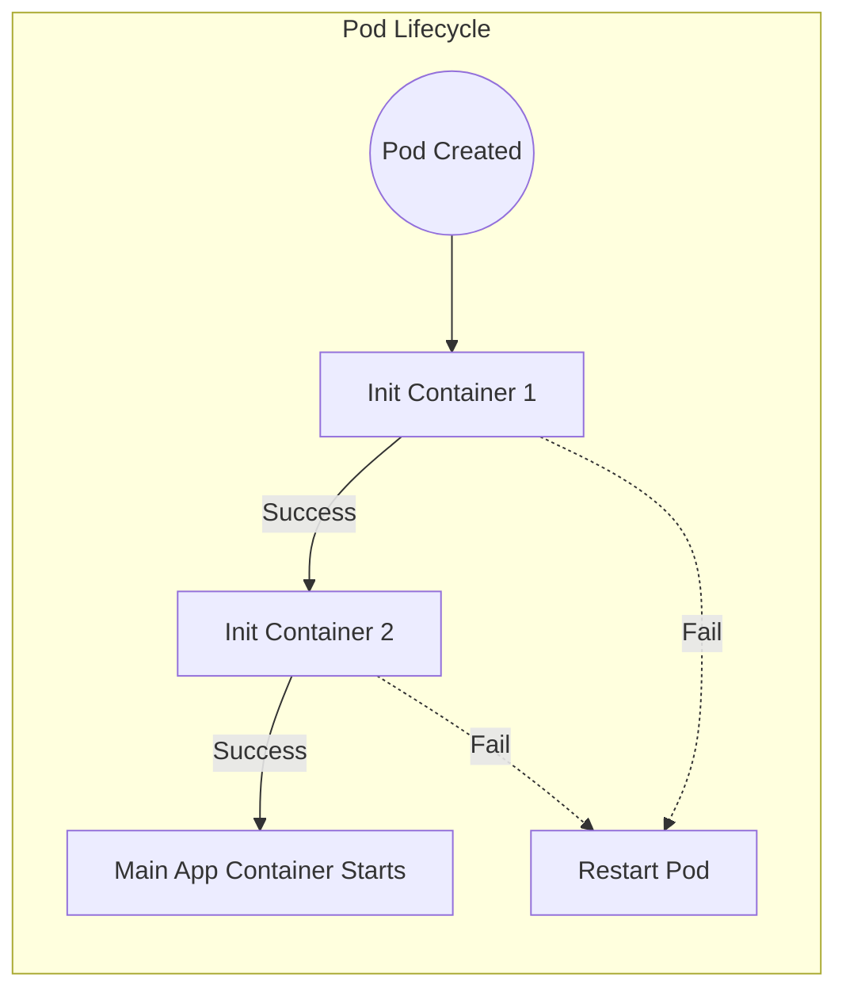

# Init Containers

In Kubernetes, a Pod is not just a single container. It can hold multiple containers that work together.

**Init Containers** are special containers that run - and **complete** - before your main application containers start. They are the "prep cooks" of Kubernetes: they chop the vegetables and prep the station so the "head chef" (your app) can start cooking immediately.

-----

## Why Use Them?

  * **Security:** Your main app image can be small and secure (e.g., `distroless`), while the Init Container contains the heavy tools (curl, git, netcat) needed for setup.
  * **Blocking Startup:** You can force your app to wait until a Database or API is actually online.
  * **Sequential Setup:** You can chain multiple steps: "Clone Git Repo" → "Decrypt Secrets" → "Start App".

-----

## Visualizing the Flow

Init Containers run **sequentially**. If you have three Init Containers, Number 2 will not start until Number 1 finishes successfully.



-----

## The "Shared Volume" Pattern

The most common use case for Init Containers is to **fetch data** (like a config file or a plugin) and hand it off to the main application.

Since containers in a Pod share storage, you use a simple `emptyDir` volume as a "drop box."

1.  **Init Container:** Mounts volume at `/data`. Downloads file. Exits.
2.  **Main Container:** Mounts volume at `/config`. Reads the file.

<!-- end list -->

```yaml
apiVersion: v1
kind: Pod
metadata:
  name: git-sync-demo
spec:
  volumes:
  - name: content
    emptyDir: {}
  initContainers:
  - name: git-cloner
    image: alpine/git
    args:
    - clone
    - --single-branch
    - --
    - https://github.com/kubernetes/kubernetes
    - /data
    volumeMounts:
    - name: content
      mountPath: /data
  containers:
  - name: web-server
    image: nginx
    volumeMounts:
    - name: content
      mountPath: /usr/share/nginx/html
```

-----

## New in v1.29: Native Sidecars

Historically, Init Containers **had** to die before the main app started. This made it hard to run "Sidecars" (helper apps like Log Shippers or Service Mesh proxies) that need to start *before* the app but *keep running*.

As of Kubernetes v1.29, we have **SidecarContainers**.

If you set `restartPolicy: Always` on an init container, Kubernetes treats it as a "Sidecar":

1.  It starts **before** the main app.
2.  It **keeps running** in the background.
3.  It does **not block** the main app from starting (once the sidecar is "Ready").

<!-- end list -->

```yaml
initContainers:
  - name: my-sidecar
    image: my-log-agent
    restartPolicy: Always # <--- The Magic Switch
```

-----

## Best Practices

1.  **Idempotency:** Init containers may run multiple times (if the Pod restarts). Ensure your script handles this (e.g., "If file exists, skip download").
2.  **Lightweight Images:** Don't use a 1GB Ubuntu image just to run `sleep 5`. Use `busybox` or `alpine`.
3.  **Active Deadline:** If your Init Container gets stuck (e.g., trying to reach a firewall-blocked DB), your Pod will be stuck in `Init:0/1` forever. Set `activeDeadlineSeconds` on the Pod if you want it to eventually fail.

-----

## Summary

  * **Init Containers** run sequentially and must complete successfully before the main app starts.
  * Use them to **wait for dependencies** or **configure data**.
  * Use **Shared Volumes** to pass data from the Init Container to the Main Container.
  * **New Feature:** Use `restartPolicy: Always` to create Native Sidecars that start first but keep running.

---

## Related Concepts

- [Pods vs Deployments](pods-deployments/)
- [Kubernetes Configuration](../configuration/configmaps-secrets/)
- [Kubernetes Security Contexts](../security/sec-context/)
