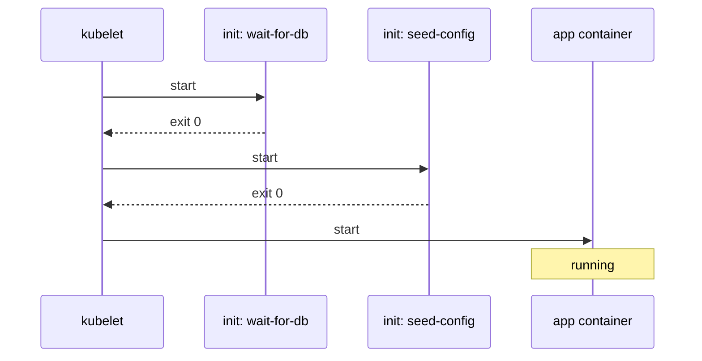

# Init Containers

Init containers run before application containers. Each init container must succeed before the next one starts.

They are ideal for setup logic that should not live in your main runtime image.

## When to use init containers

- wait for dependencies to become reachable
- fetch or render startup configuration
- run one-time bootstrap logic
- separate setup tooling from application image

## Execution model


```mermaid
sequenceDiagram
    participant K as kubelet
    participant I1 as init: wait-for-db
    participant I2 as init: seed-config
    participant A as app container

    K->>I1: start
    I1-->>K: exit 0
    K->>I2: start
    I2-->>K: exit 0
    K->>A: start
    Note over A: running
```

- Init containers run sequentially in declared order.
- App containers start only after all init containers finish successfully.
- A failing init container blocks pod readiness and retries according to pod restart behavior.

## Example

```yaml
apiVersion: v1
kind: Pod
metadata:
  name: app-with-init
spec:
  volumes:
    - name: shared-data
      emptyDir: {}
  initContainers:
    - name: wait-for-db
      image: busybox:1.36
      command:
        - sh
        - -c
        - |
          until nc -z db.default.svc.cluster.local 5432; do
            echo "waiting for db";
            sleep 2;
          done
    - name: seed-config
      image: alpine:3.20
      command: ["sh", "-c", "echo mode=prod > /work/app.env"]
      volumeMounts:
        - name: shared-data
          mountPath: /work
  containers:
    - name: app
      image: ghcr.io/example/app:v2.0.0
      volumeMounts:
        - name: shared-data
          mountPath: /app/config
```

## Init containers vs sidecars

- Init container: runs to completion before app start.
- Sidecar: runs alongside app container during runtime.

Use init containers for deterministic startup preparation. Use sidecars for ongoing runtime functions like log shipping or proxying.

### Native sidecar containers (Kubernetes 1.29+)

Kubernetes 1.29 graduated support for native sidecar containers: init containers declared with `restartPolicy: Always`. Unlike regular init containers, they start before app containers and keep running alongside them rather than exiting.

```yaml
initContainers:
  - name: log-forwarder
    image: fluent/fluent-bit:3.0
    restartPolicy: Always
```

This ensures the sidecar starts before app containers, restarts if it crashes, and is properly terminated when the pod stops -- solving the classic ordering and shutdown problems with regular sidecar patterns.

## Design guidelines

- keep init logic idempotent because pod restarts can re-run it
- keep images small and purpose-built
- set sensible timeouts so startup failures are visible quickly
- avoid embedding secrets in scripts or logs

## Troubleshooting

```bash
kubectl get pod app-with-init
kubectl describe pod app-with-init
kubectl logs pod/app-with-init -c wait-for-db
```

If the pod is stuck in `Init:*`, inspect the failing init container logs first.

## Summary

Init containers provide a clean, repeatable startup pipeline for Kubernetes workloads. They improve reliability by making dependency checks and setup explicit.

## Related Concepts

- [Pods and Deployments](pods-deployments.md)
- [ConfigMaps and Secrets](../configuration/configmaps-secrets.md)
- [Security Context](../security/sec-context.md)
