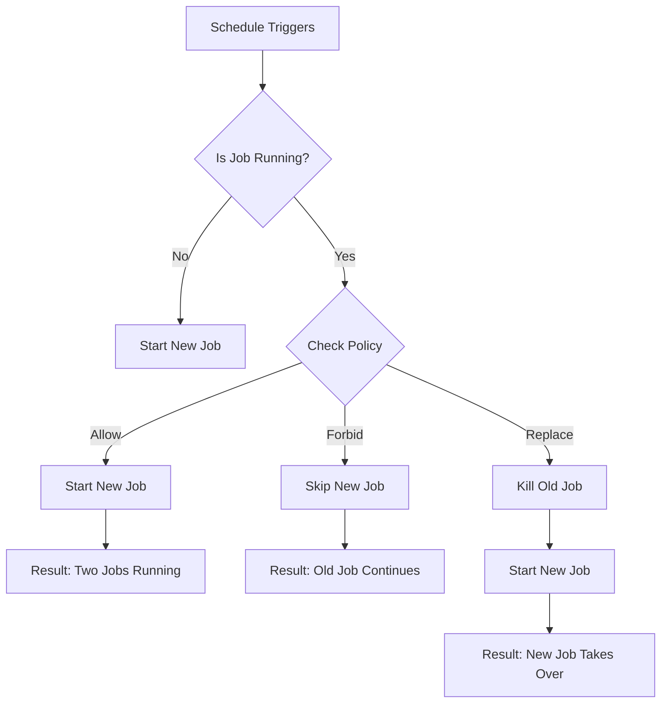

# Jobs & CronJobs

So far, we have looked at **Deployments** and **DaemonSets**. These are designed for "long-running services" - processes like web servers that should never stop. If they crash, we restart them immediately.

But what about tasks that *should* stop? What about a database backup script, a batch image processor, or a database migration? You don't want those to restart forever if they finish successfully.

That is where **Jobs** and **CronJobs** come in.

-----

## The "Contractor" Analogy

Think of your Workloads like staff members:

  * **Deployments** are your **Full-Time Employees**. They are at their desks 24/7. If one leaves, you immediately hire a replacement.
  * **Jobs** are **Contractors**. You hire them to do *one specific task* (e.g., "paint the wall").
      * If they finish the job, they go home (Process exits with code 0).
      * If they fail (e.g., the ladder breaks), they try again until they succeed or you fire them (Backoff Limit).
      * Once the job is done, you don't call them back unless you have a new job.

-----

## Jobs: Run to Completion

A **Job** creates one or more Pods and ensures that a specified number of them successfully terminate.

### 1\. Handling Failures

Unlike a Deployment (which uses `restartPolicy: Always`), a Job uses `OnFailure` or `Never`.

  * **`OnFailure`**: If the container crashes, the Pod stays, but Kubernetes restarts the container inside it.
  * **`Never`**: If the container crashes, Kubernetes doesn't touch it. It starts a *brand new Pod* to try again. (Useful if you want to inspect the logs of the failed pod separately).

### 2\. The "Backoff Limit"

If your code is broken, you don't want Kubernetes to retry it infinitely in a tight loop. The `backoffLimit` controls how many times Kubernetes retries before giving up. The default is **6 retries**, with an exponential delay (10s, 20s, 40s...) between attempts.

### 3\. Automatic Cleanup (TTL)

By default, when a Job finishes, the Pods stay in your cluster with a status of `Completed`. This is so you can read the logs. However, if you run a job every minute, you will have **1,440 dead pods** by the end of the day.

Use `ttlSecondsAfterFinished` to have Kubernetes automatically delete the Job and its Pods after a set time.

### Robust Job Example

```yaml
apiVersion: batch/v1
kind: Job
metadata:
  name: image-processor
spec:
  # Clean up this job 100 seconds after it finishes
  ttlSecondsAfterFinished: 100 
  # Retry 4 times before marking the job as "Failed"
  backoffLimit: 4
  template:
    spec:
      containers:
      - name: processor
        image: my-image-processor:v1
        command: ["python", "process_images.py"]
      # "Always" is invalid for Jobs. Must be OnFailure or Never.
      restartPolicy: OnFailure
```

### 4\. Parallelism & Completions

Sometimes you have a massive queue of work (e.g., 1,000 images to resize). You don't want one Pod to do it; you want 10 Pods working at once.

  * **`completions`**: "I want this job to succeed 50 times total."
  * **`parallelism`**: "Run 5 Pods at the same time."

-----

## CronJobs: Scheduling the Work

A **CronJob** is just a manager that creates **Jobs** on a schedule. It is exactly like the `cron` utility in Linux.

### The Concurrency Problem

This is the **\#1 issue** beginners face with CronJobs.

Imagine you have a backup job scheduled to run every **5 minutes**.

  * **12:00:** Job A starts.
  * **12:05:** Job A is *still running* (it's a slow backup).
  * **12:05:** The Schedule says it's time for Job B. What should happen?

You control this with `concurrencyPolicy`.

| Policy | Behavior | Risk |
| :--- | :--- | :--- |
| **`Allow`** (Default) | Job B starts alongside Job A. Now you have 2 backups running. | **High Risk:** If they write to the same file, you get corruption. If the job is slow, you might eventually crash the cluster with infinite jobs. |
| **`Forbid`** (Recommended) | Job B is skipped. It will not run. Job A continues alone. | Safe. Prevents overlap. |
| **`Replace`** | Job A is killed. Job B starts. | Useful if "fresh" data is more important than finishing the old task. |

### Visualizing Concurrency Policies



### Robust CronJob Example

```yaml
apiVersion: batch/v1
kind: CronJob
metadata:
  name: nightly-backup
spec:
  schedule: "0 0 * * *" # Run at midnight
  # If the cluster is down at midnight, start the job 
  # up to 2 hours (7200s) late. If later, skip it.
  startingDeadlineSeconds: 7200 
  # Critical: Don't let backups overlap!
  concurrencyPolicy: Forbid 
  # Keep the last 3 successful jobs for log inspection
  successfulJobsHistoryLimit: 3
  failedJobsHistoryLimit: 1
  jobTemplate:
    spec:
      template:
        spec:
          containers:
          - name: backup
            image: backup-tool:v1
            args: ["/bin/sh", "-c", "backup.sh"]
          restartPolicy: OnFailure
```

-----

## Best Practices

1.  **Idempotency is King:** Your jobs must be able to run twice without breaking things. If a node crashes, Kubernetes might restart your Job on another node. If your script says "Charge Customer Credit Card," ensure it checks "Has customer already been charged?" first.
2.  **Always set `ttlSecondsAfterFinished`:** Unless you love manually deleting 5,000 "Completed" pods, let Kubernetes clean up after itself.
3.  **Prefer `concurrencyPolicy: Forbid`:** Unless you are 100% sure your app can handle parallel execution, stick to `Forbid`. It is the safest default.
4.  **Monitor CronJobs:** CronJobs are "silent failures." If a backup fails, no one notices until you need the restore. Use a monitoring tool (like Prometheus with `kube-state-metrics`) to alert if the last successful run was \> 25 hours ago.

-----

## Summary

  * **Jobs** are for tasks that run to completion (batch work).
  * **CronJobs** schedule Jobs based on time.
  * **`restartPolicy`** must be `OnFailure` or `Never`.
  * Use **`concurrencyPolicy: Forbid`** to prevent overlapping jobs from causing race conditions or resource exhaustion.
  * Use **`ttlSecondsAfterFinished`** to keep your cluster clean.

!!! tip "Pro Tip"
    Want to test your CronJob immediately without waiting for the schedule? You can manually create a Job *from* the CronJob template: 
    ``` bash
    kubectl create job --from=cronjob/nightly-backup manual-test-run
    ```