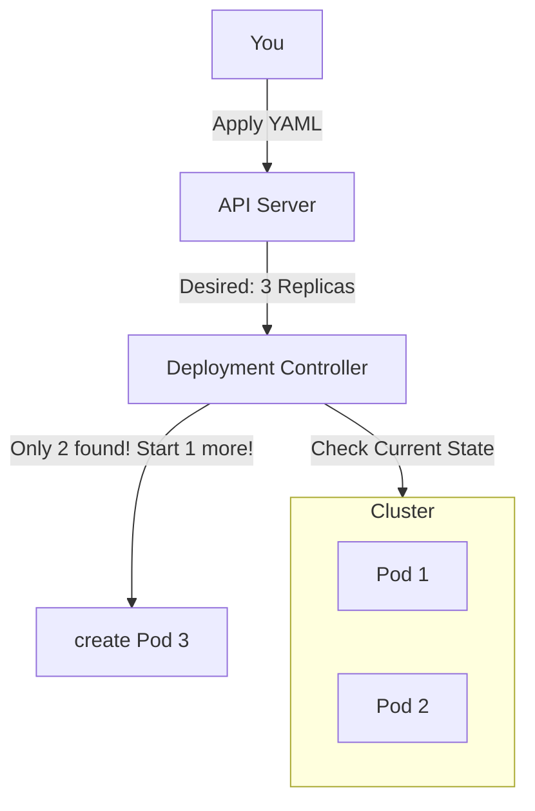

# Pods & Deployments

Kubernetes is often described as an "Operating System for the Cloud." If that is true, then **Pods** are the processes, and **Deployments** are the init system (like systemd) that keeps them running.

This is the most foundational concept in Kubernetes. If you understand this, everything else (Services, Ingress, ConfigMaps) will make sense.

-----

## What is a Pod?

A **Pod** is the smallest execution unit in Kubernetes.

Newcomers often ask: *"Why doesn't Kubernetes just run containers directly? Why do we need this 'Pod' wrapper?"*

The answer is **Shared Context**.
Sometimes, you need multiple containers to work together tightly - like they are running on the same physical server.

A Pod allows multiple containers to run inside a shared environment where they:

  * **Share the same IP Address:** They can talk to each other using `localhost`.
  * **Share Storage:** They can mount the same Volumes to read/write shared files.
  * **Share Lifecycle:** They are scheduled, started, and killed together.

### Visualizing the Pod

The diagram below illustrates how multiple containers coexist in a single Pod.


Notice three critical things in this diagram:

1.  **One IP Address:** The entire Pod has the IP `10.0.0.5`.
2.  **Localhost Communication:** "Container 1" can talk to "Container 2" just by calling `localhost:1717`. They don't need fancy networking.
3.  **Shared Files:** Both containers can read/write to the same shared "filesystem" volume.

!!! tip "The "One Process Per Container" Rule"
    Even though you *can* put multiple containers in a Pod, you usually shouldn't. 95% of Pods contain just **one** container. Only add a second container (a "Sidecar") if it is a helper process (like a log shipper or proxy) that strictly supports the main app.

-----

## What is a Deployment?

If a Pod is a worker, the **Deployment** is the Manager.

Pods are mortal. They are designed to die.

  * If a Node runs out of memory, it kills a Pod.
  * If a Node crashes, the Pod is lost forever.
  * If you want to update your app, you must kill the old Pod and start a new one.

You never want to manage this manual lifecycle yourself. Instead, you create a **Deployment**.

A Deployment ensures that a specified number of Pods (Replicas) are running at all times, matching the **Desired State** you defined.

### The "Self-Healing" Loop



1.  **You:** "I want 3 copies of nginx."
2.  **Deployment:** "I see 0 copies. I will create 3."
3.  **Disaster:** One node crashes, taking a Pod with it.
4.  **Deployment:** "I see 2 copies. I need 3. Creating a replacement immediately."

-----

## Rolling Updates (Zero Downtime)

The other superpower of Deployments is updates.

When you change the image version in a Deployment (e.g., `v1` to `v2`), it doesn't kill everything at once. It performs a **Rolling Update**:

1.  It spins up **one** new Pod (v2).
2.  It waits for it to become "Ready."
3.  It kills **one** old Pod (v1).
4.  It repeats this until all Pods are on v2.

If the new version crashes on startup, the Deployment **stops** the rollout automatically, ensuring you don't take down your production site with a bad update.

-----

## Creating Them (The Modern Way)

Don't write YAML from scratch. Use the CLI to generate it for you.

### 1\. Create a Deployment

This is the standard command to launch an app.

```bash
# syntax: kubectl create deployment <name> --image=<image>
kubectl create deployment my-web --image=nginx --replicas=3
```

### 2\. Create a "naked" Pod (Rare)

Use this only for debugging.

```bash
# syntax: kubectl run <name> --image=<image>
kubectl run my-debug-pod --image=busybox
```

!!! warning "Don't use `kubectl run` for applications!"
    `kubectl run` creates a Pod without a Deployment. If that Pod crashes, it stays dead. It will not self-heal.

-----

## The "Hidden" Layer: ReplicaSets

Technically, Deployments don't manage Pods directly. They manage a middleman called a **ReplicaSet**.

  * **Deployment:** Manages updates and rollouts.
  * **ReplicaSet:** Ensures X number of pods are running.
  * **Pod:** Runs the container.

You rarely touch ReplicaSets directly, but you will see them when you run `kubectl get all`.

```text
NAME                          READY   STATUS    AGE
pod/my-web-6d4b-xyz           1/1     Running   5m  <-- The Pod

NAME                          READY   UP-TO-DATE   AVAILABLE   AGE
deployment.apps/my-web        1/1     1            1           5m  <-- The Manager

NAME                          DESIRED   CURRENT   READY   AGE
replicaset.apps/my-web-6d4b   1         1         1       5m  <-- The Counter
```

-----

## Summary

| Feature | Pod | Deployment |
| :--- | :--- | :--- |
| **Purpose** | Run a container | Manage a fleet of Pods |
| **Lifespan** | Ephemeral (Dies easily) | Long-lived (Self-healing) |
| **Scalability**| None (1 instance) | Horizontal (Change `replicas`) |
| **Updates** | Impossible (Must delete & recreate) | Rolling Updates (Zero downtime) |
| **Production?** | No (Debug only) | **Yes** (Always use this) |

**Key Takeaway:** Pods are the "atoms" of Kubernetes, but Deployments are the "molecules" you actually work with. Always use a Deployment to keep your Pods healthy, scalable, and up-to-date.