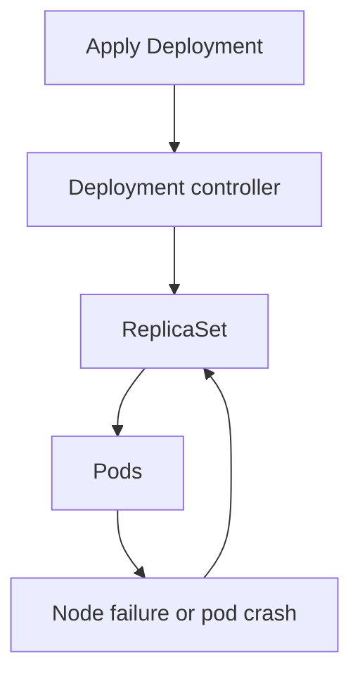

# Pods and Deployments

Pods are the runtime unit. Deployments are the lifecycle controller.

If you remember one rule, remember this: in production, you almost never run standalone pods. You run pods through a controller, usually a Deployment.

## Pod fundamentals

A pod is one or more containers that share:

- one network namespace (same IP, localhost communication)
- declared storage volumes
- one scheduling decision

Most pods should contain one main application container. Add sidecars only when they provide clear value, such as logging, proxying, or telemetry.

## Why pods alone are not enough

Pods are disposable. They can disappear during node failure, eviction, rescheduling, or rollout. A naked pod does not self-heal.

That is why controllers exist.

## What Deployments do

A Deployment manages a ReplicaSet, and the ReplicaSet manages pods.

Deployment responsibilities:

- keep the desired replica count running
- perform rolling updates
- support rollback to prior revisions
- expose rollout status and history


```mermaid
graph TD
  A[Apply Deployment] --> B[Deployment controller]
  B --> C[ReplicaSet]
  C --> D[Pods]
  D --> E[Node failure or pod crash]
  E --> C
```

## Example Deployment

```yaml
apiVersion: apps/v1
kind: Deployment
metadata:
  name: web
spec:
  replicas: 3
  selector:
    matchLabels:
      app: web
  strategy:
    type: RollingUpdate
    rollingUpdate:
      maxUnavailable: 1
      maxSurge: 1
  template:
    metadata:
      labels:
        app: web
    spec:
      containers:
        - name: web
          image: ghcr.io/example/web:v1.2.0
          ports:
            - containerPort: 8080
          readinessProbe:
            httpGet:
              path: /ready
              port: 8080
            periodSeconds: 5
```

## Rolling update behavior

During an update, Kubernetes incrementally creates new pods and removes old pods according to strategy settings.

Key controls:

- `maxUnavailable`: how many old pods can be unavailable during rollout
- `maxSurge`: how many extra new pods can be created temporarily

Use conservative values for critical services, and always pair rollouts with readiness probes.

## Standalone pod use cases

Standalone pods are still useful for short-lived debugging:

```bash
kubectl run debug-shell --image=busybox:1.36 --restart=Never -it -- sh
```

Do not use this pattern for long-running applications.

## Common mistakes

- Deploying applications with `kubectl run` and no controller
- Missing `resources.requests`, which hurts scheduling quality
- Missing readiness probes, which can route traffic to not-ready pods
- Using mutable image tags like `latest` in production

## Quick operations checklist

```bash
kubectl get deploy,rs,pods -l app=web
kubectl rollout status deploy/web
kubectl rollout history deploy/web
kubectl rollout undo deploy/web
```

## Summary

Pods execute containers. Deployments enforce application availability and safe change management. For production services, Deployment should be the default starting point.

## Related Kubernetes Workload Concepts

- [Init Containers](init-containers.md) for startup dependencies
- [Jobs and CronJobs](jobs-cronjobs.md) for batch and scheduled workloads
- [StatefulSets](statefulsets.md) for stateful applications
- [Horizontal Pod Autoscaling](scaling-hpa.md) for dynamic scaling
