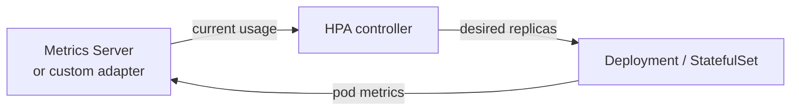

# Scaling and HPA

Scaling in Kubernetes has three layers:

- workload scaling: change pod replicas
- node scaling: add or remove cluster nodes
- resource sizing: change CPU or memory requests per pod

This page focuses on workload scaling with Horizontal Pod Autoscaler (HPA).

## Manual scaling

Manual scaling is still useful for planned events:

```bash
kubectl scale deployment web --replicas=8
```

For live traffic variability, manual scaling does not react quickly enough.

## How HPA works

HPA is a closed control loop driven by metrics:



Loop steps:

1. Read metrics for current pods (via Metrics API).
2. Compare current utilization to the configured target.
3. Compute desired replica count: `desiredReplicas = ceil(currentReplicas × currentUtil / targetUtil)`.
4. Apply stabilization window to avoid oscillation.
5. Update the target workload replica count.

## Prerequisites

HPA is only as good as metric quality.

Required baseline:

- metrics pipeline available (`metrics-server` for CPU or memory)
- workload has realistic `resources.requests`
- readiness probes are configured so new pods enter traffic safely

If `requests` are missing, percentage-based resource targets become unreliable.

## HPA example

```yaml
apiVersion: autoscaling/v2
kind: HorizontalPodAutoscaler
metadata:
  name: web-hpa
spec:
  scaleTargetRef:
    apiVersion: apps/v1
    kind: Deployment
    name: web
  minReplicas: 2
  maxReplicas: 12
  metrics:
    - type: Resource
      resource:
        name: cpu
        target:
          type: Utilization
          averageUtilization: 60
  behavior:
    scaleUp:
      stabilizationWindowSeconds: 0
      policies:
        - type: Percent
          value: 100
          periodSeconds: 60
    scaleDown:
      stabilizationWindowSeconds: 300
      policies:
        - type: Percent
          value: 20
          periodSeconds: 60
```

This configuration scales up aggressively and scales down more cautiously to reduce flapping.

## HPA troubleshooting

```bash
kubectl get hpa
kubectl describe hpa web-hpa
kubectl top pods -l app=web
```

Common failure patterns:

- `Unknown` targets due to missing metrics pipeline
- very slow response because pods have long startup times
- oscillation caused by too-tight thresholds and no stabilization

## HPA, VPA, and node autoscaling

- HPA scales pod count horizontally.
- VPA (Vertical Pod Autoscaler) adjusts pod resource requests over time - do not use HPA and VPA together on the same CPU/memory signal; they will conflict. VPA is safe to combine with HPA when HPA uses custom/external metrics instead.
- Node autoscaler or Karpenter adds infrastructure capacity when pods cannot be scheduled.

## Custom and external metrics

The built-in `autoscaling/v2` HPA supports three metric types:

- `Resource`: CPU or memory utilization against pod requests.
- `Pods`: custom per-pod metric from an adapter (e.g. requests per second).
- `External`: metric from an external system (e.g. queue depth from SQS or Kafka lag).

For event-driven scaling needs beyond what HPA covers natively, consider **KEDA** (Kubernetes Event-driven Autoscaling). KEDA extends HPA with out-of-the-box scalers for message queues, databases, HTTP traffic, and 70+ other sources - scaling to zero when idle is a key advantage.

## Practical guidance

- Start with CPU utilization targets around 50 to 70 percent
- Tune using real production latency and error metrics, not only CPU
- Set sensible min and max replica limits to protect cost and stability
- Validate behavior with load tests before relying on autoscaling in production

## Summary

HPA is a control loop, not a magic switch. It works well when metrics are trustworthy, pod requests are accurate, and rollout health checks are disciplined.

## Related Concepts

- [Pods and Deployments](pods-deployments.md)
- [Resource Requests and Limits](../configuration/limits-requests.md)
- [Kubernetes Troubleshooting](../operations/troubleshooting.md)
